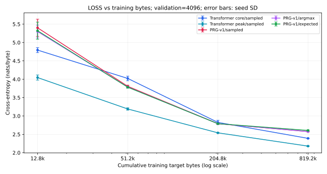
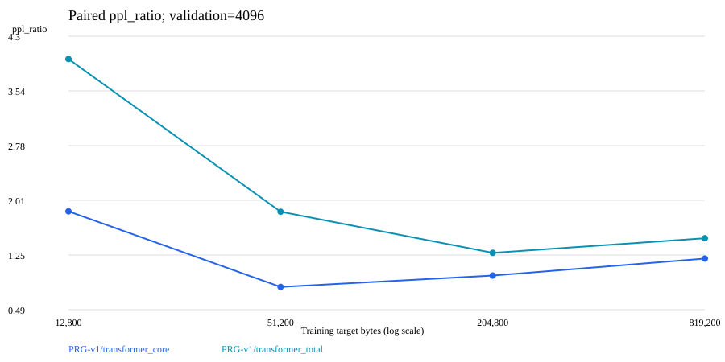

# Phase A: continuous learning curve

Complete: True. Missing checkpoints: 0.
All primary summaries require seeds 42/43/44. Incomplete groups are labelled and cannot support main conclusions.

| Model | Training tokens | Loss | PPL | Static bytes | Peak bytes | Active edges/token | Recurrence | Topology mode |
|---|---:|---:|---:|---:|---:|---:|---|---|
| prg_v1 (n=3) | 12,800 | 5.3999 ± 0.2349 | 225.3951 ± 50.9176 | 220,860 | 483,398 | 1544.0000 ± 71.1056 | ON | static |
| prg_v1 (n=3) | 51,200 | 3.8077 ± 0.0303 | 45.0611 ± 1.3720 | 220,860 | 483,398 | 613.3333 ± 53.2666 | ON | static |
| prg_v1 (n=3) | 204,800 | 2.7902 ± 0.0160 | 16.2864 ± 0.2598 | 220,860 | 483,398 | 525.3333 ± 4.6188 | ON | static |
| prg_v1 (n=3) | 819,200 | 2.5755 ± 0.0094 | 13.1382 ± 0.1235 | 220,860 | 483,398 | 520.0000 ± 13.8564 | ON | static |
| transformer_core (n=3) | 12,800 | 4.7935 ± 0.0673 | 120.9070 ± 8.1623 | 193,664 | 218,240 | N/A | N/A | static |
| transformer_core (n=3) | 51,200 | 4.0217 ± 0.0619 | 55.8675 ± 3.4534 | 193,664 | 218,240 | N/A | N/A | static |
| transformer_core (n=3) | 204,800 | 2.8254 ± 0.0579 | 16.8866 ± 0.9802 | 193,664 | 218,240 | N/A | N/A | static |
| transformer_core (n=3) | 819,200 | 2.3907 ± 0.0074 | 10.9212 ± 0.0809 | 193,664 | 218,240 | N/A | N/A | static |
| transformer_total (n=3) | 12,800 | 4.0455 ± 0.0703 | 57.2319 ± 3.9397 | 451,248 | 472,752 | N/A | N/A | static |
| transformer_total (n=3) | 51,200 | 3.1906 ± 0.0308 | 24.3101 ± 0.7425 | 451,248 | 472,752 | N/A | N/A | static |
| transformer_total (n=3) | 204,800 | 2.5413 ± 0.0088 | 12.6965 ± 0.1120 | 451,248 | 472,752 | N/A | N/A | static |
| transformer_total (n=3) | 819,200 | 2.1793 ± 0.0102 | 8.8403 ± 0.0897 | 451,248 | 472,752 | N/A | N/A | static |

## LOSS curve summary (4096-byte sampled evaluation)

| Training tokens | Transformer core | Transformer peak | PRG-v1 | PRG-v2 |
|---:|---:|---:|---:|---:|
| 12,800 | 4.7935 ± 0.0673 | 4.0455 ± 0.0703 | 5.3999 ± 0.2349 | Phase B pending |
| 51,200 | 4.0217 ± 0.0619 | 3.1906 ± 0.0308 | 3.8077 ± 0.0303 | Phase B pending |
| 204,800 | 2.8254 ± 0.0579 | 2.5413 ± 0.0088 | 2.7902 ± 0.0160 | Phase B pending |
| 819,200 | 2.3907 ± 0.0074 | 2.1793 ± 0.0102 | 2.5755 ± 0.0094 | Phase B pending |

## PPL curve summary (4096-byte sampled evaluation)

| Training tokens | Transformer core | Transformer peak | PRG-v1 | PRG-v2 |
|---:|---:|---:|---:|---:|
| 12,800 | 120.9070 ± 8.1623 | 57.2319 ± 3.9397 | 225.3951 ± 50.9176 | Phase B pending |
| 51,200 | 55.8675 ± 3.4534 | 24.3101 ± 0.7425 | 45.0611 ± 1.3720 | Phase B pending |
| 204,800 | 16.8866 ± 0.9802 | 12.6965 ± 0.1120 | 16.2864 ± 0.2598 | Phase B pending |
| 819,200 | 10.9212 ± 0.0809 | 8.8403 ± 0.0897 | 13.1382 ± 0.1235 | Phase B pending |

## Paired PRG-v1 / Transformer comparisons

| Training tokens | Validation bytes | Baseline | Routing mode | Loss gap | PPL ratio | n |
|---:|---:|---|---|---:|---:|---:|
| 12,800 | 4096 | transformer_core | sampled | 0.6064 ± 0.2159 | 1.8613 ± 0.3749 | 3 |
| 12,800 | 4096 | transformer_core | argmax | 0.5041 ± 0.1613 | 1.6694 ± 0.2560 | 3 |
| 12,800 | 4096 | transformer_core | expected | 0.5266 ± 0.2187 | 1.7192 ± 0.3498 | 3 |
| 12,800 | 4096 | transformer_total | sampled | 1.3544 ± 0.2906 | 3.9845 ± 1.1464 | 3 |
| 12,800 | 4096 | transformer_total | argmax | 1.2521 ± 0.2307 | 3.5601 ± 0.8197 | 3 |
| 12,800 | 4096 | transformer_total | expected | 1.2747 ± 0.2875 | 3.6760 ± 1.0355 | 3 |
| 12,800 | 16384 | transformer_core | sampled | 0.5963 ± 0.2021 | 1.8392 ± 0.3483 | 3 |
| 12,800 | 16384 | transformer_core | argmax | 0.4906 ± 0.1444 | 1.6443 ± 0.2269 | 3 |
| 12,800 | 16384 | transformer_core | expected | 0.5110 ± 0.2036 | 1.6891 ± 0.3217 | 3 |
| 12,800 | 16384 | transformer_total | sampled | 1.3355 ± 0.2905 | 3.9086 ± 1.1109 | 3 |
| 12,800 | 16384 | transformer_total | argmax | 1.2298 ± 0.2304 | 3.4811 ± 0.7955 | 3 |
| 12,800 | 16384 | transformer_total | expected | 1.2501 ± 0.2884 | 3.5870 ± 1.0051 | 3 |
| 51,200 | 4096 | transformer_core | sampled | -0.2140 ± 0.0324 | 0.8076 ± 0.0263 | 3 |
| 51,200 | 4096 | transformer_core | argmax | -0.2344 ± 0.0356 | 0.7913 ± 0.0284 | 3 |
| 51,200 | 4096 | transformer_core | expected | -0.2385 ± 0.0366 | 0.7881 ± 0.0288 | 3 |
| 51,200 | 4096 | transformer_total | sampled | 0.6171 ± 0.0597 | 1.8558 ± 0.1124 | 3 |
| 51,200 | 4096 | transformer_total | argmax | 0.5967 ± 0.0596 | 1.8183 ± 0.1101 | 3 |
| 51,200 | 4096 | transformer_total | expected | 0.5926 ± 0.0529 | 1.8104 ± 0.0967 | 3 |
| 51,200 | 16384 | transformer_core | sampled | -0.2053 ± 0.0269 | 0.8146 ± 0.0220 | 3 |
| 51,200 | 16384 | transformer_core | argmax | -0.2313 ± 0.0303 | 0.7938 ± 0.0242 | 3 |
| 51,200 | 16384 | transformer_core | expected | -0.2330 ± 0.0324 | 0.7924 ± 0.0255 | 3 |
| 51,200 | 16384 | transformer_total | sampled | 0.6053 ± 0.0599 | 1.8341 ± 0.1116 | 3 |
| 51,200 | 16384 | transformer_total | argmax | 0.5794 ± 0.0586 | 1.7870 ± 0.1064 | 3 |
| 51,200 | 16384 | transformer_total | expected | 0.5776 ± 0.0515 | 1.7833 ± 0.0928 | 3 |
| 204,800 | 4096 | transformer_core | sampled | -0.0352 ± 0.0449 | 0.9661 ± 0.0430 | 3 |
| 204,800 | 4096 | transformer_core | argmax | -0.0344 ± 0.0448 | 0.9668 ± 0.0429 | 3 |
| 204,800 | 4096 | transformer_core | expected | -0.0353 ± 0.0556 | 0.9663 ± 0.0529 | 3 |
| 204,800 | 4096 | transformer_total | sampled | 0.2489 ± 0.0073 | 1.2827 ± 0.0093 | 3 |
| 204,800 | 4096 | transformer_total | argmax | 0.2497 ± 0.0065 | 1.2836 ± 0.0083 | 3 |
| 204,800 | 4096 | transformer_total | expected | 0.2488 ± 0.0126 | 1.2826 ± 0.0162 | 3 |
| 204,800 | 16384 | transformer_core | sampled | -0.0333 ± 0.0481 | 0.9680 ± 0.0461 | 3 |
| 204,800 | 16384 | transformer_core | argmax | -0.0329 ± 0.0487 | 0.9684 ± 0.0467 | 3 |
| 204,800 | 16384 | transformer_core | expected | -0.0357 ± 0.0538 | 0.9659 ± 0.0512 | 3 |
| 204,800 | 16384 | transformer_total | sampled | 0.2745 ± 0.0094 | 1.3159 ± 0.0124 | 3 |
| 204,800 | 16384 | transformer_total | argmax | 0.2749 ± 0.0082 | 1.3164 ± 0.0108 | 3 |
| 204,800 | 16384 | transformer_total | expected | 0.2721 ± 0.0169 | 1.3129 ± 0.0223 | 3 |
| 819,200 | 4096 | transformer_core | sampled | 0.1848 ± 0.0044 | 1.2030 ± 0.0053 | 3 |
| 819,200 | 4096 | transformer_core | argmax | 0.1849 ± 0.0035 | 1.2031 ± 0.0042 | 3 |
| 819,200 | 4096 | transformer_core | expected | 0.2160 ± 0.0144 | 1.2412 ± 0.0178 | 3 |
| 819,200 | 4096 | transformer_total | sampled | 0.3962 ± 0.0050 | 1.4862 ± 0.0075 | 3 |
| 819,200 | 4096 | transformer_total | argmax | 0.3963 ± 0.0044 | 1.4863 ± 0.0066 | 3 |
| 819,200 | 4096 | transformer_total | expected | 0.4274 ± 0.0161 | 1.5334 ± 0.0246 | 3 |
| 819,200 | 16384 | transformer_core | sampled | 0.2076 ± 0.0094 | 1.2308 ± 0.0115 | 3 |
| 819,200 | 16384 | transformer_core | argmax | 0.2073 ± 0.0088 | 1.2304 ± 0.0109 | 3 |
| 819,200 | 16384 | transformer_core | expected | 0.2347 ± 0.0173 | 1.2647 ± 0.0218 | 3 |
| 819,200 | 16384 | transformer_total | sampled | 0.4094 ± 0.0089 | 1.5060 ± 0.0134 | 3 |
| 819,200 | 16384 | transformer_total | argmax | 0.4091 ± 0.0092 | 1.5056 ± 0.0139 | 3 |
| 819,200 | 16384 | transformer_total | expected | 0.4366 ± 0.0154 | 1.5475 ± 0.0238 | 3 |

## Phase A research questions

- Against transformer_core, paired loss gaps by milestone: [0.6064, -0.214, -0.0352, 0.1848]; paired PPL ratios: [1.8613, 0.8076, 0.9661, 1.203].
- Against transformer_total, paired loss gaps by milestone: [1.3544, 0.6171, 0.2489, 0.3962]; paired PPL ratios: [3.9845, 1.8558, 1.2827, 1.4862].
- Overall v1 reduced the initial loss gap and PPL ratio, but the trajectory is nonmonotonic. It briefly beat the core-matched Transformer and then fell behind at819.2k; the peak-matched gap narrowed until204.8k, then widened.
- Early catch-up supports slow initial optimization/sample efficiency. It does not support the stronger claim that this is only a slow-learning model: the final interval improves Transformer losses faster.
- At819.2k, both baselines retain a finite-budget advantage. Structural/representation limitations are plausible, but fixed-optimizer curves cannot distinguish them from remaining optimization limitations or prove an asymptotic limit.

Linear-axis equivalents and16384-byte validation figures are in this directory.

## Interpretation limits

Loss is cross-entropy in nats per target byte. PPL is byte perplexity, not BPE/token perplexity.
4096-byte validation is the original prefix; 16384-byte validation contains that prefix.
Expected routing is the unchanged v1 soft region-mass surrogate, not exact stochastic expectation.
Memory estimates retain the ad82f7c conventions, including the hypothetical Transformer KV cache; no packed runtime exists.
Training tokens are cumulative sampled target bytes (including repeats), not unique corpus bytes.
A finite learning curve cannot distinguish intrinsic representation limits from all possible optimizer failures.
Pending checkpoints must not be extrapolated. v2 evaluation begins only after Phase A completes.
