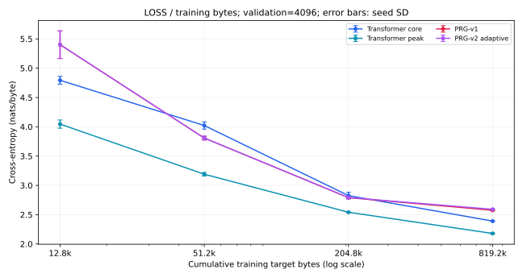
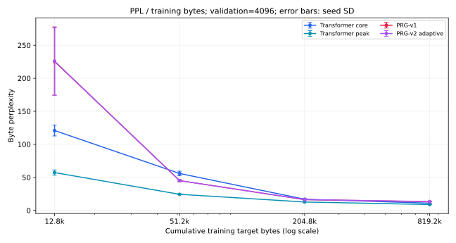

# Mutable-topology study

Complete: True; remaining v2 checkpoints: 0.
All primary summaries use seeds42/43/44. Static control reuses completed Phase A, not retraining.

| Model | Training tokens | Loss | PPL | Static bytes | Peak bytes | Active edges/token | Recurrence | Topology mode |
|---|---:|---:|---:|---:|---:|---:|---|---|
| prg_v1 (n=3) | 12,800 | 5.3999 ± 0.2349 | 225.3951 ± 50.9176 | 220,860 | 483,398 | 1544.0000 ± 71.1056 | ON | static |
| prg_v1 (n=3) | 51,200 | 3.8077 ± 0.0303 | 45.0611 ± 1.3720 | 220,860 | 483,398 | 613.3333 ± 53.2666 | ON | static |
| prg_v1 (n=3) | 204,800 | 2.7902 ± 0.0160 | 16.2864 ± 0.2598 | 220,860 | 483,398 | 525.3333 ± 4.6188 | ON | static |
| prg_v1 (n=3) | 819,200 | 2.5755 ± 0.0094 | 13.1382 ± 0.1235 | 220,860 | 483,398 | 520.0000 ± 13.8564 | ON | static |
| prg_v2_adaptive (n=3) | 12,800 | 5.4023 ± 0.2384 | 226.0497 ± 51.9002 | 220,860 | 483,398 | 1541.3333 ± 68.0392 | ON | adaptive |
| prg_v2_adaptive (n=3) | 51,200 | 3.8077 ± 0.0362 | 45.0686 ± 1.6475 | 220,860 | 483,398 | 584.0000 ± 41.5692 | ON | adaptive |
| prg_v2_adaptive (n=3) | 204,800 | 2.7928 ± 0.0102 | 16.3275 ± 0.1659 | 220,860 | 483,398 | 517.3333 ± 9.2376 | ON | adaptive |
| prg_v2_adaptive (n=3) | 819,200 | 2.5919 ± 0.0097 | 13.3556 ± 0.1296 | 220,860 | 483,398 | 512.0000 ± 0.0000 | ON | adaptive |
| prg_v2_no_accumulation (n=3) | 12,800 | 5.4535 ± 0.2241 | 237.4200 ± 51.3855 | 220,860 | 483,398 | 1480.0000 ± 65.4828 | ON | adaptive |
| prg_v2_no_accumulation (n=3) | 51,200 | 3.8541 ± 0.0422 | 47.2162 ± 1.9919 | 220,860 | 483,398 | 589.3333 ± 45.4899 | ON | adaptive |
| prg_v2_no_accumulation (n=3) | 204,800 | 2.8213 ± 0.0160 | 16.8008 ± 0.2693 | 220,860 | 483,398 | 520.0000 ± 8.0000 | ON | adaptive |
| prg_v2_no_accumulation (n=3) | 819,200 | 2.6081 ± 0.0123 | 13.5743 ± 0.1678 | 220,860 | 483,398 | 512.0000 ± 0.0000 | ON | adaptive |
| prg_v2_no_recurrence (n=3) | 12,800 | 5.3388 ± 0.2049 | 211.0959 ± 40.9354 | 220,860 | 483,398 | 1162.6667 ± 102.8656 | OFF | adaptive |
| prg_v2_no_recurrence (n=3) | 51,200 | 3.7044 ± 0.0401 | 40.6456 ± 1.6319 | 220,860 | 483,398 | 544.0000 ± 16.0000 | OFF | adaptive |
| prg_v2_no_recurrence (n=3) | 204,800 | 2.7811 ± 0.0118 | 16.1375 ± 0.1899 | 220,860 | 483,398 | 520.0000 ± 8.0000 | OFF | adaptive |
| prg_v2_no_recurrence (n=3) | 819,200 | 2.5853 ± 0.0084 | 13.2680 ± 0.1119 | 220,860 | 483,398 | 512.0000 ± 0.0000 | OFF | adaptive |
| prg_v2_uniform (n=3) | 12,800 | 5.4020 ± 0.2369 | 225.9360 ± 51.3636 | 220,860 | 483,398 | 1552.0000 ± 81.1911 | ON | uniform |
| prg_v2_uniform (n=3) | 51,200 | 3.8077 ± 0.0452 | 45.0766 ± 2.0626 | 220,860 | 483,398 | 594.6667 ± 56.7568 | ON | uniform |
| prg_v2_uniform (n=3) | 204,800 | 2.7940 ± 0.0085 | 16.3471 ± 0.1389 | 220,860 | 483,398 | 517.3333 ± 9.2376 | ON | uniform |
| prg_v2_uniform (n=3) | 819,200 | 2.5814 ± 0.0075 | 13.2165 ± 0.0993 | 220,860 | 483,398 | 514.6667 ± 4.6188 | ON | uniform |
| transformer_core (n=3) | 12,800 | 4.7935 ± 0.0673 | 120.9070 ± 8.1623 | 193,664 | 218,240 | N/A | N/A | static |
| transformer_core (n=3) | 51,200 | 4.0217 ± 0.0619 | 55.8675 ± 3.4534 | 193,664 | 218,240 | N/A | N/A | static |
| transformer_core (n=3) | 204,800 | 2.8254 ± 0.0579 | 16.8866 ± 0.9802 | 193,664 | 218,240 | N/A | N/A | static |
| transformer_core (n=3) | 819,200 | 2.3907 ± 0.0074 | 10.9212 ± 0.0809 | 193,664 | 218,240 | N/A | N/A | static |
| transformer_total (n=3) | 12,800 | 4.0455 ± 0.0703 | 57.2319 ± 3.9397 | 451,248 | 472,752 | N/A | N/A | static |
| transformer_total (n=3) | 51,200 | 3.1906 ± 0.0308 | 24.3101 ± 0.7425 | 451,248 | 472,752 | N/A | N/A | static |
| transformer_total (n=3) | 204,800 | 2.5413 ± 0.0088 | 12.6965 ± 0.1120 | 451,248 | 472,752 | N/A | N/A | static |
| transformer_total (n=3) | 819,200 | 2.1793 ± 0.0102 | 8.8403 ± 0.0897 | 451,248 | 472,752 | N/A | N/A | static |

## Learning curve: loss (4096-byte sampled)

| Training tokens | Transformer core | Transformer peak | PRG-v1 | PRG-v2 adaptive |
|---:|---:|---:|---:|---:|
| 12,800 | 4.7935 ± 0.0673 | 4.0455 ± 0.0703 | 5.3999 ± 0.2349 | 5.4023 ± 0.2384 |
| 51,200 | 4.0217 ± 0.0619 | 3.1906 ± 0.0308 | 3.8077 ± 0.0303 | 3.8077 ± 0.0362 |
| 204,800 | 2.8254 ± 0.0579 | 2.5413 ± 0.0088 | 2.7902 ± 0.0160 | 2.7928 ± 0.0102 |
| 819,200 | 2.3907 ± 0.0074 | 2.1793 ± 0.0102 | 2.5755 ± 0.0094 | 2.5919 ± 0.0097 |

## Learning curve: ppl (4096-byte sampled)

| Training tokens | Transformer core | Transformer peak | PRG-v1 | PRG-v2 adaptive |
|---:|---:|---:|---:|---:|
| 12,800 | 120.9070 ± 8.1623 | 57.2319 ± 3.9397 | 225.3951 ± 50.9176 | 226.0497 ± 51.9002 |
| 51,200 | 55.8675 ± 3.4534 | 24.3101 ± 0.7425 | 45.0611 ± 1.3720 | 45.0686 ± 1.6475 |
| 204,800 | 16.8866 ± 0.9802 | 12.6965 ± 0.1120 | 16.2864 ± 0.2598 | 16.3275 ± 0.1659 |
| 819,200 | 10.9212 ± 0.0809 | 8.8403 ± 0.0897 | 13.1382 ± 0.1235 | 13.3556 ± 0.1296 |

## Scaling slopes (4096-byte sampled)

Loss change per natural-log training-byte increment; more negative means faster improvement. These are finite-interval empirical slopes, not asymptotic scaling laws.
| Model | From tokens | To tokens | Loss slope | n |
|---|---:|---:|---:|---:|
| transformer_core | 12,800 | 51,200 | -0.5567 ± 0.0056 | 3 |
| transformer_core | 51,200 | 204,800 | -0.8629 ± 0.0050 | 3 |
| transformer_core | 204,800 | 819,200 | -0.3136 ± 0.0380 | 3 |
| transformer_total | 12,800 | 51,200 | -0.6167 ± 0.0287 | 3 |
| transformer_total | 51,200 | 204,800 | -0.4684 ± 0.0256 | 3 |
| transformer_total | 204,800 | 819,200 | -0.2611 ± 0.0015 | 3 |
| prg_v1 | 12,800 | 51,200 | -1.1485 ± 0.1600 | 3 |
| prg_v1 | 51,200 | 204,800 | -0.7339 ± 0.0141 | 3 |
| prg_v1 | 204,800 | 819,200 | -0.1549 ± 0.0053 | 3 |
| prg_v2_adaptive | 12,800 | 51,200 | -1.1502 ± 0.1536 | 3 |
| prg_v2_adaptive | 51,200 | 204,800 | -0.7321 ± 0.0204 | 3 |
| prg_v2_adaptive | 204,800 | 819,200 | -0.1449 ± 0.0080 | 3 |

## Topology evolution

| Topology mode | Training tokens | Rewires | Reverts | Exploration % | Gateway entropy | Largest hub | PPL |
|---|---:|---:|---:|---:|---:|---:|---:|
| prg_v2_adaptive (n=3) | 12,800 | 6.0000 ± 2.0000 | 0.0000 ± 0.0000 | 12.5000 ± 12.5000 | 3.4586 ± 0.0010 | 5.3333 ± 0.5774 | 226.0497 ± 51.9002 |
| prg_v2_adaptive (n=3) | 51,200 | 50.0000 ± 2.0000 | 0.0000 ± 0.0000 | 7.9551 ± 1.6831 | 3.4255 ± 0.0011 | 6.3333 ± 0.5774 | 45.0686 ± 1.6475 |
| prg_v2_adaptive (n=3) | 204,800 | 221.6667 ± 3.5119 | 59.0000 ± 3.6056 | 8.8704 ± 0.9051 | 3.4178 ± 0.0133 | 7.0000 ± 1.0000 | 16.3275 ± 0.1659 |
| prg_v2_adaptive (n=3) | 819,200 | 886.0000 ± 7.8102 | 575.3333 ± 37.8726 | 8.1593 ± 1.3009 | 3.3986 ± 0.0251 | 6.6667 ± 0.5774 | 13.3556 ± 0.1296 |
| prg_v2_no_accumulation (n=3) | 12,800 | 6.0000 ± 2.0000 | 0.0000 ± 0.0000 | 12.5000 ± 12.5000 | 3.4611 ± 0.0023 | 5.0000 ± 0.0000 | 237.4200 ± 51.3855 |
| prg_v2_no_accumulation (n=3) | 51,200 | 50.0000 ± 2.0000 | 0.0000 ± 0.0000 | 7.9551 ± 1.6831 | 3.4263 ± 0.0226 | 6.3333 ± 0.5774 | 47.2162 ± 1.9919 |
| prg_v2_no_accumulation (n=3) | 204,800 | 221.6667 ± 3.5119 | 38.3333 ± 16.0416 | 8.8704 ± 0.9051 | 3.3936 ± 0.0409 | 7.6667 ± 1.5275 | 16.8008 ± 0.2693 |
| prg_v2_no_accumulation (n=3) | 819,200 | 886.0000 ± 7.8102 | 564.3333 ± 43.6501 | 8.1593 ± 1.3009 | 3.3772 ± 0.0307 | 8.6667 ± 0.5774 | 13.5743 ± 0.1678 |
| prg_v2_no_recurrence (n=3) | 12,800 | 6.0000 ± 2.0000 | 0.0000 ± 0.0000 | 12.5000 ± 12.5000 | 3.4583 ± 0.0031 | 5.0000 ± 0.0000 | 211.0959 ± 40.9354 |
| prg_v2_no_recurrence (n=3) | 51,200 | 50.0000 ± 2.0000 | 20.0000 ± 1.7321 | 7.9551 ± 1.6831 | 3.4212 ± 0.0107 | 7.0000 ± 1.0000 | 40.6456 ± 1.6319 |
| prg_v2_no_recurrence (n=3) | 204,800 | 221.6667 ± 3.5119 | 140.0000 ± 14.7986 | 8.8704 ± 0.9051 | 3.3469 ± 0.0365 | 8.0000 ± 1.0000 | 16.1375 ± 0.1899 |
| prg_v2_no_recurrence (n=3) | 819,200 | 886.0000 ± 7.8102 | 732.6667 ± 22.6789 | 8.1593 ± 1.3009 | 3.3615 ± 0.0244 | 8.0000 ± 1.0000 | 13.2680 ± 0.1119 |
| prg_v2_uniform (n=3) | 12,800 | 5.6667 ± 2.0817 | 0.0000 ± 0.0000 | 100.0000 ± 0.0000 | 3.4578 ± 0.0000 | 5.0000 ± 0.0000 | 225.9360 ± 51.3636 |
| prg_v2_uniform (n=3) | 51,200 | 48.0000 ± 2.6458 | 0.0000 ± 0.0000 | 100.0000 ± 0.0000 | 3.3966 ± 0.0225 | 7.0000 ± 0.0000 | 45.0766 ± 2.0626 |
| prg_v2_uniform (n=3) | 204,800 | 218.6667 ± 9.8658 | 44.3333 ± 4.7258 | 100.0000 ± 0.0000 | 3.3638 ± 0.0186 | 7.3333 ± 0.5774 | 16.3471 ± 0.1389 |
| prg_v2_uniform (n=3) | 819,200 | 884.3333 ± 23.0290 | 513.6667 ± 48.6450 | 100.0000 ± 0.0000 | 3.3258 ± 0.0822 | 7.6667 ± 0.5774 | 13.2165 ± 0.0993 |

## Paired controls

| Training tokens | Validation bytes | Routing | Treatment − control | Loss delta | PPL ratio | n |
|---:|---:|---|---|---:|---:|---:|
| 12,800 | 4096 | sampled | prg_v2_adaptive − prg_v1 | 0.0023 ± 0.0043 | 1.0024 ± 0.0043 | 3 |
| 12,800 | 4096 | sampled | prg_v2_uniform − prg_v1 | 0.0021 ± 0.0030 | 1.0021 ± 0.0030 | 3 |
| 12,800 | 4096 | sampled | prg_v2_adaptive − prg_v2_uniform | 0.0002 ± 0.0049 | 1.0002 ± 0.0049 | 3 |
| 12,800 | 4096 | sampled | prg_v2_no_recurrence − prg_v2_adaptive | -0.0635 ± 0.0496 | 0.9393 ± 0.0459 | 3 |
| 12,800 | 4096 | sampled | prg_v2_no_accumulation − prg_v2_adaptive | 0.0512 ± 0.0143 | 1.0526 ± 0.0150 | 3 |
| 12,800 | 4096 | argmax | prg_v2_adaptive − prg_v1 | 0.0000 ± 0.0000 | 1.0000 ± 0.0000 | 3 |
| 12,800 | 4096 | argmax | prg_v2_uniform − prg_v1 | 0.0000 ± 0.0000 | 1.0000 ± 0.0000 | 3 |
| 12,800 | 4096 | argmax | prg_v2_adaptive − prg_v2_uniform | 0.0000 ± 0.0000 | 1.0000 ± 0.0000 | 3 |
| 12,800 | 4096 | argmax | prg_v2_no_recurrence − prg_v2_adaptive | -0.0584 ± 0.0410 | 0.9438 ± 0.0384 | 3 |
| 12,800 | 4096 | argmax | prg_v2_no_accumulation − prg_v2_adaptive | 0.0591 ± 0.0242 | 1.0611 ± 0.0255 | 3 |
| 12,800 | 4096 | expected | prg_v2_adaptive − prg_v1 | 0.0006 ± 0.0020 | 1.0006 ± 0.0020 | 3 |
| 12,800 | 4096 | expected | prg_v2_uniform − prg_v1 | 0.0001 ± 0.0003 | 1.0001 ± 0.0003 | 3 |
| 12,800 | 4096 | expected | prg_v2_adaptive − prg_v2_uniform | 0.0006 ± 0.0017 | 1.0006 ± 0.0017 | 3 |
| 12,800 | 4096 | expected | prg_v2_no_recurrence − prg_v2_adaptive | -0.0588 ± 0.0502 | 0.9437 ± 0.0468 | 3 |
| 12,800 | 4096 | expected | prg_v2_no_accumulation − prg_v2_adaptive | 0.0247 ± 0.0139 | 1.0251 ± 0.0142 | 3 |
| 12,800 | 16384 | sampled | prg_v2_adaptive − prg_v1 | 0.0007 ± 0.0005 | 1.0007 ± 0.0005 | 3 |
| 12,800 | 16384 | sampled | prg_v2_uniform − prg_v1 | 0.0013 ± 0.0007 | 1.0013 ± 0.0007 | 3 |
| 12,800 | 16384 | sampled | prg_v2_adaptive − prg_v2_uniform | -0.0006 ± 0.0007 | 0.9994 ± 0.0007 | 3 |
| 12,800 | 16384 | sampled | prg_v2_no_recurrence − prg_v2_adaptive | -0.0735 ± 0.0332 | 0.9295 ± 0.0305 | 3 |
| 12,800 | 16384 | sampled | prg_v2_no_accumulation − prg_v2_adaptive | 0.0511 ± 0.0089 | 1.0524 ± 0.0093 | 3 |
| 12,800 | 16384 | argmax | prg_v2_adaptive − prg_v1 | 0.0000 ± 0.0000 | 1.0000 ± 0.0000 | 3 |
| 12,800 | 16384 | argmax | prg_v2_uniform − prg_v1 | 0.0000 ± 0.0000 | 1.0000 ± 0.0000 | 3 |
| 12,800 | 16384 | argmax | prg_v2_adaptive − prg_v2_uniform | 0.0000 ± 0.0000 | 1.0000 ± 0.0000 | 3 |
| 12,800 | 16384 | argmax | prg_v2_no_recurrence − prg_v2_adaptive | -0.0639 ± 0.0452 | 0.9388 ± 0.0421 | 3 |
| 12,800 | 16384 | argmax | prg_v2_no_accumulation − prg_v2_adaptive | 0.0567 ± 0.0253 | 1.0585 ± 0.0266 | 3 |
| 12,800 | 16384 | expected | prg_v2_adaptive − prg_v1 | 0.0010 ± 0.0026 | 1.0010 ± 0.0026 | 3 |
| 12,800 | 16384 | expected | prg_v2_uniform − prg_v1 | -0.0000 ± 0.0001 | 1.0000 ± 0.0001 | 3 |
| 12,800 | 16384 | expected | prg_v2_adaptive − prg_v2_uniform | 0.0011 ± 0.0026 | 1.0011 ± 0.0026 | 3 |
| 12,800 | 16384 | expected | prg_v2_no_recurrence − prg_v2_adaptive | -0.0610 ± 0.0501 | 0.9416 ± 0.0466 | 3 |
| 12,800 | 16384 | expected | prg_v2_no_accumulation − prg_v2_adaptive | 0.0224 ± 0.0136 | 1.0227 ± 0.0138 | 3 |
| 51,200 | 4096 | sampled | prg_v2_adaptive − prg_v1 | 0.0000 ± 0.0122 | 1.0001 ± 0.0121 | 3 |
| 51,200 | 4096 | sampled | prg_v2_uniform − prg_v1 | -0.0000 ± 0.0241 | 1.0002 ± 0.0240 | 3 |
| 51,200 | 4096 | sampled | prg_v2_adaptive − prg_v2_uniform | 0.0001 ± 0.0120 | 1.0001 ± 0.0120 | 3 |
| 51,200 | 4096 | sampled | prg_v2_no_recurrence − prg_v2_adaptive | -0.1034 ± 0.0564 | 0.9027 ± 0.0516 | 3 |
| 51,200 | 4096 | sampled | prg_v2_no_accumulation − prg_v2_adaptive | 0.0464 ± 0.0227 | 1.0477 ± 0.0237 | 3 |
| 51,200 | 4096 | argmax | prg_v2_adaptive − prg_v1 | -0.0087 ± 0.0088 | 0.9914 ± 0.0087 | 3 |
| 51,200 | 4096 | argmax | prg_v2_uniform − prg_v1 | 0.0030 ± 0.0135 | 1.0030 ± 0.0135 | 3 |
| 51,200 | 4096 | argmax | prg_v2_adaptive − prg_v2_uniform | -0.0116 ± 0.0061 | 0.9885 ± 0.0060 | 3 |
| 51,200 | 4096 | argmax | prg_v2_no_recurrence − prg_v2_adaptive | -0.0923 ± 0.0509 | 0.9126 ± 0.0469 | 3 |
| 51,200 | 4096 | argmax | prg_v2_no_accumulation − prg_v2_adaptive | 0.0639 ± 0.0347 | 1.0664 ± 0.0368 | 3 |
| 51,200 | 4096 | expected | prg_v2_adaptive − prg_v1 | -0.0108 ± 0.0126 | 0.9894 ± 0.0124 | 3 |
| 51,200 | 4096 | expected | prg_v2_uniform − prg_v1 | -0.0023 ± 0.0242 | 0.9979 ± 0.0240 | 3 |
| 51,200 | 4096 | expected | prg_v2_adaptive − prg_v2_uniform | -0.0085 ± 0.0139 | 0.9916 ± 0.0138 | 3 |
| 51,200 | 4096 | expected | prg_v2_no_recurrence − prg_v2_adaptive | -0.0861 ± 0.0514 | 0.9183 ± 0.0479 | 3 |
| 51,200 | 4096 | expected | prg_v2_no_accumulation − prg_v2_adaptive | 0.0499 ± 0.0200 | 1.0513 ± 0.0211 | 3 |
| 51,200 | 16384 | sampled | prg_v2_adaptive − prg_v1 | -0.0061 ± 0.0018 | 0.9939 ± 0.0018 | 3 |
| 51,200 | 16384 | sampled | prg_v2_uniform − prg_v1 | -0.0030 ± 0.0135 | 0.9971 ± 0.0135 | 3 |
| 51,200 | 16384 | sampled | prg_v2_adaptive − prg_v2_uniform | -0.0032 ± 0.0122 | 0.9969 ± 0.0122 | 3 |
| 51,200 | 16384 | sampled | prg_v2_no_recurrence − prg_v2_adaptive | -0.0987 ± 0.0517 | 0.9069 ± 0.0475 | 3 |
| 51,200 | 16384 | sampled | prg_v2_no_accumulation − prg_v2_adaptive | 0.0459 ± 0.0275 | 1.0472 ± 0.0287 | 3 |
| 51,200 | 16384 | argmax | prg_v2_adaptive − prg_v1 | -0.0077 ± 0.0038 | 0.9923 ± 0.0037 | 3 |
| 51,200 | 16384 | argmax | prg_v2_uniform − prg_v1 | 0.0012 ± 0.0036 | 1.0012 ± 0.0036 | 3 |
| 51,200 | 16384 | argmax | prg_v2_adaptive − prg_v2_uniform | -0.0090 ± 0.0074 | 0.9911 ± 0.0073 | 3 |
| 51,200 | 16384 | argmax | prg_v2_no_recurrence − prg_v2_adaptive | -0.0899 ± 0.0462 | 0.9147 ± 0.0428 | 3 |
| 51,200 | 16384 | argmax | prg_v2_no_accumulation − prg_v2_adaptive | 0.0592 ± 0.0356 | 1.0614 ± 0.0375 | 3 |
| 51,200 | 16384 | expected | prg_v2_adaptive − prg_v1 | -0.0090 ± 0.0078 | 0.9911 ± 0.0078 | 3 |
| 51,200 | 16384 | expected | prg_v2_uniform − prg_v1 | -0.0028 ± 0.0186 | 0.9973 ± 0.0184 | 3 |
| 51,200 | 16384 | expected | prg_v2_adaptive − prg_v2_uniform | -0.0062 ± 0.0149 | 0.9939 ± 0.0148 | 3 |
| 51,200 | 16384 | expected | prg_v2_no_recurrence − prg_v2_adaptive | -0.0876 ± 0.0520 | 0.9170 ± 0.0484 | 3 |
| 51,200 | 16384 | expected | prg_v2_no_accumulation − prg_v2_adaptive | 0.0473 ± 0.0208 | 1.0486 ± 0.0219 | 3 |
| 204,800 | 4096 | sampled | prg_v2_adaptive − prg_v1 | 0.0026 ± 0.0073 | 1.0026 ± 0.0073 | 3 |
| 204,800 | 4096 | sampled | prg_v2_uniform − prg_v1 | 0.0038 ± 0.0237 | 1.0040 ± 0.0240 | 3 |
| 204,800 | 4096 | sampled | prg_v2_adaptive − prg_v2_uniform | -0.0012 ± 0.0169 | 0.9989 ± 0.0168 | 3 |
| 204,800 | 4096 | sampled | prg_v2_no_recurrence − prg_v2_adaptive | -0.0117 ± 0.0017 | 0.9884 ± 0.0016 | 3 |
| 204,800 | 4096 | sampled | prg_v2_no_accumulation − prg_v2_adaptive | 0.0285 ± 0.0077 | 1.0290 ± 0.0080 | 3 |
| 204,800 | 4096 | argmax | prg_v2_adaptive − prg_v1 | 0.0013 ± 0.0062 | 1.0013 ± 0.0062 | 3 |
| 204,800 | 4096 | argmax | prg_v2_uniform − prg_v1 | 0.0023 ± 0.0230 | 1.0025 ± 0.0232 | 3 |
| 204,800 | 4096 | argmax | prg_v2_adaptive − prg_v2_uniform | -0.0011 ± 0.0171 | 0.9990 ± 0.0170 | 3 |
| 204,800 | 4096 | argmax | prg_v2_no_recurrence − prg_v2_adaptive | -0.0114 ± 0.0019 | 0.9887 ± 0.0019 | 3 |
| 204,800 | 4096 | argmax | prg_v2_no_accumulation − prg_v2_adaptive | 0.0300 ± 0.0064 | 1.0304 ± 0.0066 | 3 |
| 204,800 | 4096 | expected | prg_v2_adaptive − prg_v1 | 0.0083 ± 0.0167 | 1.0085 ± 0.0168 | 3 |
| 204,800 | 4096 | expected | prg_v2_uniform − prg_v1 | 0.0071 ± 0.0181 | 1.0072 ± 0.0182 | 3 |
| 204,800 | 4096 | expected | prg_v2_adaptive − prg_v2_uniform | 0.0012 ± 0.0015 | 1.0012 ± 0.0015 | 3 |
| 204,800 | 4096 | expected | prg_v2_no_recurrence − prg_v2_adaptive | -0.0145 ± 0.0130 | 0.9856 ± 0.0128 | 3 |
| 204,800 | 4096 | expected | prg_v2_no_accumulation − prg_v2_adaptive | 0.0067 ± 0.0209 | 1.0069 ± 0.0211 | 3 |
| 204,800 | 16384 | sampled | prg_v2_adaptive − prg_v1 | 0.0075 ± 0.0017 | 1.0075 ± 0.0017 | 3 |
| 204,800 | 16384 | sampled | prg_v2_uniform − prg_v1 | 0.0065 ± 0.0190 | 1.0067 ± 0.0192 | 3 |
| 204,800 | 16384 | sampled | prg_v2_adaptive − prg_v2_uniform | 0.0010 ± 0.0178 | 1.0011 ± 0.0177 | 3 |
| 204,800 | 16384 | sampled | prg_v2_no_recurrence − prg_v2_adaptive | -0.0097 ± 0.0118 | 0.9904 ± 0.0117 | 3 |
| 204,800 | 16384 | sampled | prg_v2_no_accumulation − prg_v2_adaptive | 0.0299 ± 0.0126 | 1.0304 ± 0.0131 | 3 |
| 204,800 | 16384 | argmax | prg_v2_adaptive − prg_v1 | 0.0066 ± 0.0012 | 1.0066 ± 0.0012 | 3 |
| 204,800 | 16384 | argmax | prg_v2_uniform − prg_v1 | 0.0057 ± 0.0185 | 1.0059 ± 0.0187 | 3 |
| 204,800 | 16384 | argmax | prg_v2_adaptive − prg_v2_uniform | 0.0009 ± 0.0187 | 1.0010 ± 0.0187 | 3 |
| 204,800 | 16384 | argmax | prg_v2_no_recurrence − prg_v2_adaptive | -0.0094 ± 0.0111 | 0.9906 ± 0.0110 | 3 |
| 204,800 | 16384 | argmax | prg_v2_no_accumulation − prg_v2_adaptive | 0.0323 ± 0.0115 | 1.0329 ± 0.0119 | 3 |
| 204,800 | 16384 | expected | prg_v2_adaptive − prg_v1 | 0.0138 ± 0.0098 | 1.0139 ± 0.0099 | 3 |
| 204,800 | 16384 | expected | prg_v2_uniform − prg_v1 | 0.0086 ± 0.0139 | 1.0088 ± 0.0141 | 3 |
| 204,800 | 16384 | expected | prg_v2_adaptive − prg_v2_uniform | 0.0051 ± 0.0055 | 1.0052 ± 0.0055 | 3 |
| 204,800 | 16384 | expected | prg_v2_no_recurrence − prg_v2_adaptive | -0.0126 ± 0.0112 | 0.9876 ± 0.0111 | 3 |
| 204,800 | 16384 | expected | prg_v2_no_accumulation − prg_v2_adaptive | 0.0076 ± 0.0212 | 1.0078 ± 0.0215 | 3 |
| 819,200 | 4096 | sampled | prg_v2_adaptive − prg_v1 | 0.0164 ± 0.0100 | 1.0166 ± 0.0101 | 3 |
| 819,200 | 4096 | sampled | prg_v2_uniform − prg_v1 | 0.0060 ± 0.0091 | 1.0060 ± 0.0091 | 3 |
| 819,200 | 4096 | sampled | prg_v2_adaptive − prg_v2_uniform | 0.0105 ± 0.0022 | 1.0105 ± 0.0022 | 3 |
| 819,200 | 4096 | sampled | prg_v2_no_recurrence − prg_v2_adaptive | -0.0066 ± 0.0146 | 0.9935 ± 0.0145 | 3 |
| 819,200 | 4096 | sampled | prg_v2_no_accumulation − prg_v2_adaptive | 0.0162 ± 0.0190 | 1.0165 ± 0.0194 | 3 |
| 819,200 | 4096 | argmax | prg_v2_adaptive − prg_v1 | 0.0166 ± 0.0084 | 1.0167 ± 0.0086 | 3 |
| 819,200 | 4096 | argmax | prg_v2_uniform − prg_v1 | 0.0065 ± 0.0088 | 1.0066 ± 0.0089 | 3 |
| 819,200 | 4096 | argmax | prg_v2_adaptive − prg_v2_uniform | 0.0101 ± 0.0029 | 1.0101 ± 0.0029 | 3 |
| 819,200 | 4096 | argmax | prg_v2_no_recurrence − prg_v2_adaptive | -0.0063 ± 0.0150 | 0.9938 ± 0.0150 | 3 |
| 819,200 | 4096 | argmax | prg_v2_no_accumulation − prg_v2_adaptive | 0.0162 ± 0.0190 | 1.0164 ± 0.0194 | 3 |
| 819,200 | 4096 | expected | prg_v2_adaptive − prg_v1 | 0.0215 ± 0.0172 | 1.0218 ± 0.0175 | 3 |
| 819,200 | 4096 | expected | prg_v2_uniform − prg_v1 | 0.0097 ± 0.0267 | 1.0100 ± 0.0270 | 3 |
| 819,200 | 4096 | expected | prg_v2_adaptive − prg_v2_uniform | 0.0118 ± 0.0303 | 1.0122 ± 0.0309 | 3 |
| 819,200 | 4096 | expected | prg_v2_no_recurrence − prg_v2_adaptive | -0.0229 ± 0.0308 | 0.9776 ± 0.0300 | 3 |
| 819,200 | 4096 | expected | prg_v2_no_accumulation − prg_v2_adaptive | -0.0003 ± 0.0309 | 1.0000 ± 0.0309 | 3 |
| 819,200 | 16384 | sampled | prg_v2_adaptive − prg_v1 | 0.0080 ± 0.0084 | 1.0081 ± 0.0085 | 3 |
| 819,200 | 16384 | sampled | prg_v2_uniform − prg_v1 | -0.0011 ± 0.0116 | 0.9989 ± 0.0117 | 3 |
| 819,200 | 16384 | sampled | prg_v2_adaptive − prg_v2_uniform | 0.0091 ± 0.0055 | 1.0092 ± 0.0056 | 3 |
| 819,200 | 16384 | sampled | prg_v2_no_recurrence − prg_v2_adaptive | -0.0045 ± 0.0209 | 0.9957 ± 0.0209 | 3 |
| 819,200 | 16384 | sampled | prg_v2_no_accumulation − prg_v2_adaptive | 0.0156 ± 0.0171 | 1.0158 ± 0.0174 | 3 |
| 819,200 | 16384 | argmax | prg_v2_adaptive − prg_v1 | 0.0083 ± 0.0084 | 1.0084 ± 0.0085 | 3 |
| 819,200 | 16384 | argmax | prg_v2_uniform − prg_v1 | -0.0007 ± 0.0112 | 0.9994 ± 0.0113 | 3 |
| 819,200 | 16384 | argmax | prg_v2_adaptive − prg_v2_uniform | 0.0090 ± 0.0058 | 1.0091 ± 0.0059 | 3 |
| 819,200 | 16384 | argmax | prg_v2_no_recurrence − prg_v2_adaptive | -0.0043 ± 0.0212 | 0.9958 ± 0.0212 | 3 |
| 819,200 | 16384 | argmax | prg_v2_no_accumulation − prg_v2_adaptive | 0.0160 ± 0.0175 | 1.0163 ± 0.0177 | 3 |
| 819,200 | 16384 | expected | prg_v2_adaptive − prg_v1 | 0.0133 ± 0.0202 | 1.0135 ± 0.0203 | 3 |
| 819,200 | 16384 | expected | prg_v2_uniform − prg_v1 | 0.0056 ± 0.0290 | 1.0059 ± 0.0293 | 3 |
| 819,200 | 16384 | expected | prg_v2_adaptive − prg_v2_uniform | 0.0078 ± 0.0332 | 1.0082 ± 0.0337 | 3 |
| 819,200 | 16384 | expected | prg_v2_no_recurrence − prg_v2_adaptive | -0.0201 ± 0.0301 | 0.9804 ± 0.0295 | 3 |
| 819,200 | 16384 | expected | prg_v2_no_accumulation − prg_v2_adaptive | 0.0036 ± 0.0279 | 1.0039 ± 0.0279 | 3 |

## Audit of inherited memory estimates

The original Transformer estimate counts its learned position embedding in both other_numerical and other_static_metadata. To preserve Phase A matching conditions, model sizes were not retuned. Correcting this reporting duplication gives:
| Model | Original static / peak bytes | Corrected static / peak bytes |
|---|---:|---:|
| transformer_core | 193,664 / 218,240 | 189,568 / 214,144 |
| transformer_total | 451,248 / 472,752 | 440,496 / 462,000 |
PRG reported peak remains483398 bytes. These are modeled state estimates, not measured resident-memory peaks or allocator/workspace bounds. The current code uses FP32 edge latents and dense state operations; it does not implement packed inference.

## Final serialization and training throughput

| Model | Inference export bytes | Resume checkpoint bytes | Training-only metadata bytes | Training bytes/s |
|---|---:|---:|---:|---:|
| prg_v1 | 2194968.0000 ± 0.0000 | 6768857.6667 ± 36.9504 | 0.0000 ± 0.0000 | 919.4589 ± 11.6183 |
| prg_v2_adaptive | 2195160.0000 ± 0.0000 | 7001912.3333 ± 2081.0664 | 474335.0000 ± 6622.5816 | 768.3657 ± 7.8788 |
| prg_v2_no_accumulation | 2195160.0000 ± 0.0000 | 6979491.0000 ± 1260.6538 | 474491.0000 ± 2667.8285 | 773.9500 ± 1.1392 |
| prg_v2_no_recurrence | 2195160.0000 ± 0.0000 | 6977123.0000 ± 1999.4239 | 459993.0000 ± 7078.3859 | 694.9620 ± 2.9292 |
| prg_v2_uniform | 2195160.0000 ± 0.0000 | 6979875.0000 ± 4446.5033 | 476573.3333 ± 10136.7309 | 740.5630 ± 5.6349 |
| transformer_core | 204494.0000 ± 0.0000 | 804022.0000 ± 0.0000 | 0.0000 ± 0.0000 | 16106.3609 ± 381.0537 |
| transformer_total | 447030.0000 ± 0.0000 | 1527769.0000 ± 0.0000 | 0.0000 ± 0.0000 | 23239.4092 ± 268.0967 |
Training throughput includes the actual concurrent seed schedule; metadata excludes optimizer/neural gradients, whose serialized state is present in resume checkpoints.

## Final inference microbenchmark

One16-byte sample after2-byte warmup per seed. Context recomputed, no KV cache. Prototype timing, not hardware efficiency.
Settings: {"prompt": "To be, or not to be, that is the question.", "max_tokens": 16, "temperature": 1.0, "record_trace": false, "training_tokens": 819200, "context": 32, "backend": "cpu"}

| Model | Generated bytes/s | Latency ms/byte |
|---|---:|---:|
| transformer_core | 1486.7628 ± 105.6339 | 0.6749 ± 0.0491 |
| transformer_total | 2281.4687 ± 119.0032 | 0.4391 ± 0.0236 |
| prg_v1 | 32.0892 ± 1.3024 | 31.1969 ± 1.2478 |
| prg_v2_adaptive | 33.0377 ± 2.3031 | 30.3708 ± 2.2032 |
| prg_v2_uniform | 32.5666 ± 0.9681 | 30.7244 ± 0.9168 |
| prg_v2_no_recurrence | 29.3657 ± 0.4085 | 34.0577 ± 0.4763 |
| prg_v2_no_accumulation | 32.8955 ± 1.9692 | 30.4700 ± 1.7718 |
Full settings, per-seed samples and checkpoint hashes: [inference_benchmark.json](inference_benchmark.json).

## Inference and training metadata

The local-edge/gateway/router/embedding/runtime breakdown is recorded in every result.memory.
EMA, mutation RNG, counters, ever-edge table, probation and histories are training-only.
Inference exports discard these buffers, retaining the gateway table and neural state.
Full resumable checkpoints retain all mutation state; their byte size is separate from model-only exports.
Active edges/token counts processed edge slots; effective nonzero edges are separately recorded.
Region hotness/output credit is a proxy, not a causal usefulness measurement. Gradient credit is optional and disabled in the main experiment.
RecurrenceOFF inherits the v1 ascending-region-ID mask; it additionally alters the usable gateway graph.
The inherited expected surrogate reads accumulator values even for accumulationOFF, while the hard engine reads persistent-state messages. Thus its OFF readout is a different definition, not simply a mathematical expectation; sampled/argmax results are primary.
The forced diagnostic bypasses RouterNet credit: actual straight-through training may retain an indirect prefix-gradient path via routing probabilities. The observed limitation is the absence of a direct temporal-state readout path under the default accumulator, not proof of zero total training gradient.
A forced direct-OUTPUT, one-cycle characterization test shows ON has zero gradient from the last-token logit to prefix embedding activations, whereas OFF retains a nonzero temporal-state path. This does not mean inference is exactly stateless: hard node selection still depends on prior state. Late diagnostic trajectories overwhelmingly choose direct OUTPUT, making this gradient limitation relevant to investigate.
A characterization test also shows that a last-cycle gateway to an unvisited destination can leave ON readout gathering a zero accumulator (bias-only), while OFF retains the source message. The frozen v1 semantics are preserved, not repaired in this experiment; this is a horizon/readout confound requiring a separate future control.
AccumulationOFF also switches readout from the per-token accumulator to tanh of persistent node state. This inherited source/nonlinearity difference prevents attributing the entire ablation delta to summation alone.
Three seeds describe this dataset/configuration; no unobserved asymptotic claim is warranted.

## Answers to the ten research questions

1. v1 reduced its overall peak-matched loss gap from 1.354 to 0.396 nats/byte. The gap is nonmonotonic: it narrowed at204.8k then widened at819.2k. Final core gap=0.185.
2. There is strong evidence of initial slow optimization/sample efficiency, but eventual finite-budget inferiority persists. These curves cannot isolate intrinsic representation efficiency from residual optimizer limitations.
3. No improvement in this run: adaptive − static final loss delta=0.0164; lower is better. See paired seed deltas and16384-byte checks above.
4. No hotness-guided advantage in this run: adaptive − uniform final loss delta=0.0105; small/inconsistent differences do not establish a hotness benefit.
5. Useful self-organization is not established. Rewiring and nonuniform topology are measured, but useful self-organization requires a reproducible language-model improvement over uniform/static; graph shape alone is insufficient.
6. No severe hub collapse is observed. Adaptive largest indegrees=[6, 7, 7], Gini=[0.142, 0.205, 0.229], isolated regions=[0, 0, 0]. Maximum possible indegree is31; report concentration without treating diversity as proof of utility.
7. Exploratory edges still present at final checkpoint with indegree≥6 and positive downstream-credit EMA: [{"seed": 42, "source": 21, "destination": 17, "mutation_step": 5250, "indegree": 6.0, "credit_proxy": 4.5231986208575715e-17, "birth_hot_score": -0.35470759868621826, "current_age": 1150}]. This is retrospective proxy evidence, not causal discovery of useful hubs. Numerically tiny credit is not meaningful usefulness. No causally useful hub is confirmed; no qualifying case is reported when the list is empty.
8. Recurrence has no measured advantage: OFF − ON final loss delta=-0.0066. The destination-ID masking confound prevents attributing the entire delta to revisits alone.
9. Accumulation retains a small measured advantage: OFF − ON final loss delta=0.0162. Positive deltas favor accumulation; compare consistency across seeds/milestones.
Adaptive final training-EMA gateway selection fraction by seed: [0.0003754449526648372, 0.000624416077811285, 0.0006988859940382958]. Sampled diagnostic visits/token: [2.0, 2.0, 2.0]. The two initial walkers can terminate without using a gateway; weak road usage limits the topology experiment.
10. The original precision-for-recurrence hypothesis is not established by these experiments. Improvement from training volume or changing topology cannot by itself show that traversal replaced numerical weight precision. Favorable adaptive results would justify a narrower sparse-topology hypothesis; unfavorable or inconsistent controls do not rescue it. The goal is finding working mechanisms, not defending a hypothesis.
