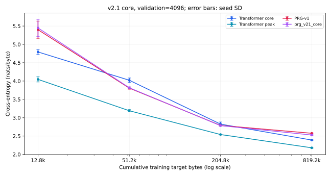
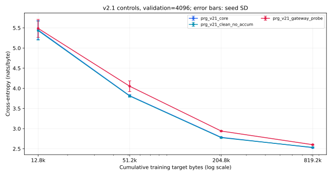
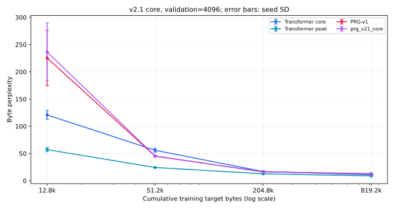
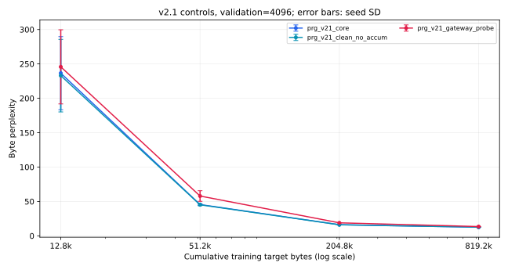
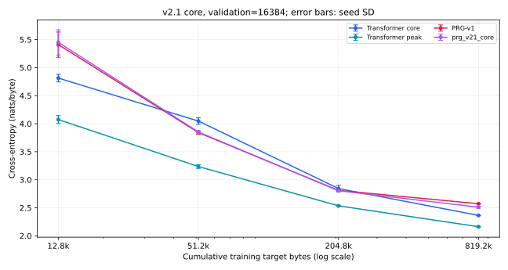
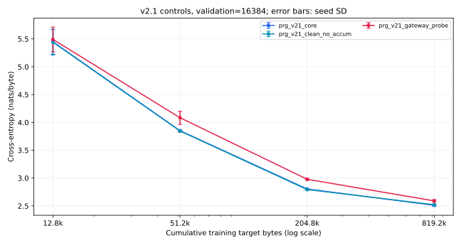
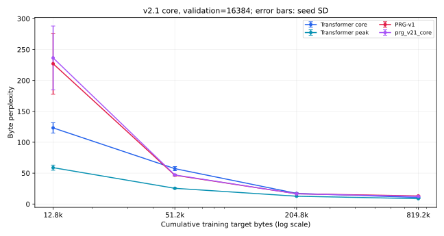
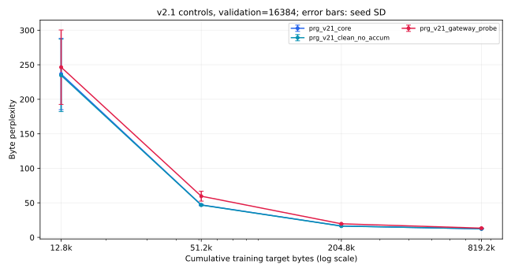

# PRG-LM v2.1 — Core Correction Study

## Executive summary

Final core sampled loss/PPL: 2.52756 ± 0.01277 / 12.52355 ± 0.16049.
Core−v1 loss=-0.04794; probe−core=0.07379; no-accum−core=0.00616.
Complete: True. New milestones complete: 36/36. No frozen baseline was retrained.
Objective: separate temporal-credit, cap/readout and gateway-opportunity limitations with minimal new mechanisms.
Main runs: core, clean_no_accum, diagnostic gateway_probe; seeds42/43/44, continuous12.8k→51.2k→204.8k→819.2k.
No final conclusions are drawn until all primary experiments finish. No dashboard/UI artifacts are modified.

## Exact architecture changes

PRGLMv21 inherits frozen v1 propagation and shared RouterNet; no topology mutation or attention. Before each token, persistent node state is pooled into K fixed node-index-mod-K channels by sum/sqrt(R*N/K), then tanh. This prefix-only context uses the existing readout projection weight without its bias and a learned scalar sigmoid gate initialized at0 (gate0.5). It is added once to normalized per-walker local readout before existing LayerNorm/vocabulary head. It is a real contextual input, not a gradient-only loss or injected gradient.

Both accumulation settings read tanh of the same current-token accumulator, with the same contextual input, router, state update, dimensions and memory convention. OFF replaces previous accumulator with incoming delta; ON adds it with the configured decay. Router features can consequently differ because accumulator contents differ. This is an intended downstream consequence, not a changed RouterNet. The added tanh is explicit and shared; the bundle comparison with v2 does not isolate the temporal fix alone.

At the hard cycle cap, remaining walkers contribute their LAST PROCESSED source accumulator message, saved before any transition. An unprocessed gateway destination is never gathered for readout. Expected routing terminates surviving mass from processed current sources before final transitions. Valid messages can cancel to zero; the eliminated artifact is reading an uninitialized destination, not a guarantee that every valid signal is nonzero.

The diagnostic probe requires >=1 GATEWAY action per walker before OUTPUT. If needed, LOCAL/RETURN are masked when only required hops plus one destination-processing cycle remain. The cycle bound must exceed minimum hops. Destinations are processed before the bound; no topology changes or auxiliary loss occur. Core has no such constraint. Expected probe routing is deliberately unavailable because its merged soft branches cannot faithfully track per-walker hop requirements. Expected core/OFF remain supplementary region-mass surrogates, not exact expectations.

## Frozen protocol and baselines

Start commit67ac23b. TinyShakespeare bytes256/context32, R32/N1024/E16/G4/K16/W2/C4/D64. AdamW lr3e-4, batch4, gradient clip1, one CPU thread per seed. Same fixed training starts/seed and validation windows as Phase A. Four cumulative training-byte milestones. Every100 optimizer steps plus milestones saves optimizer/RNG/cursor/EMA. Evaluation RNG is restored before continuing training.
4096-byte primary targets are a prefix subset of16384-byte secondary targets; these are correlated checks, not independent datasets. Original v1/v2 classes, trainers, reports/results, dashboard and checkpoints remain frozen. Existing recurrence/accumulationOFF results are shown separately and retain their documented confounds.

## Progress

| Model | Seed | 12.8k | 51.2k | 204.8k | 819.2k |
|---|---:|---|---|---|---|
| prg_v21_core | 42 | done | done | done | done |
| prg_v21_core | 43 | done | done | done | done |
| prg_v21_core | 44 | done | done | done | done |
| prg_v21_clean_no_accum | 42 | done | done | done | done |
| prg_v21_clean_no_accum | 43 | done | done | done | done |
| prg_v21_clean_no_accum | 44 | done | done | done | done |
| prg_v21_gateway_probe | 42 | done | done | done | done |
| prg_v21_gateway_probe | 43 | done | done | done | done |
| prg_v21_gateway_probe | 44 | done | done | done | done |

## Sanity tests

Python tests: 42 passed; existing33 + new9 tests. Full-shape smoke: All3 variants, seed42, full main shape,128→256 training bytes; six finite milestones. Frozen baselines not trained..
Forced direct-OUTPUT prefix activation gradient L1: v2=0; v2.1=0.608478107. Exact controlled config/seed and per-token values are in sanity.json.
Tests cover valid final-cycle source, clean one-event ON/OFF output+gradient equivalence, multi-event accumulator-only difference, per-walker probe hop+destination processing, eval state freeze, seeded save/load, exact optimizer/RNG-resume and completed-job skip. Existing v1/v2 tests remain unchanged.

## Main learning curves

Loss is nats/byte. PPL is byte-level. Mean ± sample SD; only n=3 groups support main comparisons. Expected probe is not applicable.

### Sampled validation: 4096 bytes

| Model | Training bytes | Loss | PPL | n |
|---|---:|---:|---:|---:|
| transformer_core | 12,800 | 4.79351 ± 0.06729 | 120.90696 ± 8.16229 | 3 |
| transformer_core | 51,200 | 4.02171 ± 0.06192 | 55.86751 ± 3.45336 | 3 |
| transformer_core | 204,800 | 2.82540 ± 0.05786 | 16.88664 ± 0.98020 | 3 |
| transformer_core | 819,200 | 2.39069 ± 0.00742 | 10.92120 ± 0.08093 | 3 |
| transformer_total | 12,800 | 4.04549 ± 0.07030 | 57.23185 ± 3.93969 | 3 |
| transformer_total | 51,200 | 3.19058 ± 0.03082 | 24.31008 ± 0.74253 | 3 |
| transformer_total | 204,800 | 2.54130 ± 0.00884 | 12.69651 ± 0.11196 | 3 |
| transformer_total | 819,200 | 2.17929 ± 0.01017 | 8.84030 ± 0.08968 | 3 |
| prg_v1 | 12,800 | 5.39993 ± 0.23489 | 225.39509 ± 50.91763 | 3 |
| prg_v1 | 51,200 | 3.80771 ± 0.03034 | 45.06106 ± 1.37197 | 3 |
| prg_v1 | 204,800 | 2.79025 ± 0.01602 | 16.28640 ± 0.25976 | 3 |
| prg_v1 | 819,200 | 2.57549 ± 0.00942 | 13.13818 ± 0.12353 | 3 |
| prg_v2_adaptive | 12,800 | 5.40227 ± 0.23841 | 226.04972 ± 51.90015 | 3 |
| prg_v2_adaptive | 51,200 | 3.80775 ± 0.03619 | 45.06862 ± 1.64745 | 3 |
| prg_v2_adaptive | 204,800 | 2.79282 ± 0.01017 | 16.32749 ± 0.16585 | 3 |
| prg_v2_adaptive | 819,200 | 2.59190 ± 0.00969 | 13.35557 ± 0.12965 | 3 |
| prg_v2_uniform | 12,800 | 5.40205 ± 0.23688 | 225.93600 ± 51.36361 | 3 |
| prg_v2_uniform | 51,200 | 3.80768 ± 0.04523 | 45.07660 ± 2.06260 | 3 |
| prg_v2_uniform | 204,800 | 2.79402 ± 0.00849 | 16.34707 ± 0.13889 | 3 |
| prg_v2_uniform | 819,200 | 2.58145 ± 0.00750 | 13.21648 ± 0.09932 | 3 |
| prg_v2_no_recurrence | 12,800 | 5.33881 ± 0.20492 | 211.09590 ± 40.93544 | 3 |
| prg_v2_no_recurrence | 51,200 | 3.70435 ± 0.04011 | 40.64564 ± 1.63194 | 3 |
| prg_v2_no_recurrence | 204,800 | 2.78110 ± 0.01178 | 16.13754 ± 0.18990 | 3 |
| prg_v2_no_recurrence | 819,200 | 2.58533 ± 0.00843 | 13.26804 ± 0.11189 | 3 |
| prg_v2_no_accumulation | 12,800 | 5.45347 ± 0.22415 | 237.42000 ± 51.38552 | 3 |
| prg_v2_no_accumulation | 51,200 | 3.85414 ± 0.04218 | 47.21620 ± 1.99193 | 3 |
| prg_v2_no_accumulation | 204,800 | 2.82134 ± 0.01598 | 16.80082 ± 0.26931 | 3 |
| prg_v2_no_accumulation | 819,200 | 2.60812 ± 0.01233 | 13.57426 ± 0.16775 | 3 |
| prg_v21_core | 12,800 | 5.44826 ± 0.23346 | 236.50901 ± 53.18715 | 3 |
| prg_v21_core | 51,200 | 3.81749 ± 0.02532 | 45.49961 ± 1.14645 | 3 |
| prg_v21_core | 204,800 | 2.78445 ± 0.00596 | 16.19110 ± 0.09664 | 3 |
| prg_v21_core | 819,200 | 2.52756 ± 0.01277 | 12.52355 ± 0.16049 | 3 |
| prg_v21_clean_no_accum | 12,800 | 5.43290 ± 0.23403 | 232.93607 ± 52.75215 | 3 |
| prg_v21_clean_no_accum | 51,200 | 3.80933 ± 0.02921 | 45.13290 ± 1.30714 | 3 |
| prg_v21_clean_no_accum | 204,800 | 2.77572 ± 0.01552 | 16.05142 ± 0.25010 | 3 |
| prg_v21_clean_no_accum | 819,200 | 2.53372 ± 0.01274 | 12.60097 ± 0.16113 | 3 |
| prg_v21_gateway_probe | 12,800 | 5.48781 ± 0.22353 | 245.73583 ± 53.90377 | 3 |
| prg_v21_gateway_probe | 51,200 | 4.05272 ± 0.13286 | 57.89429 ± 7.71226 | 3 |
| prg_v21_gateway_probe | 204,800 | 2.94000 ± 0.01437 | 18.91715 ± 0.27269 | 3 |
| prg_v21_gateway_probe | 819,200 | 2.60135 ± 0.01120 | 13.48248 ± 0.15075 | 3 |

### Sampled validation: 16384 bytes

| Model | Training bytes | Loss | PPL | n |
|---|---:|---:|---:|---:|
| transformer_core | 12,800 | 4.81260 ± 0.06736 | 123.23876 ± 8.36196 | 3 |
| transformer_core | 51,200 | 4.04653 ± 0.05779 | 57.26233 ± 3.30097 | 3 |
| transformer_core | 204,800 | 2.84318 ± 0.05947 | 17.19056 ± 1.02946 | 3 |
| transformer_core | 819,200 | 2.36426 ± 0.00385 | 10.63623 ± 0.04104 | 3 |
| transformer_total | 12,800 | 4.07344 ± 0.07198 | 58.85919 ± 4.15912 | 3 |
| transformer_total | 51,200 | 3.23590 ± 0.03396 | 25.43905 ± 0.85864 | 3 |
| transformer_total | 204,800 | 2.53538 ± 0.00862 | 12.62153 ± 0.10905 | 3 |
| transformer_total | 819,200 | 2.16244 ± 0.01079 | 8.69265 ± 0.09377 | 3 |
| prg_v1 | 12,800 | 5.40890 ± 0.22537 | 227.10524 ± 49.28073 | 3 |
| prg_v1 | 51,200 | 3.84125 ± 0.03106 | 46.59854 ± 1.44829 | 3 |
| prg_v1 | 204,800 | 2.80987 ± 0.01238 | 16.60859 ± 0.20522 | 3 |
| prg_v1 | 819,200 | 2.57186 ± 0.00607 | 13.09031 ± 0.07950 | 3 |
| prg_v2_adaptive | 12,800 | 5.40959 ± 0.22497 | 227.24898 ± 49.23843 | 3 |
| prg_v2_adaptive | 51,200 | 3.83511 ± 0.03054 | 46.31293 ± 1.41755 | 3 |
| prg_v2_adaptive | 204,800 | 2.81739 ± 0.01078 | 16.73373 ± 0.18004 | 3 |
| prg_v2_adaptive | 819,200 | 2.57987 ± 0.00817 | 13.19573 ± 0.10764 | 3 |
| prg_v2_uniform | 12,800 | 5.41019 ± 0.22560 | 227.40778 ± 49.42139 | 3 |
| prg_v2_uniform | 51,200 | 3.83827 ± 0.03865 | 46.46827 ± 1.81317 | 3 |
| prg_v2_uniform | 204,800 | 2.81640 ± 0.00864 | 16.71697 ± 0.14439 | 3 |
| prg_v2_uniform | 819,200 | 2.57074 ± 0.00802 | 13.07578 ± 0.10488 | 3 |
| prg_v2_no_recurrence | 12,800 | 5.33610 ± 0.20060 | 210.41749 ± 40.21695 | 3 |
| prg_v2_no_recurrence | 51,200 | 3.73645 ± 0.02981 | 41.96110 ± 1.25234 | 3 |
| prg_v2_no_recurrence | 204,800 | 2.80767 ± 0.01699 | 16.57293 ± 0.28289 | 3 |
| prg_v2_no_recurrence | 819,200 | 2.57538 ± 0.01272 | 13.13707 ± 0.16775 | 3 |
| prg_v2_no_accumulation | 12,800 | 5.46064 ± 0.22565 | 239.19451 ± 52.35482 | 3 |
| prg_v2_no_accumulation | 51,200 | 3.88098 ± 0.03373 | 48.48996 ± 1.63911 | 3 |
| prg_v2_no_accumulation | 204,800 | 2.84727 ± 0.02078 | 17.24311 ± 0.35975 | 3 |
| prg_v2_no_accumulation | 819,200 | 2.59548 ± 0.00967 | 13.40350 ± 0.12932 | 3 |
| prg_v21_core | 12,800 | 5.44952 ± 0.22539 | 236.53638 ± 51.63108 | 3 |
| prg_v21_core | 51,200 | 3.85141 ± 0.01474 | 47.06258 ± 0.69092 | 3 |
| prg_v21_core | 204,800 | 2.80382 ± 0.00494 | 16.50774 ± 0.08160 | 3 |
| prg_v21_core | 819,200 | 2.51062 ± 0.01765 | 12.31389 ± 0.21817 | 3 |
| prg_v21_clean_no_accum | 12,800 | 5.44067 ± 0.22983 | 234.61647 ± 52.44732 | 3 |
| prg_v21_clean_no_accum | 51,200 | 3.84546 ± 0.02227 | 46.78788 ± 1.03606 | 3 |
| prg_v21_clean_no_accum | 204,800 | 2.79326 ± 0.01171 | 16.33492 ± 0.19188 | 3 |
| prg_v21_clean_no_accum | 819,200 | 2.52123 ± 0.00428 | 12.44400 ± 0.05336 | 3 |
| prg_v21_gateway_probe | 12,800 | 5.49086 ± 0.22363 | 246.48009 ± 53.90929 | 3 |
| prg_v21_gateway_probe | 51,200 | 4.08365 ± 0.11921 | 59.64469 ± 7.15472 | 3 |
| prg_v21_gateway_probe | 204,800 | 2.97861 ± 0.01946 | 19.66293 ± 0.38478 | 3 |
| prg_v21_gateway_probe | 819,200 | 2.58951 ± 0.02502 | 13.32605 ± 0.33103 | 3 |

## Supplementary argmax / expected

| Model | Training bytes | Validation bytes | Mode | Loss | PPL | n |
|---|---:|---:|---|---:|---:|---:|
| prg_v21_core | 12,800 | 4096 | argmax | 5.28861 ± 0.20359 | 200.75897 ± 39.44387 | 3 |
| prg_v21_core | 12,800 | 4096 | expected | 5.32850 ± 0.23757 | 209.91665 ± 47.45858 | 3 |
| prg_v21_core | 12,800 | 16384 | argmax | 5.29292 ± 0.19015 | 201.28437 ± 37.07818 | 3 |
| prg_v21_core | 12,800 | 16384 | expected | 5.33086 ± 0.22849 | 210.13181 ± 45.82310 | 3 |
| prg_v21_core | 51,200 | 4096 | argmax | 3.78986 ± 0.02549 | 44.25967 ± 1.12307 | 3 |
| prg_v21_core | 51,200 | 4096 | expected | 3.79732 ± 0.02319 | 44.58970 ± 1.03544 | 3 |
| prg_v21_core | 51,200 | 16384 | argmax | 3.82120 ± 0.01646 | 45.66321 ± 0.75066 | 3 |
| prg_v21_core | 51,200 | 16384 | expected | 3.82904 ± 0.01314 | 46.02082 ± 0.60521 | 3 |
| prg_v21_core | 204,800 | 4096 | argmax | 2.78266 ± 0.00567 | 16.16219 ± 0.09171 | 3 |
| prg_v21_core | 204,800 | 4096 | expected | 2.80146 ± 0.00526 | 16.46884 ± 0.08667 | 3 |
| prg_v21_core | 204,800 | 16384 | argmax | 2.80173 ± 0.00455 | 16.47316 ± 0.07505 | 3 |
| prg_v21_core | 204,800 | 16384 | expected | 2.82195 ± 0.00245 | 16.80956 ± 0.04114 | 3 |
| prg_v21_core | 819,200 | 4096 | argmax | 2.52730 ± 0.01226 | 12.52033 ± 0.15392 | 3 |
| prg_v21_core | 819,200 | 4096 | expected | 2.56416 ± 0.01358 | 12.99052 ± 0.17713 | 3 |
| prg_v21_core | 819,200 | 16384 | argmax | 2.51028 ± 0.01750 | 12.30961 ± 0.21627 | 3 |
| prg_v21_core | 819,200 | 16384 | expected | 2.54722 ± 0.01930 | 12.77319 ± 0.24766 | 3 |
| prg_v21_clean_no_accum | 12,800 | 4096 | argmax | 5.31635 ± 0.19007 | 206.04090 ± 37.57842 | 3 |
| prg_v21_clean_no_accum | 12,800 | 4096 | expected | 5.33647 ± 0.23945 | 211.65271 ± 48.14782 | 3 |
| prg_v21_clean_no_accum | 12,800 | 16384 | argmax | 5.31762 ± 0.18083 | 206.08014 ± 35.93447 | 3 |
| prg_v21_clean_no_accum | 12,800 | 16384 | expected | 5.33814 ± 0.22971 | 211.70260 ± 46.35406 | 3 |
| prg_v21_clean_no_accum | 51,200 | 4096 | argmax | 3.78410 ± 0.02606 | 44.00613 ± 1.13825 | 3 |
| prg_v21_clean_no_accum | 51,200 | 4096 | expected | 3.78680 ± 0.02168 | 44.12197 ± 0.95172 | 3 |
| prg_v21_clean_no_accum | 51,200 | 16384 | argmax | 3.81710 ± 0.01954 | 45.47778 ± 0.88411 | 3 |
| prg_v21_clean_no_accum | 51,200 | 16384 | expected | 3.81837 ± 0.01460 | 45.53295 ± 0.66219 | 3 |
| prg_v21_clean_no_accum | 204,800 | 4096 | argmax | 2.77368 ± 0.01360 | 16.01844 ± 0.21860 | 3 |
| prg_v21_clean_no_accum | 204,800 | 4096 | expected | 2.78108 ± 0.01006 | 16.13696 ± 0.16274 | 3 |
| prg_v21_clean_no_accum | 204,800 | 16384 | argmax | 2.79210 ± 0.01054 | 16.31581 ± 0.17225 | 3 |
| prg_v21_clean_no_accum | 204,800 | 16384 | expected | 2.79535 ± 0.00818 | 16.36874 ± 0.13420 | 3 |
| prg_v21_clean_no_accum | 819,200 | 4096 | argmax | 2.53153 ± 0.01112 | 12.57330 ± 0.14027 | 3 |
| prg_v21_clean_no_accum | 819,200 | 4096 | expected | 2.58369 ± 0.01518 | 13.24693 ± 0.20073 | 3 |
| prg_v21_clean_no_accum | 819,200 | 16384 | argmax | 2.51932 ± 0.00543 | 12.42021 ± 0.06739 | 3 |
| prg_v21_clean_no_accum | 819,200 | 16384 | expected | 2.57121 ± 0.00964 | 13.08201 ± 0.12571 | 3 |
| prg_v21_gateway_probe | 12,800 | 4096 | argmax | 5.42978 ± 0.28059 | 234.03291 ± 63.57321 | 3 |
| prg_v21_gateway_probe | 12,800 | 16384 | argmax | 5.43148 ± 0.27292 | 234.08282 ± 61.42507 | 3 |
| prg_v21_gateway_probe | 51,200 | 4096 | argmax | 4.03964 ± 0.12995 | 57.12489 ± 7.36747 | 3 |
| prg_v21_gateway_probe | 51,200 | 16384 | argmax | 4.07564 ± 0.12226 | 59.18311 ± 7.26298 | 3 |
| prg_v21_gateway_probe | 204,800 | 4096 | argmax | 2.93325 ± 0.00971 | 18.78910 ± 0.18243 | 3 |
| prg_v21_gateway_probe | 204,800 | 16384 | argmax | 2.96992 ± 0.01520 | 19.49180 ± 0.29752 | 3 |
| prg_v21_gateway_probe | 819,200 | 4096 | argmax | 2.58896 ± 0.01081 | 13.31646 ± 0.14396 | 3 |
| prg_v21_gateway_probe | 819,200 | 16384 | argmax | 2.57828 ± 0.02267 | 13.17673 ± 0.29676 | 3 |

## Late scaling slope

Loss delta / ln(819200/204800); more negative is faster improvement. Finite interval, not an asymptotic scaling law.
| Model | Validation bytes | Loss slope | n |
|---|---:|---:|---:|
| transformer_core | 4096 | -0.31358 ± 0.03804 | 3 |
| transformer_core | 16384 | -0.34546 ± 0.04335 | 3 |
| transformer_total | 4096 | -0.26114 ± 0.00153 | 3 |
| transformer_total | 16384 | -0.26902 ± 0.00516 | 3 |
| prg_v1 | 4096 | -0.15491 ± 0.00527 | 3 |
| prg_v1 | 16384 | -0.17169 ± 0.00803 | 3 |
| prg_v2_adaptive | 4096 | -0.14493 ± 0.00803 | 3 |
| prg_v2_adaptive | 16384 | -0.17133 ± 0.00194 | 3 |
| prg_v2_uniform | 4096 | -0.15334 ± 0.01139 | 3 |
| prg_v2_uniform | 16384 | -0.17721 ± 0.01201 | 3 |
| prg_v2_no_recurrence | 4096 | -0.14122 ± 0.01457 | 3 |
| prg_v2_no_recurrence | 16384 | -0.16756 ± 0.01924 | 3 |
| prg_v2_no_accumulation | 4096 | -0.15380 ± 0.01971 | 3 |
| prg_v2_no_accumulation | 16384 | -0.18162 ± 0.02196 | 3 |
| prg_v21_core | 4096 | -0.18531 ± 0.01194 | 3 |
| prg_v21_core | 16384 | -0.21150 ± 0.01411 | 3 |
| prg_v21_clean_no_accum | 4096 | -0.17456 ± 0.01739 | 3 |
| prg_v21_clean_no_accum | 16384 | -0.19623 ± 0.01008 | 3 |
| prg_v21_gateway_probe | 4096 | -0.24428 ± 0.01767 | 3 |
| prg_v21_gateway_probe | 16384 | -0.28067 ± 0.03202 | 3 |

## Gateway utilization

New held-out routing metrics cover ALL4096 primary validation bytes with sampled routing. Training columns are EMA counts normalized into fractions. Direct OUTPUT is the fraction of tokens where ALL initial walkers output at cycle1; first-cycle OUTPUT additionally reports walker fraction in JSON. Trajectory length is actions/walker; cycles/token and unique Regions/token are separate.
| Model | Training bytes | Train EMA gateway % | Held-out gateway % | Gateway tokens % | Hops/token | Direct OUTPUT % | Actions/walker | Unique Regions/token |
|---|---:|---:|---:|---:|---:|---:|---:|---:|
| prg_v21_core (n=3) | 12,800 | 59.85594 ± 2.96646 | 58.63952 ± 2.95078 | 92.29329 ± 0.72190 | 3.36125 ± 0.17205 | 5.28971 ± 0.16256 | 2.86597 ± 0.01190 | 4.62394 ± 0.15959 |
| prg_v21_core (n=3) | 51,200 | 12.17610 ± 5.36157 | 10.10972 ± 4.65379 | 19.63704 ± 9.40960 | 0.23739 ± 0.12439 | 77.09147 ± 10.39885 | 1.15059 ± 0.07726 | 2.22673 ± 0.11338 |
| prg_v21_core (n=3) | 204,800 | 0.74339 ± 0.21142 | 0.97475 ± 0.54018 | 1.91243 ± 1.08974 | 0.01978 ± 0.01103 | 97.74577 ± 1.22954 | 1.01217 ± 0.00605 | 2.01864 ± 0.00978 |
| prg_v21_core (n=3) | 819,200 | 0.54837 ± 0.17833 | 0.22261 ± 0.21705 | 0.34180 ± 0.31926 | 0.00448 ± 0.00438 | 99.60938 ± 0.34180 | 1.00338 ± 0.00305 | 2.00423 ± 0.00395 |
| prg_v21_clean_no_accum (n=3) | 12,800 | 60.07457 ± 2.67241 | 59.01321 ± 2.63328 | 92.52116 ± 0.55797 | 3.39299 ± 0.14682 | 5.17578 ± 0.06459 | 2.87496 ± 0.02564 | 4.64551 ± 0.14706 |
| prg_v21_clean_no_accum (n=3) | 51,200 | 11.38881 ± 4.56237 | 9.57252 ± 2.84111 | 18.35124 ± 5.62978 | 0.22062 ± 0.07574 | 78.19010 ± 6.59371 | 1.14278 ± 0.04900 | 2.21419 ± 0.07359 |
| prg_v21_clean_no_accum (n=3) | 204,800 | 0.86702 ± 0.24289 | 0.94045 ± 0.64289 | 1.76595 ± 1.19836 | 0.01912 ± 0.01320 | 97.82715 ± 1.61631 | 1.01253 ± 0.00928 | 2.01831 ± 0.01305 |
| prg_v21_clean_no_accum (n=3) | 819,200 | 1.42073 ± 0.60651 | 1.13250 ± 0.63496 | 1.71712 ± 0.93456 | 0.02311 ± 0.01307 | 97.87598 ± 0.97013 | 1.01746 ± 0.00842 | 2.02091 ± 0.01150 |
| prg_v21_gateway_probe (n=3) | 12,800 | 66.13807 ± 3.26182 | 65.55909 ± 3.03297 | 100.00000 ± 0.00000 | 4.64657 ± 0.17355 | 0.00000 ± 0.00000 | 3.54488 ± 0.04817 | 5.59945 ± 0.16892 |
| prg_v21_gateway_probe (n=3) | 51,200 | 51.07506 ± 1.29555 | 50.58976 ± 1.23655 | 100.00000 ± 0.00000 | 2.63802 ± 0.07580 | 0.00000 ± 0.00000 | 2.60828 ± 0.09622 | 4.42896 ± 0.04496 |
| prg_v21_gateway_probe (n=3) | 204,800 | 50.09398 ± 0.13231 | 50.11632 ± 0.08907 | 100.00000 ± 0.00000 | 2.01449 ± 0.00833 | 0.00000 ± 0.00000 | 2.00981 ± 0.00581 | 3.95223 ± 0.03239 |
| prg_v21_gateway_probe (n=3) | 819,200 | 49.79967 ± 0.16214 | 49.81305 ± 0.14145 | 100.00000 ± 0.00000 | 2.00326 ± 0.00134 | 0.00000 ± 0.00000 | 2.01078 ± 0.00510 | 3.92399 ± 0.06225 |
Frozen v2 reported adaptive training-EMA gateway fractions0.04–0.07% at final. Its saved held-out trace covers32 bytes, unlike the new4096-byte accounting; do not equate different sample sizes. Existing route traces/visit statistics and frozen source references remain in results.json.

## Clean accumulation and gateway probe

Paired per-seed sampled loss deltas relative to core; positive is worse. Clean OFF changes only accumulator update rule; probe is diagnostic, not the main architecture.
| Condition − core | Training bytes | Validation bytes | Loss delta | Per-seed deltas |
|---|---:|---:|---:|---|
| prg_v21_clean_no_accum − core | 12,800 | 4096 | -0.01536 ± 0.00572 | {42: -0.01077684760093689, 43: -0.021776467561721802, 44: -0.013532370328903198} |
| prg_v21_clean_no_accum − core | 12,800 | 16384 | -0.00886 ± 0.00748 | {42: -0.0005825906991958618, 43: -0.015139378607273102, 44: -0.0108523890376091} |
| prg_v21_clean_no_accum − core | 51,200 | 4096 | -0.00816 ± 0.00695 | {42: -0.0003829002380371094, 43: -0.010353922843933105, 44: -0.013749286532402039} |
| prg_v21_clean_no_accum − core | 51,200 | 16384 | -0.00595 ± 0.00980 | {42: 0.004753325134515762, 43: -0.008094049990177155, 44: -0.014498740434646606} |
| prg_v21_clean_no_accum − core | 204,800 | 4096 | -0.00873 ± 0.00966 | {42: 0.0022342801094055176, 43: -0.015987053513526917, 44: -0.012446701526641846} |
| prg_v21_clean_no_accum − core | 204,800 | 16384 | -0.01056 ± 0.00700 | {42: -0.0029979124665260315, 43: -0.01682063192129135, 44: -0.011868961155414581} |
| prg_v21_clean_no_accum − core | 819,200 | 4096 | 0.00616 ± 0.02152 | {42: 0.006343096494674683, 43: -0.01544797420501709, 44: 0.02759431302547455} |
| prg_v21_clean_no_accum − core | 819,200 | 16384 | 0.01061 ± 0.01339 | {42: 0.01573704183101654, 43: -0.004587635397911072, 44: 0.020677216351032257} |
| prg_v21_gateway_probe − core | 12,800 | 4096 | 0.03955 ± 0.02268 | {42: 0.04427310824394226, 43: 0.01487642526626587, 44: 0.05949470400810242} |
| prg_v21_gateway_probe − core | 12,800 | 16384 | 0.04133 ± 0.01148 | {42: 0.0474463626742363, 43: 0.02808558940887451, 44: 0.04846075177192688} |
| prg_v21_gateway_probe − core | 51,200 | 4096 | 0.23523 ± 0.11776 | {42: 0.3644055426120758, 43: 0.20745070278644562, 44: 0.13384544849395752} |
| prg_v21_gateway_probe − core | 51,200 | 16384 | 0.23224 ± 0.10917 | {42: 0.3506612665951252, 43: 0.2104596197605133, 44: 0.13560493662953377} |
| prg_v21_gateway_probe − core | 204,800 | 4096 | 0.15555 ± 0.01920 | {42: 0.13706770539283752, 43: 0.1541953682899475, 44: 0.1753873974084854} |
| prg_v21_gateway_probe − core | 204,800 | 16384 | 0.17479 ± 0.02276 | {42: 0.15627463907003403, 43: 0.16788573563098907, 44: 0.20019982010126114} |
| prg_v21_gateway_probe − core | 819,200 | 4096 | 0.07379 ± 0.00903 | {42: 0.08421348035335541, 43: 0.06885726749897003, 44: 0.0683070719242096} |
| prg_v21_gateway_probe − core | 819,200 | 16384 | 0.07889 ± 0.01768 | {42: 0.09832992404699326, 43: 0.074556153267622, 44: 0.0637815035879612} |

## Memory

Same inherited modeled inference-state convention for all new variants. Extra static: scalar gate4 bytes. Extra peak: gate4 + prefix-context64 + last-valid source128 + hop counters8 =204 bytes for the main shape. These numbers exclude allocator/autograd/operator workspaces; actual model export still stores FP32 edge latents. Existing Transformer position-embedding double-count audit is preserved in the v2 report; no baseline sizes are retuned.
| Model | Static packed | Modeled peak | Actual export bytes | Routing stats training bytes | Optimizer tensor bytes |
|---|---:|---:|---:|---:|---:|
| prg_v21_core | 220864 | 483602 | 2195328.00000 ± 0.00000 | 240 | 4373764 |
| prg_v21_clean_no_accum | 220864 | 483602 | 2195328.00000 ± 0.00000 | 240 | 4373764 |
| prg_v21_gateway_probe | 220864 | 483602 | 2195328.00000 ± 0.00000 | 240 | 4373764 |
Full memory component breakdown, checkpoint identifiers, stream hashes, training EMA/cumulative and every routing mode are in [results.json](results.json). Full optimizer/RNG/resume checkpoints remain under ignored runs/v2_1; no large model exports are committed.

## Interpretation and known limits

The core correction bundles temporal context, common tanh readout and cap semantics; its validation improvement cannot be attributed solely to one correction. Fixed global context pooling can itself bypass graph traversal, so better LM results alone do not prove useful gateways. Gateway probe simultaneously removes early OUTPUT shortcuts and changes compute/trajectory, preventing a pure causal estimate of gateway usefulness. Even improved recurrence would require separate low-bit/precision-matched controls before supporting precision replacement.
Hard top-k/node selection remains nondifferentiable and training uses a straight-through route surrogate. Fixed context32/window resets, one corpus, three seeds and finite budget restrict generalization. Modeled memory is not measured physical memory. No hardware, packed execution or topology mutation is introduced. No hyperparameters, validation targets or seeds are tuned to emerging results.

## Final research questions

1. Forced direct-OUTPUT prefix gradients survive: final core seeds=[1.621573120355606, 1.8543513417243958, 2.4788162112236023]. Initial before/after values are above; full ST gradient is a different diagnostic.
2. Core correction bundle final loss=2.52756 ± 0.01277, PPL=12.52355 ± 0.16049; loss delta vs v1=-0.04794, vs adaptive v2=-0.06435. Negative means improvement; bundle cannot isolate the temporal fix alone.
3. Late loss/log-byte slope: core=-0.18531, v1=-0.15491, v2=-0.14493. Core late improvement is faster.
4. The finite-budget plateau is partly alleviated by these measurements. No claim about asymptotic capacity follows.
5. Unprocessed-destination cap reads are removed by construction and controlled tests in hard and expected core engines. Valid signal cancellation remains possible; this is not a universal guarantee of nonzero logits.
6. Natural gateway action %: training EMA=0.54837 ± 0.17833, held-out=0.22261 ± 0.21705. Training mean is above the old0.04–0.07% range; compare all seeds, not different sample scopes. No significance test or matched old full-validation trajectory sample is claimed.
7. Diagnostic probe loss minus core=0.07379 ± 0.00903; PPL=13.48248 ± 0.15075. Constraint guarantees opportunity; actual utilization and prefix diagnostics are recorded for every seed.
8. The probe is worse/equal and provides no measured gateway-opportunity benefit here. Blocked early OUTPUT and extra processing remain confounds; neither contrast proves traversal causality.
9. Clean no-accum minus core loss=0.00616 ± 0.02152; measured contrast favors accumulation ON. Paired-seed magnitudes above limit confidence; this is cleaner than the frozen v2 OFF readout comparison.
10. These controls test contextual/readout and gateway mechanisms, not replacement of numerical precision. The original precision-for-recurrence hypothesis remains unestablished. Sparse-graph usefulness must be supported by consistent probe/natural traversal benefits rather than a context-only improvement.
11. These controls do not yet justify another main mutation sweep. Separate contextual-bypass and OUTPUT-timing controls before claiming topology usefulness.
12. Preserve negative results. Prioritize a factorial correction control and sparse contextual routing if the global context path dominates; reconsider this architecture before expensive scaling when gateway utility remains absent.

