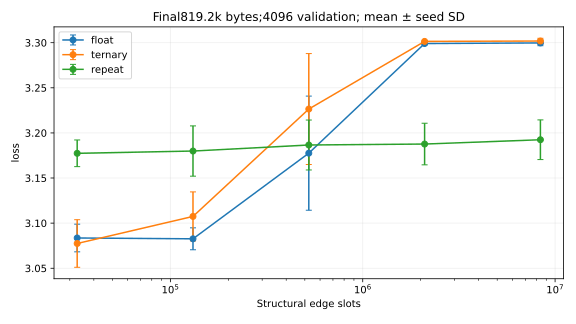
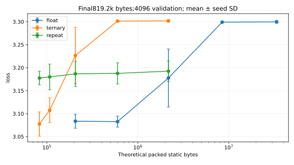
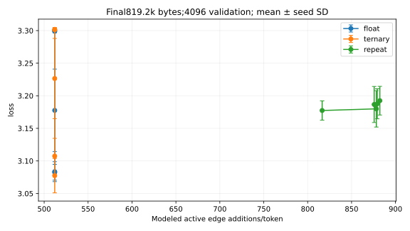
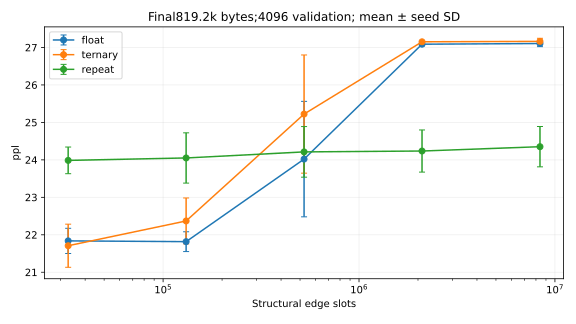
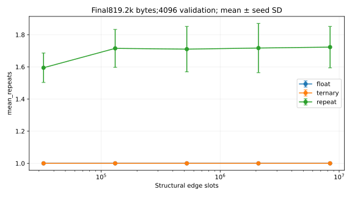
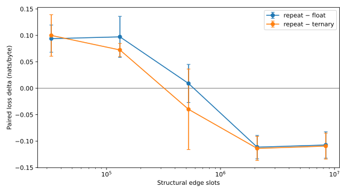

# PRG-LM v3 — Same-Edge Repetition Scaling Study

Complete: True; 180/180 primary milestone results; 0 recorded failed/resource-limited jobs.
Hypothesis: Can additive temporal reuse of the SAME low-bit source/destination/slot replace part of stored numerical magnitude, and become more favorable with graph scale? No conclusion is presumed.

## Exact architecture

The graph stores N nodes ×32 relative-offset edge slots. Sixteen source nodes are selected by a fixed causal rolling prefix hash and source stride37. The shared relative offset template is (slot+1)*2654435761 mod N. Node counts are powers of two, so slots/destinations and activated sources are unique. Float and ternary families use identical identities at the same scale.

Current-byte embedding plus0.9 times the previous graph-produced16-channel state creates one tanh source message. Source, destination, slot, reference message and edge value remain frozen throughout its repetition episode. First pass adds sign*message; each REPEAT adds that SAME value again. A six-feature shared6→16→1 controller predicts continuation from reference, |reference|, sign, normalized source/destination and repeat index. It has129 parameters independent of N; there are no edge-specific recurrence parameters/probability buffers. Bernoulli logistic-noise straight-through gates train bounded repetition; inference samples Bernoulli gates. Maximum repeat8.

Per-edge linear accumulators are reduced into destination-index-mod16 channels with fixed1/sqrt(32) scaling, followed by tanh, existing-sized readout and tied byte head. There is no LayerNorm to erase a uniform repetition magnitude. The next token's persistent state is ONLY graph-produced output: zero graph values eliminate token/prefix influence. There is no direct embedding/context-to-head residual, attention, global contextual pooling, Region/router/gateway/fatigue/mutation.

This is a compact16-channel causal state with hashed sparse connectivity, not persistent independent state for every stored node. Address aliasing and the compressed destination readout restrict the model class; conclusions do not cover all graph architectures. Nonlinear LM equivalence is not assumed from linear k*s*m equality. The controller is shared but high-precision, so gains alone do not prove an efficient replacement for arbitrary stored magnitude.

## Preregistered protocol

CPU/CUDA/MPS auto selection; this environment has2 CPU cores and8GB memory. Two worker processes, one PyTorch thread each. Families: Float32 single pass, ternary single pass, ternary shared learned repetition. No Transformer is retrained/reused as a falsely matched v3 baseline.
TinyShakespeare, first90%/last10% split, byte256, context32, seeds42/43/44. Continuous12.8k→51.2k→204.8k→819.2k training bytes, same hashed stream/seed. AdamW neural blocks + SparseAdam edge latents, lr3e-4, shared combined gradient clip1. SparseAdam has no weight decay in every family. Dense moments are training-only. This is FIXED-DATA-BUDGET scaling: large graphs can be undertrained.
Primary held-out sampled routing4096 bytes, secondary16384 prefix-correlated bytes; identical windows to prior studies. Controller p=.5 initially, logistic-noise hard/ST training. Inference uses sampled counts. Conditional probabilities depend on fixed reference/sign/addresses/index, never on freshly transformed repeated messages.
Bounds/resource limits are fixed in configs/repetition_scaling.json before training. No scales/seeds/hyperparameters are selected from emerging validation. Planned S0–S4 only; S5 is not planned. Resource-limited jobs remain visible with incomplete cells.

## Scale and memory rules

| Scale | Nodes | Slots/node | Stored edges |
|---|---:|---:|---:|
| S0 | 1,024 | 32 | 32,768 |
| S1 | 4,096 | 32 | 131,072 |
| S2 | 16,384 | 32 | 524,288 |
| S3 | 65,536 | 32 | 2,097,152 |
| S4 | 262,144 | 32 | 8,388,608 |
Float structural storage isFP32 (4 bytes), low-bit structural storage2 bits. Other neural blocks/controller areFP32; unused controller is retained/frozen in single-pass controls so repeatOFF is architecturally matched. Low-bit training storesFP32 latents. Actual inference exports pack ternary codes into2 bits but this PyTorch executor DECOMPRESSES toFP32; serialized savings are not resident-memory/speed savings.
Modeled dynamic state assumes streaming controllers: persistent16-channel state, hash/source addresses, frozen edge reference/accumulator and counters. Actual batched probability/feature/gradient workspaces are excluded. Both training and current inference batch all candidate gates, including inactive lanes. Theoretical active additions do NOT equal executed GPU/CPU FLOPs. Actual FP32 tensors, process peak RSS, CUDA allocated/reserved when available, optimizer bytes and export/resume sizes are separately recorded.

## Progress

| Family | Scale | Seed42 | Seed43 | Seed44 | Final complete |
|---|---|---:|---:|---:|---|
| float | S0 | 819200 | 819200 | 819200 | True |
| ternary | S0 | 819200 | 819200 | 819200 | True |
| repeat | S0 | 819200 | 819200 | 819200 | True |
| float | S1 | 819200 | 819200 | 819200 | True |
| ternary | S1 | 819200 | 819200 | 819200 | True |
| repeat | S1 | 819200 | 819200 | 819200 | True |
| float | S2 | 819200 | 819200 | 819200 | True |
| ternary | S2 | 819200 | 819200 | 819200 | True |
| repeat | S2 | 819200 | 819200 | 819200 | True |
| float | S3 | 819200 | 819200 | 819200 | True |
| ternary | S3 | 819200 | 819200 | 819200 | True |
| repeat | S3 | 819200 | 819200 | 819200 | True |
| float | S4 | 819200 | 819200 | 819200 | True |
| ternary | S4 | 819200 | 819200 | 819200 | True |
| repeat | S4 | 819200 | 819200 | 819200 | True |

## Sanity tests

52 tests passed (including all previous tests). Three full-shape smoke families completed; additive maximum absolute error9.54e-7, nonzero prefix activation gradients, exact two-optimizer/RNG resume and causal-prefix invariance verified.
Signed additive1/2/4/8 equality, locked edge identities, frozen messages, prefix credit, zero-graph bypass test, causal prefix invariance, no-repeat equivalence, packed export/save-load and two-optimizer/RNG-resume are checked. Full exact values/configs are in sanity.json.

## Learning curves

| Family | Scale | Training bytes | Validation bytes | Loss | Byte PPL | n |
|---|---|---:|---:|---:|---:|---:|
| float | S0 | 12,800 | 4096 | 5.47274 ± 0.01814 | 238.13702 ± 4.30568 | 3 |
| float | S0 | 12,800 | 16384 | 5.47555 ± 0.02026 | 238.81522 ± 4.81976 | 3 |
| float | S0 | 51,200 | 4096 | 5.16368 ± 0.03683 | 174.88440 ± 6.37769 | 3 |
| float | S0 | 51,200 | 16384 | 5.17035 ± 0.03843 | 176.06316 ± 6.69575 | 3 |
| float | S0 | 204,800 | 4096 | 3.30587 ± 0.00623 | 27.27252 ± 0.17030 | 3 |
| float | S0 | 204,800 | 16384 | 3.35969 ± 0.00602 | 28.78049 ± 0.17340 | 3 |
| float | S0 | 819,200 | 4096 | 3.08353 ± 0.01534 | 21.83711 ± 0.33618 | 3 |
| float | S0 | 819,200 | 16384 | 3.10628 ± 0.01940 | 22.34068 ± 0.43583 | 3 |
| float | S1 | 12,800 | 4096 | 5.47249 ± 0.01807 | 238.07720 ± 4.29264 | 3 |
| float | S1 | 12,800 | 16384 | 5.47499 ± 0.01930 | 238.67717 ± 4.59847 | 3 |
| float | S1 | 51,200 | 4096 | 5.16432 ± 0.03606 | 174.99339 ± 6.25297 | 3 |
| float | S1 | 51,200 | 16384 | 5.17032 ± 0.03724 | 176.05277 ± 6.49326 | 3 |
| float | S1 | 204,800 | 4096 | 3.41607 ± 0.08305 | 30.52062 ± 2.59231 | 3 |
| float | S1 | 204,800 | 16384 | 3.46567 ± 0.08206 | 32.07082 ± 2.69020 | 3 |
| float | S1 | 819,200 | 4096 | 3.08262 ± 0.01217 | 21.81651 ± 0.26452 | 3 |
| float | S1 | 819,200 | 16384 | 3.09970 ± 0.00876 | 22.19181 ± 0.19399 | 3 |
| float | S2 | 12,800 | 4096 | 5.47305 ± 0.02030 | 238.21753 ± 4.81811 | 3 |
| float | S2 | 12,800 | 16384 | 5.47580 ± 0.01948 | 238.87123 ± 4.64100 | 3 |
| float | S2 | 51,200 | 4096 | 5.16549 ± 0.03950 | 175.21326 ± 6.85038 | 3 |
| float | S2 | 51,200 | 16384 | 5.17160 ± 0.03858 | 176.28251 ± 6.73309 | 3 |
| float | S2 | 204,800 | 4096 | 3.50565 ± 0.02945 | 33.31274 ± 0.97379 | 3 |
| float | S2 | 204,800 | 16384 | 3.55093 ± 0.02896 | 34.85539 ± 1.00176 | 3 |
| float | S2 | 819,200 | 4096 | 3.17757 ± 0.06327 | 24.02069 ± 1.54089 | 3 |
| float | S2 | 819,200 | 16384 | 3.22349 ± 0.06961 | 25.15666 ± 1.78015 | 3 |
| float | S3 | 12,800 | 4096 | 5.47415 ± 0.01970 | 238.47732 ± 4.68217 | 3 |
| float | S3 | 12,800 | 16384 | 5.47601 ± 0.01977 | 238.92253 ± 4.70983 | 3 |
| float | S3 | 51,200 | 4096 | 5.16643 ± 0.03821 | 175.37198 ± 6.63668 | 3 |
| float | S3 | 51,200 | 16384 | 5.17162 ± 0.03822 | 176.28473 ± 6.67127 | 3 |
| float | S3 | 204,800 | 4096 | 3.50762 ± 0.02849 | 33.37760 ± 0.94451 | 3 |
| float | S3 | 204,800 | 16384 | 3.55109 ± 0.02832 | 34.86061 ± 0.97974 | 3 |
| float | S3 | 819,200 | 4096 | 3.29907 ± 0.00160 | 27.08733 ± 0.04345 | 3 |
| float | S3 | 819,200 | 16384 | 3.35217 ± 0.00093 | 28.56468 ± 0.02671 | 3 |
| float | S4 | 12,800 | 4096 | 5.47570 ± 0.02352 | 238.86229 ± 5.60544 | 3 |
| float | S4 | 12,800 | 16384 | 5.47557 ± 0.02190 | 238.82566 ± 5.21568 | 3 |
| float | S4 | 51,200 | 4096 | 5.16791 ± 0.04129 | 175.64747 ± 7.18387 | 3 |
| float | S4 | 51,200 | 16384 | 5.17151 ± 0.04004 | 176.27459 ± 6.98776 | 3 |
| float | S4 | 204,800 | 4096 | 3.50836 ± 0.02840 | 33.40242 ± 0.94433 | 3 |
| float | S4 | 204,800 | 16384 | 3.55157 ± 0.02876 | 34.87764 ± 0.99579 | 3 |
| float | S4 | 819,200 | 4096 | 3.29974 ± 0.00306 | 27.10579 ± 0.08279 | 3 |
| float | S4 | 819,200 | 16384 | 3.35255 ± 0.00143 | 28.57548 ± 0.04091 | 3 |
| ternary | S0 | 12,800 | 4096 | 5.47929 ± 0.01728 | 239.69913 ± 4.12456 | 3 |
| ternary | S0 | 12,800 | 16384 | 5.48194 ± 0.01930 | 240.34264 ± 4.61983 | 3 |
| ternary | S0 | 51,200 | 4096 | 5.17522 ± 0.03569 | 176.90963 ± 6.25091 | 3 |
| ternary | S0 | 51,200 | 16384 | 5.18158 ± 0.03701 | 178.04528 ± 6.52272 | 3 |
| ternary | S0 | 204,800 | 4096 | 3.36362 ± 0.02898 | 28.90165 ± 0.83111 | 3 |
| ternary | S0 | 204,800 | 16384 | 3.41444 ± 0.02688 | 30.40706 ± 0.81081 | 3 |
| ternary | S0 | 819,200 | 4096 | 3.07744 ± 0.02638 | 21.70792 ± 0.57565 | 3 |
| ternary | S0 | 819,200 | 16384 | 3.09430 ± 0.03415 | 22.08045 ± 0.75919 | 3 |
| ternary | S1 | 12,800 | 4096 | 5.47777 ± 0.01816 | 239.33898 ± 4.33542 | 3 |
| ternary | S1 | 12,800 | 16384 | 5.48134 ± 0.01982 | 240.20019 ± 4.74647 | 3 |
| ternary | S1 | 51,200 | 4096 | 5.17497 ± 0.03600 | 176.86774 ± 6.30747 | 3 |
| ternary | S1 | 51,200 | 16384 | 5.18107 ± 0.03710 | 177.95419 ± 6.53710 | 3 |
| ternary | S1 | 204,800 | 4096 | 3.43531 ± 0.07421 | 31.09879 ± 2.35162 | 3 |
| ternary | S1 | 204,800 | 16384 | 3.48298 ± 0.07346 | 32.61608 ± 2.44031 | 3 |
| ternary | S1 | 819,200 | 4096 | 3.10743 ± 0.02721 | 22.36916 ± 0.61346 | 3 |
| ternary | S1 | 819,200 | 16384 | 3.12994 ± 0.04392 | 22.88755 ± 1.01733 | 3 |
| ternary | S2 | 12,800 | 4096 | 5.47856 ± 0.02116 | 239.53692 ± 5.04924 | 3 |
| ternary | S2 | 12,800 | 16384 | 5.48237 ± 0.02014 | 240.44790 ± 4.82895 | 3 |
| ternary | S2 | 51,200 | 4096 | 5.17622 ± 0.03968 | 177.10481 ± 6.95754 | 3 |
| ternary | S2 | 51,200 | 16384 | 5.18329 ± 0.03849 | 178.35507 ± 6.79892 | 3 |
| ternary | S2 | 204,800 | 4096 | 3.51603 ± 0.03077 | 33.66124 ± 1.02888 | 3 |
| ternary | S2 | 204,800 | 16384 | 3.56062 ± 0.02951 | 35.19516 ± 1.03145 | 3 |
| ternary | S2 | 819,200 | 4096 | 3.22646 ± 0.06150 | 25.22253 ± 1.57713 | 3 |
| ternary | S2 | 819,200 | 16384 | 3.27491 ± 0.06613 | 26.47987 ± 1.78282 | 3 |
| ternary | S3 | 12,800 | 4096 | 5.48058 ± 0.01991 | 240.01841 ± 4.76602 | 3 |
| ternary | S3 | 12,800 | 16384 | 5.48251 ± 0.02017 | 240.48099 ± 4.83514 | 3 |
| ternary | S3 | 51,200 | 4096 | 5.17843 ± 0.03824 | 177.49035 ± 6.72668 | 3 |
| ternary | S3 | 51,200 | 16384 | 5.18324 ± 0.03831 | 178.34665 ± 6.76534 | 3 |
| ternary | S3 | 204,800 | 4096 | 3.51749 ± 0.02999 | 33.70990 ± 1.00527 | 3 |
| ternary | S3 | 204,800 | 16384 | 3.55960 ± 0.02968 | 35.15933 ± 1.03614 | 3 |
| ternary | S3 | 819,200 | 4096 | 3.30145 ± 0.00025 | 27.15205 ± 0.00677 | 3 |
| ternary | S3 | 819,200 | 16384 | 3.35423 ± 0.00114 | 28.62351 ± 0.03276 | 3 |
| ternary | S4 | 12,800 | 4096 | 5.48251 ± 0.02203 | 240.48850 ± 5.29520 | 3 |
| ternary | S4 | 12,800 | 16384 | 5.48223 ± 0.02081 | 240.41696 ± 4.99324 | 3 |
| ternary | S4 | 51,200 | 4096 | 5.17992 ± 0.03920 | 177.75976 ± 6.91213 | 3 |
| ternary | S4 | 51,200 | 16384 | 5.18337 ± 0.03847 | 178.37010 ± 6.79784 | 3 |
| ternary | S4 | 204,800 | 4096 | 3.51901 ± 0.02908 | 33.76058 ± 0.97869 | 3 |
| ternary | S4 | 204,800 | 16384 | 3.56078 ± 0.02981 | 35.20094 ± 1.04272 | 3 |
| ternary | S4 | 819,200 | 4096 | 3.30185 ± 0.00300 | 27.16291 ± 0.08138 | 3 |
| ternary | S4 | 819,200 | 16384 | 3.35438 ± 0.00143 | 28.62774 ± 0.04081 | 3 |
| repeat | S0 | 12,800 | 4096 | 5.52413 ± 0.01691 | 250.69308 ± 4.22878 | 3 |
| repeat | S0 | 12,800 | 16384 | 5.52864 ± 0.02084 | 251.83833 ± 5.22105 | 3 |
| repeat | S0 | 51,200 | 4096 | 5.19844 ± 0.06085 | 181.21241 ± 11.02236 | 3 |
| repeat | S0 | 51,200 | 16384 | 5.20382 ± 0.05938 | 182.18006 ± 10.85428 | 3 |
| repeat | S0 | 204,800 | 4096 | 3.29717 ± 0.00448 | 27.03633 ± 0.12125 | 3 |
| repeat | S0 | 204,800 | 16384 | 3.35439 ± 0.00474 | 28.62825 ± 0.13558 | 3 |
| repeat | S0 | 819,200 | 4096 | 3.17739 ± 0.01477 | 23.98572 ± 0.35572 | 3 |
| repeat | S0 | 819,200 | 16384 | 3.21050 ± 0.01616 | 24.79366 ± 0.40238 | 3 |
| repeat | S1 | 12,800 | 4096 | 5.52316 ± 0.01677 | 250.44884 ± 4.19630 | 3 |
| repeat | S1 | 12,800 | 16384 | 5.52665 ± 0.01888 | 251.33007 ± 4.73286 | 3 |
| repeat | S1 | 51,200 | 4096 | 5.20389 ± 0.04605 | 182.10847 ± 8.45145 | 3 |
| repeat | S1 | 51,200 | 16384 | 5.21042 ± 0.04405 | 183.29096 ± 8.14538 | 3 |
| repeat | S1 | 204,800 | 4096 | 3.29069 ± 0.00795 | 26.86204 ± 0.21313 | 3 |
| repeat | S1 | 204,800 | 16384 | 3.34854 ± 0.00644 | 28.46146 ± 0.18322 | 3 |
| repeat | S1 | 819,200 | 4096 | 3.17991 ± 0.02787 | 24.05080 ± 0.67127 | 3 |
| repeat | S1 | 819,200 | 16384 | 3.21563 ± 0.03037 | 24.92667 ± 0.75698 | 3 |
| repeat | S2 | 12,800 | 4096 | 5.52554 ± 0.02232 | 251.06461 ± 5.58645 | 3 |
| repeat | S2 | 12,800 | 16384 | 5.52929 ± 0.02195 | 252.00478 ± 5.51082 | 3 |
| repeat | S2 | 51,200 | 4096 | 5.18464 ± 0.08629 | 178.95050 ± 15.33266 | 3 |
| repeat | S2 | 51,200 | 16384 | 5.19152 ± 0.08402 | 180.16382 ± 15.04944 | 3 |
| repeat | S2 | 204,800 | 4096 | 3.30284 ± 0.00492 | 27.18995 ± 0.13351 | 3 |
| repeat | S2 | 204,800 | 16384 | 3.35962 ± 0.00690 | 28.77880 ± 0.19898 | 3 |
| repeat | S2 | 819,200 | 4096 | 3.18661 ± 0.02769 | 24.21254 ± 0.67547 | 3 |
| repeat | S2 | 819,200 | 16384 | 3.22082 ± 0.02726 | 25.05500 ± 0.68678 | 3 |
| repeat | S3 | 12,800 | 4096 | 5.53177 ± 0.01587 | 252.61117 ± 4.00135 | 3 |
| repeat | S3 | 12,800 | 16384 | 5.53065 ± 0.01999 | 252.34102 ± 5.02416 | 3 |
| repeat | S3 | 51,200 | 4096 | 5.18068 ± 0.09384 | 178.32103 ± 16.48551 | 3 |
| repeat | S3 | 51,200 | 16384 | 5.18472 ± 0.09016 | 179.00490 ± 15.96250 | 3 |
| repeat | S3 | 204,800 | 4096 | 3.29629 ± 0.00083 | 27.01219 ± 0.02251 | 3 |
| repeat | S3 | 204,800 | 16384 | 3.35303 ± 0.00278 | 28.58923 ± 0.07953 | 3 |
| repeat | S3 | 819,200 | 4096 | 3.18766 ± 0.02304 | 24.23595 ± 0.56213 | 3 |
| repeat | S3 | 819,200 | 16384 | 3.22297 ± 0.02363 | 25.10731 ± 0.59593 | 3 |
| repeat | S4 | 12,800 | 4096 | 5.52583 ± 0.02369 | 251.14215 ± 5.96520 | 3 |
| repeat | S4 | 12,800 | 16384 | 5.52718 ± 0.02178 | 251.47361 ± 5.46682 | 3 |
| repeat | S4 | 51,200 | 4096 | 5.16580 ± 0.12038 | 176.01327 ± 20.70802 | 3 |
| repeat | S4 | 51,200 | 16384 | 5.16968 ± 0.11423 | 176.61495 ± 19.77008 | 3 |
| repeat | S4 | 204,800 | 4096 | 3.29794 ± 0.00472 | 27.05696 ± 0.12794 | 3 |
| repeat | S4 | 204,800 | 16384 | 3.35397 ± 0.00557 | 28.61637 ± 0.15949 | 3 |
| repeat | S4 | 819,200 | 4096 | 3.19244 ± 0.02199 | 24.35171 ± 0.53825 | 3 |
| repeat | S4 | 819,200 | 16384 | 3.22980 ± 0.02578 | 25.28013 ± 0.65462 | 3 |

## Final compute/repetition

| Family | Scale | Repeats/edge | ≥2 fraction | ≥4 fraction | Edge additions/token | Repetition compute fraction | Active fraction |
|---|---|---:|---:|---:|---:|---:|---:|
| float | S0 | 1.00000 ± 0.00000 | 0.00000 ± 0.00000 | 0.00000 ± 0.00000 | 512.00000 ± 0.00000 | 0.00000 ± 0.00000 | 0.01562 ± 0.00000 |
| float | S1 | 1.00000 ± 0.00000 | 0.00000 ± 0.00000 | 0.00000 ± 0.00000 | 512.00000 ± 0.00000 | 0.00000 ± 0.00000 | 0.00391 ± 0.00000 |
| float | S2 | 1.00000 ± 0.00000 | 0.00000 ± 0.00000 | 0.00000 ± 0.00000 | 512.00000 ± 0.00000 | 0.00000 ± 0.00000 | 0.00098 ± 0.00000 |
| float | S3 | 1.00000 ± 0.00000 | 0.00000 ± 0.00000 | 0.00000 ± 0.00000 | 512.00000 ± 0.00000 | 0.00000 ± 0.00000 | 0.00024 ± 0.00000 |
| float | S4 | 1.00000 ± 0.00000 | 0.00000 ± 0.00000 | 0.00000 ± 0.00000 | 512.00000 ± 0.00000 | 0.00000 ± 0.00000 | 0.00006 ± 0.00000 |
| ternary | S0 | 1.00000 ± 0.00000 | 0.00000 ± 0.00000 | 0.00000 ± 0.00000 | 512.00000 ± 0.00000 | 0.00000 ± 0.00000 | 0.01562 ± 0.00000 |
| ternary | S1 | 1.00000 ± 0.00000 | 0.00000 ± 0.00000 | 0.00000 ± 0.00000 | 512.00000 ± 0.00000 | 0.00000 ± 0.00000 | 0.00391 ± 0.00000 |
| ternary | S2 | 1.00000 ± 0.00000 | 0.00000 ± 0.00000 | 0.00000 ± 0.00000 | 512.00000 ± 0.00000 | 0.00000 ± 0.00000 | 0.00098 ± 0.00000 |
| ternary | S3 | 1.00000 ± 0.00000 | 0.00000 ± 0.00000 | 0.00000 ± 0.00000 | 512.00000 ± 0.00000 | 0.00000 ± 0.00000 | 0.00024 ± 0.00000 |
| ternary | S4 | 1.00000 ± 0.00000 | 0.00000 ± 0.00000 | 0.00000 ± 0.00000 | 512.00000 ± 0.00000 | 0.00000 ± 0.00000 | 0.00006 ± 0.00000 |
| repeat | S0 | 1.59473 ± 0.09133 | 0.24618 ± 0.05751 | 0.08265 ± 0.01337 | 816.50106 ± 46.76219 | 0.37160 ± 0.03506 | 0.02492 ± 0.00143 |
| repeat | S1 | 1.71520 ± 0.11790 | 0.24526 ± 0.07362 | 0.10306 ± 0.01425 | 878.18441 ± 60.36343 | 0.41517 ± 0.03950 | 0.00670 ± 0.00046 |
| repeat | S2 | 1.71044 ± 0.14133 | 0.26403 ± 0.06252 | 0.10136 ± 0.02002 | 875.74764 ± 72.35882 | 0.41281 ± 0.04632 | 0.00167 ± 0.00014 |
| repeat | S3 | 1.71730 ± 0.15311 | 0.26273 ± 0.06817 | 0.10274 ± 0.02156 | 879.25830 ± 78.39336 | 0.41474 ± 0.04963 | 0.00042 ± 0.00004 |
| repeat | S4 | 1.72301 ± 0.12876 | 0.26262 ± 0.06535 | 0.10357 ± 0.01819 | 882.18091 ± 65.92703 | 0.41754 ± 0.04174 | 0.00011 ± 0.00001 |
All modeled active counts include zero ternary edges; nonzero operations are separately in JSON. Unique activated edges/token is512 by design. Consecutive revisits are counted within locked per-edge episodes, not different edges or new tokens. Repeated edges are interleaved parallel lanes; every lane retains identity/reference. Controller probabilities, full histograms, median, bound fraction, projected output contribution by count and correlations are in machine results.
Output contribution is a PRE-NONLINEARITY readout-column magnitude proxy; count increases its magnitude by construction. Positive correlation is not causal evidence of useful language-model computation.

## Same-edge-count paired gaps

| Control | Scale | Validation bytes | Repeat − control loss | Per-seed deltas |
|---|---|---:|---:|---|
| float | S0 | 4096 | 0.09385 ± 0.02574 | {'42': 0.11668145656585693, '43': 0.09892170131206512, '44': 0.06595687568187714} |
| ternary | S0 | 4096 | 0.09994 ± 0.03927 | {'42': 0.13865698873996735, '43': 0.10102854669094086, '44': 0.060138776898384094} |
| float | S1 | 4096 | 0.09729 ± 0.03878 | {'42': 0.14011552929878235, '43': 0.0645456463098526, '44': 0.08721236884593964} |
| ternary | S1 | 4096 | 0.07247 ± 0.01229 | {'42': 0.06988079845905304, '43': 0.06169264018535614, '44': 0.08584915101528168} |
| float | S2 | 4096 | 0.00905 ± 0.03606 | {'42': -0.03043125569820404, '43': 0.0402391254901886, '44': 0.017327740788459778} |
| ternary | S2 | 4096 | -0.03985 ± 0.07617 | {'42': 0.02316346764564514, '43': -0.018220603466033936, '44': -0.1244889497756958} |
| float | S3 | 4096 | -0.11141 ± 0.02216 | {'42': -0.08593869209289551, '43': -0.1262848824262619, '44': -0.12199458479881287} |
| ternary | S3 | 4096 | -0.11379 ± 0.02280 | {'42': -0.08748193085193634, '43': -0.1277533620595932, '44': -0.1261444240808487} |
| float | S4 | 4096 | -0.10730 ± 0.02495 | {'42': -0.07898999750614166, '43': -0.12609504163265228, '44': -0.11682750284671783} |
| ternary | S4 | 4096 | -0.10941 ± 0.02457 | {'42': -0.08137206733226776, '43': -0.1271793097257614, '44': -0.11967706680297852} |
| float | S0 | 16384 | 0.10422 ± 0.03034 | {'42': 0.13417574018239975, '43': 0.1049601174890995, '44': 0.07351652160286903} |
| ternary | S0 | 16384 | 0.11620 ± 0.04650 | {'42': 0.16284942254424095, '43': 0.11588728427886963, '44': 0.06985913217067719} |
| float | S1 | 16384 | 0.11593 ± 0.03867 | {'42': 0.15633563697338104, '43': 0.07926047593355179, '44': 0.1122034341096878} |
| ternary | S1 | 16384 | 0.08569 ± 0.02561 | {'42': 0.06554384157061577, '43': 0.07700004428625107, '44': 0.11451354995369911} |
| float | S2 | 16384 | -0.00266 ± 0.04249 | {'42': -0.05134975537657738, '43': 0.026943180710077286, '44': 0.016412563621997833} |
| ternary | S2 | 16384 | -0.05408 ± 0.07678 | {'42': 0.011130429804325104, '43': -0.034673675894737244, '44': -0.1387110948562622} |
| float | S3 | 16384 | -0.12920 ± 0.02275 | {'42': -0.10404785349965096, '43': -0.14833737909793854, '44': -0.13520938530564308} |
| ternary | S3 | 16384 | -0.13126 ± 0.02328 | {'42': -0.10509925708174706, '43': -0.1497029960155487, '44': -0.13896410167217255} |
| float | S4 | 16384 | -0.12275 ± 0.02640 | {'42': -0.09333153069019318, '43': -0.14436401426792145, '44': -0.13055985048413277} |
| ternary | S4 | 16384 | -0.12458 ± 0.02664 | {'42': -0.09493490681052208, '43': -0.1465255171060562, '44': -0.1322760470211506} |

## Nearest measured same-memory comparison

| Float scale | Repeat scale | Validation bytes | Static byte ratio | Edge ratio | Loss delta | Within1% budget |
|---|---|---:|---:|---:|---:|---|
| S0 | S2 | 4096 | 1.000000 | 16.00 | 0.10308 | True |
| S1 | S3 | 4096 | 1.000000 | 16.00 | 0.10504 | True |
| S2 | S4 | 4096 | 1.000015 | 16.00 | 0.01487 | True |
| S3 | S4 | 4096 | 0.256617 | 4.00 | -0.10663 | False |
| S4 | S4 | 4096 | 0.064581 | 1.00 | -0.10730 | False |
| S0 | S2 | 16384 | 1.000000 | 16.00 | 0.11454 | True |
| S1 | S3 | 16384 | 1.000000 | 16.00 | 0.12327 | True |
| S2 | S4 | 16384 | 1.000015 | 16.00 | 0.00631 | True |
| S3 | S4 | 16384 | 0.256617 | 4.00 | -0.12237 | False |
| S4 | S4 | 16384 | 0.064581 | 1.00 | -0.12275 | False |
Only within1% measured matches support a same-memory claim; unmatched nearest rows are explicitly not budget matched. No interpolation/extrapolation. FP16 float models were not trained and are not substituted into the measured table.

## Empirical scaling slopes

| Family | From | To | Validation bytes | Dimension | Loss/log-dimension slope |
|---|---|---|---:|---|---:|
| float | S0 | S1 | 4096 | edge_slots | -0.000660 |
| float | S0 | S1 | 4096 | packed_static_bytes | -0.000856 |
| float | S1 | S2 | 4096 | edge_slots | 0.068493 |
| float | S1 | S2 | 4096 | packed_static_bytes | 0.073709 |
| float | S2 | S3 | 4096 | edge_slots | 0.087641 |
| float | S2 | S3 | 4096 | packed_static_bytes | 0.089324 |
| float | S3 | S4 | 4096 | edge_slots | 0.000490 |
| float | S3 | S4 | 4096 | packed_static_bytes | 0.000492 |
| ternary | S0 | S1 | 4096 | edge_slots | 0.021634 |
| ternary | S0 | S1 | 4096 | packed_static_bytes | 0.115414 |
| ternary | S1 | S2 | 4096 | edge_slots | 0.085860 |
| ternary | S1 | S2 | 4096 | packed_static_bytes | 0.183149 |
| ternary | S2 | S3 | 4096 | edge_slots | 0.054094 |
| ternary | S2 | S3 | 4096 | packed_static_bytes | 0.070169 |
| ternary | S3 | S4 | 4096 | edge_slots | 0.000286 |
| ternary | S3 | S4 | 4096 | packed_static_bytes | 0.000308 |
| repeat | S0 | S1 | 4096 | edge_slots | 0.001820 |
| repeat | S0 | S1 | 4096 | packed_static_bytes | 0.009711 |
| repeat | S1 | S2 | 4096 | edge_slots | 0.004837 |
| repeat | S1 | S2 | 4096 | packed_static_bytes | 0.010317 |
| repeat | S2 | S3 | 4096 | edge_slots | 0.000754 |
| repeat | S2 | S3 | 4096 | packed_static_bytes | 0.000978 |
| repeat | S3 | S4 | 4096 | edge_slots | 0.003449 |
| repeat | S3 | S4 | 4096 | packed_static_bytes | 0.003711 |
| float | S0 | S1 | 16384 | edge_slots | -0.004750 |
| float | S0 | S1 | 16384 | packed_static_bytes | -0.006162 |
| float | S1 | S2 | 16384 | edge_slots | 0.089297 |
| float | S1 | S2 | 16384 | packed_static_bytes | 0.096098 |
| float | S2 | S3 | 16384 | edge_slots | 0.092824 |
| float | S2 | S3 | 16384 | packed_static_bytes | 0.094606 |
| float | S3 | S4 | 16384 | edge_slots | 0.000272 |
| float | S3 | S4 | 16384 | packed_static_bytes | 0.000274 |
| ternary | S0 | S1 | 16384 | edge_slots | 0.025711 |
| ternary | S0 | S1 | 16384 | packed_static_bytes | 0.137166 |
| ternary | S1 | S2 | 16384 | edge_slots | 0.104570 |
| ternary | S1 | S2 | 16384 | packed_static_bytes | 0.223058 |
| ternary | S2 | S3 | 16384 | edge_slots | 0.057216 |
| ternary | S2 | S3 | 16384 | packed_static_bytes | 0.074219 |
| ternary | S3 | S4 | 16384 | edge_slots | 0.000106 |
| ternary | S3 | S4 | 16384 | packed_static_bytes | 0.000114 |
| repeat | S0 | S1 | 16384 | edge_slots | 0.003701 |
| repeat | S0 | S1 | 16384 | packed_static_bytes | 0.019742 |
| repeat | S1 | S2 | 16384 | edge_slots | 0.003747 |
| repeat | S1 | S2 | 16384 | packed_static_bytes | 0.007992 |
| repeat | S2 | S3 | 16384 | edge_slots | 0.001549 |
| repeat | S2 | S3 | 16384 | packed_static_bytes | 0.002010 |
| repeat | S3 | S4 | 16384 | edge_slots | 0.004923 |
| repeat | S3 | S4 | 16384 | packed_static_bytes | 0.005297 |

## Memory and prototype runtime

| Family | Scale | Trainable FP params | Low-bit slots | Packed structure | Controller bytes | Embedding/head bytes | Static packed | Dynamic | Modeled peak | Export bytes | Resume bytes | Optimizer bytes |
|---|---|---:|---:|---:|---:|---:|---:|---:|---:|---:|---:|---:|
| float | S0 | 51280 | 0 | 131072 | 516 | 65536 | 205700 | 5218 | 210918 | 210416.00000 ± 0.00000 | 812739.33333 ± 36.95042 | 410260 |
| float | S1 | 149584 | 0 | 524288 | 516 | 65536 | 598916 | 5218 | 604134 | 603632.00000 ± 0.00000 | 1992430.00000 ± 0.00000 | 1196692 |
| float | S2 | 542800 | 0 | 2097152 | 516 | 65536 | 2171780 | 5218 | 2176998 | 2176496.00000 ± 0.00000 | 6711022.00000 ± 0.00000 | 4342420 |
| float | S3 | 2115664 | 0 | 8388608 | 516 | 65536 | 8463236 | 5218 | 8468454 | 8467952.00000 ± 0.00000 | 25585390.00000 ± 0.00000 | 16925332 |
| float | S4 | 8407120 | 0 | 33554432 | 516 | 65536 | 33629092 | 5235 | 33634327 | 33633776.00000 ± 0.00000 | 101082862.00000 ± 0.00000 | 67256980 |
| ternary | S0 | 51280 | 32768 | 8192 | 516 | 65536 | 82820 | 5218 | 88038 | 87536.00000 ± 0.00000 | 812760.66667 ± 36.95042 | 410260 |
| ternary | S1 | 149584 | 131072 | 32768 | 516 | 65536 | 107396 | 5218 | 112614 | 112112.00000 ± 0.00000 | 1992430.00000 ± 0.00000 | 1196692 |
| ternary | S2 | 542800 | 524288 | 131072 | 516 | 65536 | 205700 | 5218 | 210918 | 210416.00000 ± 0.00000 | 6711022.00000 ± 0.00000 | 4342420 |
| ternary | S3 | 2115664 | 2097152 | 524288 | 516 | 65536 | 598916 | 5218 | 604134 | 603632.00000 ± 0.00000 | 25585390.00000 ± 0.00000 | 16925332 |
| ternary | S4 | 8407120 | 8388608 | 2097152 | 516 | 65536 | 2171812 | 5235 | 2177047 | 2176496.00000 ± 0.00000 | 101082862.00000 ± 0.00000 | 67256980 |
| repeat | S0 | 51409 | 32768 | 8192 | 516 | 65536 | 82820 | 5218 | 88038 | 87536.00000 ± 0.00000 | 817107.33333 ± 36.95042 | 411308 |
| repeat | S1 | 149713 | 131072 | 32768 | 516 | 65536 | 107396 | 5218 | 112614 | 112112.00000 ± 0.00000 | 1996755.33333 ± 36.95042 | 1197740 |
| repeat | S2 | 542929 | 524288 | 131072 | 516 | 65536 | 205700 | 5218 | 210918 | 210416.00000 ± 0.00000 | 6715347.33333 ± 36.95042 | 4343468 |
| repeat | S3 | 2115793 | 2097152 | 524288 | 516 | 65536 | 598916 | 5218 | 604134 | 603632.00000 ± 0.00000 | 25589736.66667 ± 36.95042 | 16926380 |
| repeat | S4 | 8407249 | 8388608 | 2097152 | 516 | 65536 | 2171812 | 5235 | 2177047 | 2176496.00000 ± 0.00000 | 101087208.66667 ± 36.95042 | 67258028 |

| Family | Scale | Train tok/s | Inference tok/s | Latency ms/token | Peak process RSS bytes |
|---|---|---:|---:|---:|---:|
| float | S0 | 9315.94308 ± 313.54531 | 722.32423 ± 96.16907 | 1.40217 ± 0.20014 | 294100992.00000 ± 90576.25861 |
| float | S1 | 9482.28540 ± 266.74030 | 784.31057 ± 6.25428 | 1.27506 ± 0.01017 | 297736874.66667 ± 171070.32796 |
| float | S2 | 9203.22578 ± 148.23242 | 703.66307 ± 56.83946 | 1.42717 ± 0.11216 | 308142080.00000 ± 258762.18629 |
| float | S3 | 8978.46841 ± 211.84085 | 752.20275 ± 17.26267 | 1.32989 ± 0.03044 | 352675157.33333 ± 343486.49947 |
| float | S4 | 8934.12946 ± 205.17602 | 740.34778 ± 43.48292 | 1.35392 ± 0.08186 | 497819648.00000 ± 247019.70487 |
| ternary | S0 | 8892.18892 ± 179.88945 | 603.20354 ± 58.68037 | 1.66894 ± 0.17152 | 294638933.33333 ± 59403.76895 |
| ternary | S1 | 8752.57277 ± 164.69970 | 545.49443 ± 145.78233 | 1.94251 ± 0.61356 | 298362197.33333 ± 408581.56053 |
| ternary | S2 | 8478.75013 ± 100.32038 | 619.92826 ± 11.61364 | 1.61347 ± 0.03023 | 309190656.00000 ± 720814.54085 |
| ternary | S3 | 8168.87484 ± 189.70946 | 631.72038 ± 12.57433 | 1.58339 ± 0.03118 | 355946496.00000 ± 294769.74347 |
| ternary | S4 | 8039.60246 ± 231.15368 | 608.27370 ± 30.75947 | 1.64686 ± 0.08483 | 496660480.00000 ± 346033.22180 |
| repeat | S0 | 1170.90495 ± 26.27557 | 135.90620 ± 3.66701 | 7.36165 ± 0.20177 | 398875306.66667 ± 1486217.85729 |
| repeat | S1 | 1166.55600 ± 7.29188 | 133.17699 ± 1.65809 | 7.50958 ± 0.09305 | 400594261.33333 ± 3938585.32814 |
| repeat | S2 | 1187.84085 ± 7.51767 | 136.37769 ± 3.96054 | 7.33675 ± 0.21536 | 403162453.33333 ± 2392408.81533 |
| repeat | S3 | 1193.64676 ± 5.95343 | 138.09848 ± 3.60336 | 7.24447 ± 0.18763 | 446879061.33333 ± 2152448.32477 |
| repeat | S4 | 1190.25020 ± 12.83413 | 132.02203 ± 7.07970 | 7.58909 ± 0.40857 | 583051946.66667 ± 5005253.90037 |
Timings are prototype measurements under the actual worker schedule. Peak process RSS includes interpreter/Torch and is cumulative per job process. CUDA stats are null on CPU. No GPU or custom-accelerator advantage is inferred from packed bytes or Python wall time.

## Representative repetition ablations

Ternary single-pass is the trained repetitionOFF control, proven equivalent to repeat architecture with max_repeat1 and an unused controller. S0/S2/S4 additionally evaluate the SAME learned checkpoint with fixed1/2/4/8 on4096 bytes: inference interventions, not retraining or hyperparameter selection.
| Scale | Fixed count | Loss | PPL | n |
|---|---:|---:|---:|---:|
| S0 | 1 | 4.20108 ± 0.23711 | 67.98118 ± 15.34929 | 3 |
| S0 | 2 | 4.30517 ± 0.27935 | 75.93172 ± 19.53363 | 3 |
| S0 | 4 | 4.43755 ± 0.30872 | 87.12972 ± 24.41241 | 3 |
| S0 | 8 | 4.53524 ± 0.31800 | 96.24189 ± 27.71511 | 3 |
| S2 | 1 | 4.21098 ± 0.30899 | 69.67652 ± 22.53876 | 3 |
| S2 | 2 | 4.34855 ± 0.34281 | 80.56076 ± 28.88492 | 3 |
| S2 | 4 | 4.48378 ± 0.37265 | 92.92026 ± 36.35231 | 3 |
| S2 | 8 | 4.57466 ± 0.38478 | 102.10217 ± 41.42335 | 3 |
| S4 | 1 | 4.30638 ± 0.26139 | 75.85755 ± 19.43927 | 3 |
| S4 | 2 | 4.46592 ± 0.28090 | 89.26141 ± 24.13569 | 3 |
| S4 | 4 | 4.61669 ± 0.29873 | 104.11494 ± 29.62086 | 3 |
| S4 | 8 | 4.70843 ± 0.30991 | 114.35560 ± 33.56015 | 3 |

## Final research questions

1. Yes, the controlled linear accumulator reproduces (sign*count)*message for signs−1/0/+1 and counts1/2/4/8 within tolerance. This does not establish nonlinear LM equivalence.
2. Actual learned repeat usage by scale: {'S0': '1.59473 ± 0.09133', 'S1': '1.71520 ± 0.11790', 'S2': '1.71044 ± 0.14133', 'S3': '1.71730 ± 0.15311', 'S4': '1.72301 ± 0.12876'}. Full histograms and actual locked identities verify repeats>1 where measured; usage alone is not usefulness.
3. Trained repetitionOFF comparison (repeat − ternary) loss: {'S0': '0.09994 ± 0.03927', 'S1': '0.07247 ± 0.01229', 'S2': '-0.03985 ± 0.07617', 'S3': '-0.11379 ± 0.02280', 'S4': '-0.10941 ± 0.02457'}. Fixed1 inference intervention is a separate matched-checkpoint diagnostic above.
4. Negative repeat−ternary deltas indicate recovery; compare float gaps separately. No single favorable seed/scale defines recovery.
5. Same-edge float gaps by scale: {'S0': '0.09385 ± 0.02574', 'S1': '0.09729 ± 0.03878', 'S2': '0.00905 ± 0.03606', 'S3': '-0.11141 ± 0.02216', 'S4': '-0.10730 ± 0.02495'}.
6. Within1% nearest MEASURED memory matches: [{'float_scale': 'S0', 'repeat_scale': 'S2', 'validation_bytes': 4096, 'static_byte_ratio': 1.0, 'structural_edge_ratio': 16.0, 'loss_delta': 0.10308160384496023, 'matched_within_one_percent': True}, {'float_scale': 'S1', 'repeat_scale': 'S3', 'validation_bytes': 4096, 'static_byte_ratio': 1.0, 'structural_edge_ratio': 16.0, 'loss_delta': 0.10504129032293985, 'matched_within_one_percent': True}, {'float_scale': 'S2', 'repeat_scale': 'S4', 'validation_bytes': 4096, 'static_byte_ratio': 1.0000147344574497, 'structural_edge_ratio': 16.0, 'loss_delta': 0.014871368805567275, 'matched_within_one_percent': True}]. Favorable matches: []. No unmatched/interpolated budget is treated as evidence.
7. Float relative-gap sequence: [0.09385334451993306, 0.0972911814848582, 0.00904520352681478, -0.1114060531059901, -0.10730418066183726]. No monotonically improving relative gap across the measured points is established.
8. Observed adjacent mean-loss sign-change crossover scales: ['S3']. Negative repeat−float measured points: ['S3', 'S4']. Seed SD/paired deltas limit confidence; no extrapolated crossover is claimed.
9. Repeat count/output-proxy correlations are in JSON. Proxy magnitude grows with count by definition and is before tanh/head; this association does not show causal LM utility.
10. Unique activated edges/token=512 by design, so unique active fraction falls4× per stored-capacity step. Operation fraction additionally depends on measured repeat counts. This is only attractive if quality also improves; fraction reduction alone is tautological.
11. Shared controller stays129 params/516 bytes across scales. Its packed-static fractions are recorded per model: overhead is increasingly amortized, unlike FP32 training edge latents/optimizer memory.
12. Measured equal-or-better mean-quality dominance pairs: [{'repeat_scale': 'S0', 'float_scale': 'S2', 'memory_ratio': 0.03813461768687436, 'operations_ratio': 1.5947286287943523}, {'repeat_scale': 'S0', 'float_scale': 'S3', 'memory_ratio': 0.009785854961388292, 'operations_ratio': 1.5947286287943523}, {'repeat_scale': 'S0', 'float_scale': 'S4', 'memory_ratio': 0.0024627486225319434, 'operations_ratio': 1.5947286287943523}, {'repeat_scale': 'S1', 'float_scale': 'S3', 'memory_ratio': 0.01268970875915548, 'operations_ratio': 1.7152039210001628}, {'repeat_scale': 'S1', 'float_scale': 'S4', 'memory_ratio': 0.0031935444465761966, 'operations_ratio': 1.7152039210001628}, {'repeat_scale': 'S2', 'float_scale': 'S3', 'memory_ratio': 0.02430512395022424, 'operations_ratio': 1.7104446093241374}, {'repeat_scale': 'S2', 'float_scale': 'S4', 'memory_ratio': 0.006116727742753209, 'operations_ratio': 1.7104446093241374}, {'repeat_scale': 'S3', 'float_scale': 'S3', 'memory_ratio': 0.07076678471449928, 'operations_ratio': 1.717301368713379}, {'repeat_scale': 'S3', 'float_scale': 'S4', 'memory_ratio': 0.01780946092746126, 'operations_ratio': 1.717301368713379}, {'repeat_scale': 'S4', 'float_scale': 'S3', 'memory_ratio': 0.25661720883123196, 'operations_ratio': 1.7230095863342285}, {'repeat_scale': 'S4', 'float_scale': 'S4', 'memory_ratio': 0.06458134522335601, 'operations_ratio': 1.7230095863342285}]. Only ratios<1 indicate a packed-memory saving at no worse measured mean quality; no quality interpolation or statistical-equivalence claim.
13. The same measured dominance pairs report operation ratios. Only ratios<1 show active-addition savings at no worse mean quality; all families use the same512 unique activations, so repeated additions generally cost more.
14. This is a CPU prototype; actual timings/RSS and decoded FP32 training/inference memory differ from2-bit packed estimates. No GPU-speed/energy claim is established.
15. Controlled arithmetic supports feasibility of linear magnitude substitution. Practical LM/scaling support requires reproducible negative paired gaps and favorable memory-quality tradeoffs above; positive arithmetic alone is insufficient. No favorable matched-memory advantage is established here.
16. These results do not yet justify claiming a larger-scale crossover; investigate the measured losses, controller utility and undertraining before scaling further.
17. Positive float gaps, non-improving gap trends, repetition costs without ternary recovery or absent same-memory advantages weaken the practical hypothesis in this model. Undertraining, hashed compact-state limits and ST optimization prevent a universal impossibility claim.

## Limits and preservation

Only fully measured three-seed groups support primary conclusions. Fixed-data-budget large models can be undertrained, and hashed prefix-address capacity may generalize poorly. More stored low-bit edges without validation improvement is not useful capacity. Controller/address functions can only express a constrained shared magnitude family, unlike independent float weights. ST gradients are biased; count/output correlation is partly definitional. Model-wide confidence/generalization requires independent corpora and training-budget controls. No hyperparameter changes, old-model retraining or dashboard/UI work occurred.

