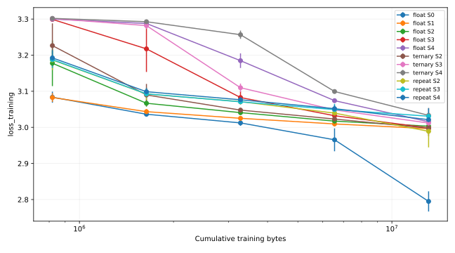
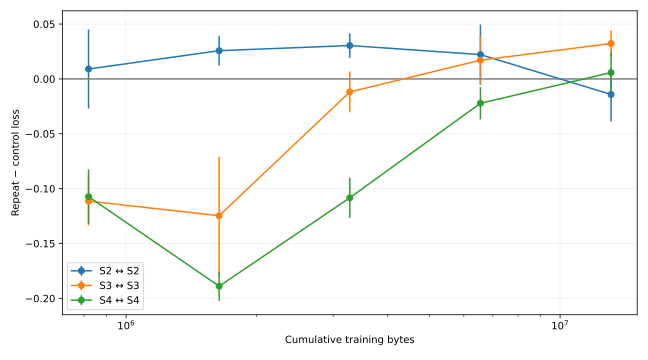
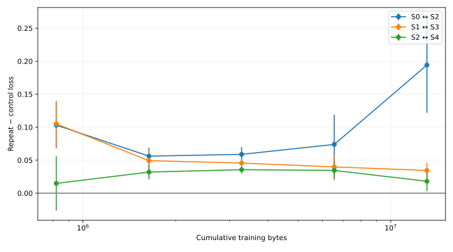
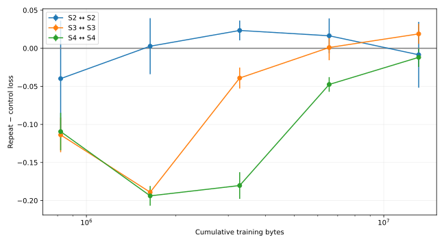
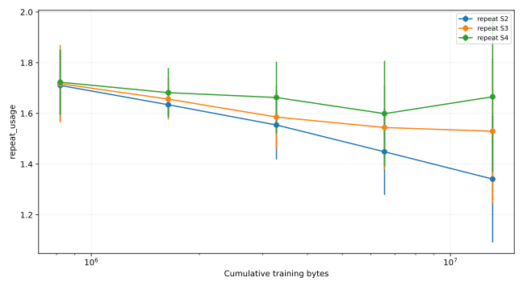
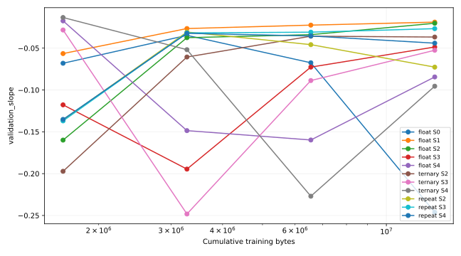

# PRG-LM v3.0.1 — Extended-Training Crossover Verification

Complete: True; completed extension milestones: 132/132; failed jobs: 0; resource-limited jobs: 0; latest completed training bytes: 13,107,200.

## Frozen hypothesis and protocol

Does v3 same-edge repetition advantage survive substantially longer training, or did larger numerical-weight baselines converge more slowly? Duration extension ONLY: all v3 model/topology/hash/state/representation/controller/max_repeat8/optimizer/lr3e-4/clipping/tokenizer/context32/split/validation/seeds/objective remain unchanged. No tuning, new architecture, old-run retraining or dashboard work.
33 continuations: Float S0–S4; ternary S2–S4; Repeat S2–S4; seeds42/43/44. Source model, both optimizers, RNG and cursor at819200 are restored. New NumPy sampling stream has a verified byte-for-byte819200 prefix match, then continues the same sampler. Evaluation uses unchanged4096/16384 windows, batch8, sampled seed+batch index. Evaluation RNG is restored before training.
Preregistered cumulative milestones:1638400,3276800,6553600,13107200. Final13.1072M is the primary decision; last6.5536M and13.1072M directions are checked. No early stopping or favorable checkpoint selection. Original819200 rows are copied as historical baseline, not re-evaluated.
The original v3 has five4× edge scales and compact16-channel state. Same-edge S2/S3/S4 and SAME measured packed-memory pairs Float S0↔Repeat S2, S1↔S3, S2↔S4 are fixed. No interpolation/extrapolation. n=3 mean±sample SD and every paired seed delta are reported, without significance claims.
CPU, two one-thread workers. Limits fixed before training: six hours per job per milestone stage, free disk at least2GB before each job/checkpoint. Resource-limited jobs retain completed milestones/checkpoints; they do not supply final conclusions. Full checkpoint recreation is unnecessary: all33 sources are present.
Packed/static/dynamic accounting reuses immutable v3 metrics. Exports pack ternary2-bit edges, PyTorch execution decodesFP32. Controller candidates include inactive lanes. Modeled active additions are not actual FLOPs or energy. Process RSS/optimizer tensors/prototype throughput remain separate.

## Progress

| Family | Scale | Seed42 | Seed43 | Seed44 | Final |
|---|---|---:|---:|---:|---|
| float | S0 | 13107200 | 13107200 | 13107200 | True |
| float | S1 | 13107200 | 13107200 | 13107200 | True |
| float | S2 | 13107200 | 13107200 | 13107200 | True |
| float | S3 | 13107200 | 13107200 | 13107200 | True |
| float | S4 | 13107200 | 13107200 | 13107200 | True |
| ternary | S2 | 13107200 | 13107200 | 13107200 | True |
| ternary | S3 | 13107200 | 13107200 | 13107200 | True |
| ternary | S4 | 13107200 | 13107200 | 13107200 | True |
| repeat | S2 | 13107200 | 13107200 | 13107200 | True |
| repeat | S3 | 13107200 | 13107200 | 13107200 | True |
| repeat | S4 | 13107200 | 13107200 | 13107200 | True |

## Sanity checks

56 tests passed, including all previous tests. Tiny continuation matches an uninterrupted immutable v3 trainer bit-for-bit for weights, both optimizer states, RNG and history. Interrupted extension and milestone-stage barriers are also bit-exact. All33 original819200 checkpoints are present. Actual Float S0/seed42 checkpoint continuation smoke reached832000 bytes (12800 additional), preserving original files. Smoke is separate from primary results and did not select/tune settings.

## All validation results

| Family | Scale | Training bytes | Validation bytes | Loss | Byte PPL | n |
|---|---|---:|---:|---:|---:|---:|
| float | S0 | 819200 | 4096 | 3.08353 ± 0.01534 | 21.83711 ± 0.33618 | 3 |
| float | S0 | 1638400 | 4096 | 3.03635 ± 0.00366 | 20.82918 ± 0.07615 | 3 |
| float | S0 | 3276800 | 4096 | 3.01231 ± 0.00809 | 20.33468 ± 0.16408 | 3 |
| float | S0 | 6553600 | 4096 | 2.96553 ± 0.03179 | 19.41149 ± 0.61133 | 3 |
| float | S0 | 13107200 | 4096 | 2.79490 ± 0.02791 | 16.36526 ± 0.45969 | 3 |
| float | S1 | 819200 | 4096 | 3.08262 ± 0.01217 | 21.81651 ± 0.26452 | 3 |
| float | S1 | 1638400 | 4096 | 3.04347 ± 0.00733 | 20.97825 ± 0.15410 | 3 |
| float | S1 | 3276800 | 4096 | 3.02506 ± 0.00278 | 20.59529 ± 0.05722 | 3 |
| float | S1 | 6553600 | 4096 | 3.00948 ± 0.00146 | 20.27678 ± 0.02951 | 3 |
| float | S1 | 13107200 | 4096 | 2.99638 ± 0.00173 | 20.01305 ± 0.03470 | 3 |
| float | S2 | 819200 | 4096 | 3.17757 ± 0.06327 | 24.02069 ± 1.54089 | 3 |
| float | S2 | 1638400 | 4096 | 3.06673 ± 0.00936 | 21.47214 ± 0.20079 | 3 |
| float | S2 | 3276800 | 4096 | 3.04075 ± 0.00580 | 20.92121 ± 0.12116 | 3 |
| float | S2 | 6553600 | 4096 | 3.01726 ± 0.01410 | 20.43661 ± 0.28692 | 3 |
| float | S2 | 13107200 | 4096 | 3.00323 ± 0.02075 | 20.15331 ± 0.41557 | 3 |
| float | S3 | 819200 | 4096 | 3.29907 ± 0.00160 | 27.08733 ± 0.04345 | 3 |
| float | S3 | 1638400 | 4096 | 3.21743 ± 0.06399 | 24.99820 ± 1.62184 | 3 |
| float | S3 | 3276800 | 4096 | 3.08255 ± 0.01689 | 21.81605 ± 0.36999 | 3 |
| float | S3 | 6553600 | 4096 | 3.03219 ± 0.00711 | 20.74291 ± 0.14732 | 3 |
| float | S3 | 13107200 | 4096 | 2.99848 ± 0.00275 | 20.05505 ± 0.05511 | 3 |
| float | S4 | 819200 | 4096 | 3.29974 ± 0.00306 | 27.10579 ± 0.08279 | 3 |
| float | S4 | 1638400 | 4096 | 3.28770 ± 0.00269 | 26.78114 ± 0.07203 | 3 |
| float | S4 | 3276800 | 4096 | 3.18470 ± 0.02022 | 24.16344 ± 0.48717 | 3 |
| float | S4 | 6553600 | 4096 | 3.07395 ± 0.00550 | 21.62736 ± 0.11888 | 3 |
| float | S4 | 13107200 | 4096 | 3.01543 ± 0.01652 | 20.39970 ± 0.33549 | 3 |
| ternary | S2 | 819200 | 4096 | 3.22646 ± 0.06150 | 25.22253 ± 1.57713 | 3 |
| ternary | S2 | 1638400 | 4096 | 3.08977 ± 0.03052 | 21.97884 ± 0.67629 | 3 |
| ternary | S2 | 3276800 | 4096 | 3.04778 ± 0.00596 | 21.06867 ± 0.12570 | 3 |
| ternary | S2 | 6553600 | 4096 | 3.02302 ± 0.00847 | 20.55382 ± 0.17369 | 3 |
| ternary | S2 | 13107200 | 4096 | 2.99757 ± 0.02177 | 20.03991 ± 0.43900 | 3 |
| ternary | S3 | 819200 | 4096 | 3.30145 ± 0.00025 | 27.15205 ± 0.00677 | 3 |
| ternary | S3 | 1638400 | 4096 | 3.28184 ± 0.00921 | 26.62544 ± 0.24583 | 3 |
| ternary | S3 | 3276800 | 4096 | 3.10978 ± 0.01147 | 22.41710 ± 0.25800 | 3 |
| ternary | S3 | 6553600 | 4096 | 3.04828 ± 0.00229 | 21.07910 ± 0.04829 | 3 |
| ternary | S3 | 13107200 | 4096 | 3.01188 ± 0.00255 | 20.32566 ± 0.05188 | 3 |
| ternary | S4 | 819200 | 4096 | 3.30185 ± 0.00300 | 27.16291 ± 0.08138 | 3 |
| ternary | S4 | 1638400 | 4096 | 3.29258 ± 0.00277 | 26.91216 ± 0.07458 | 3 |
| ternary | S4 | 3276800 | 4096 | 3.25664 ± 0.01142 | 25.96325 ± 0.29747 | 3 |
| ternary | S4 | 6553600 | 4096 | 3.09931 ± 0.00319 | 22.18267 ± 0.07084 | 3 |
| ternary | S4 | 13107200 | 4096 | 3.03312 ± 0.02080 | 20.76499 ± 0.42935 | 3 |
| repeat | S2 | 819200 | 4096 | 3.18661 ± 0.02769 | 24.21254 ± 0.67547 | 3 |
| repeat | S2 | 1638400 | 4096 | 3.09249 ± 0.01617 | 22.03371 ± 0.35653 | 3 |
| repeat | S2 | 3276800 | 4096 | 3.07118 ± 0.00830 | 21.56784 ± 0.17915 | 3 |
| repeat | S2 | 6553600 | 4096 | 3.03942 ± 0.01477 | 20.89469 ± 0.30835 | 3 |
| repeat | S2 | 13107200 | 4096 | 2.98903 ± 0.04451 | 19.87945 ± 0.87501 | 3 |
| repeat | S3 | 819200 | 4096 | 3.18766 ± 0.02304 | 24.23595 ± 0.56213 | 3 |
| repeat | S3 | 1638400 | 4096 | 3.09274 ± 0.01092 | 22.03816 ± 0.24138 | 3 |
| repeat | S3 | 3276800 | 4096 | 3.07071 ± 0.00472 | 21.55729 ± 0.10191 | 3 |
| repeat | S3 | 6553600 | 4096 | 3.04928 ± 0.01580 | 21.10199 ± 0.33249 | 3 |
| repeat | S3 | 13107200 | 4096 | 3.03078 ± 0.01061 | 20.71423 ± 0.21919 | 3 |
| repeat | S4 | 819200 | 4096 | 3.19244 ± 0.02199 | 24.35171 ± 0.53825 | 3 |
| repeat | S4 | 1638400 | 4096 | 3.09874 ± 0.01071 | 22.17085 ± 0.23784 | 3 |
| repeat | S4 | 3276800 | 4096 | 3.07636 ± 0.00667 | 21.67972 ± 0.14478 | 3 |
| repeat | S4 | 6553600 | 4096 | 3.05177 ± 0.01021 | 21.15352 ± 0.21633 | 3 |
| repeat | S4 | 13107200 | 4096 | 3.02123 ± 0.03149 | 20.52335 ± 0.64372 | 3 |
| float | S0 | 819200 | 16384 | 3.10628 ± 0.01940 | 22.34068 ± 0.43583 | 3 |
| float | S0 | 1638400 | 16384 | 3.04345 ± 0.00118 | 20.97747 ± 0.02483 | 3 |
| float | S0 | 3276800 | 16384 | 3.01736 ± 0.00584 | 20.43751 ± 0.11909 | 3 |
| float | S0 | 6553600 | 16384 | 2.96641 ± 0.02936 | 19.42766 ± 0.56567 | 3 |
| float | S0 | 13107200 | 16384 | 2.78839 ± 0.02548 | 16.25839 ± 0.41650 | 3 |
| float | S1 | 819200 | 16384 | 3.09970 ± 0.00876 | 22.19181 ± 0.19399 | 3 |
| float | S1 | 1638400 | 16384 | 3.05187 ± 0.00840 | 21.15545 ± 0.17764 | 3 |
| float | S1 | 3276800 | 16384 | 3.02968 ± 0.00186 | 20.69059 ± 0.03853 | 3 |
| float | S1 | 6553600 | 16384 | 3.01202 ± 0.00176 | 20.32845 ± 0.03572 | 3 |
| float | S1 | 13107200 | 16384 | 2.99795 ± 0.00254 | 20.04452 ± 0.05096 | 3 |
| float | S2 | 819200 | 16384 | 3.22349 ± 0.06961 | 25.15666 ± 1.78015 | 3 |
| float | S2 | 1638400 | 16384 | 3.08794 ± 0.00657 | 21.93222 ± 0.14435 | 3 |
| float | S2 | 3276800 | 16384 | 3.05564 ± 0.00400 | 21.23492 ± 0.08484 | 3 |
| float | S2 | 6553600 | 16384 | 3.03038 ± 0.00481 | 20.70526 ± 0.09954 | 3 |
| float | S2 | 13107200 | 16384 | 3.01418 ± 0.01201 | 20.37333 ± 0.24427 | 3 |
| float | S3 | 819200 | 16384 | 3.35217 ± 0.00093 | 28.56468 ± 0.02671 | 3 |
| float | S3 | 1638400 | 16384 | 3.26690 ± 0.06715 | 26.26980 ± 1.78668 | 3 |
| float | S3 | 3276800 | 16384 | 3.10765 ± 0.01489 | 22.37011 ± 0.33419 | 3 |
| float | S3 | 6553600 | 16384 | 3.05274 ± 0.00384 | 21.17344 ± 0.08124 | 3 |
| float | S3 | 13107200 | 16384 | 3.02091 ± 0.00175 | 20.50995 ± 0.03586 | 3 |
| float | S4 | 819200 | 16384 | 3.35255 ± 0.00143 | 28.57548 ± 0.04091 | 3 |
| float | S4 | 1638400 | 16384 | 3.33949 ± 0.00202 | 28.20485 ± 0.05692 | 3 |
| float | S4 | 3276800 | 16384 | 3.22632 ± 0.02273 | 25.19109 ± 0.56969 | 3 |
| float | S4 | 6553600 | 16384 | 3.10143 ± 0.02072 | 22.23281 ± 0.46324 | 3 |
| float | S4 | 13107200 | 16384 | 3.03621 ± 0.01567 | 20.82785 ± 0.32498 | 3 |
| ternary | S2 | 819200 | 16384 | 3.27491 ± 0.06613 | 26.47987 ± 1.78282 | 3 |
| ternary | S2 | 1638400 | 16384 | 3.11485 ± 0.03628 | 22.54003 ± 0.82318 | 3 |
| ternary | S2 | 3276800 | 16384 | 3.06563 ± 0.00867 | 21.44861 ± 0.18570 | 3 |
| ternary | S2 | 6553600 | 16384 | 3.03867 ± 0.00086 | 20.87754 ± 0.01800 | 3 |
| ternary | S2 | 13107200 | 16384 | 3.01240 ± 0.01530 | 20.33769 ± 0.31184 | 3 |
| ternary | S3 | 819200 | 16384 | 3.35423 ± 0.00114 | 28.62351 ± 0.03276 | 3 |
| ternary | S3 | 1638400 | 16384 | 3.33382 ± 0.00954 | 28.04612 ± 0.26790 | 3 |
| ternary | S3 | 3276800 | 16384 | 3.14285 ± 0.00820 | 23.17036 ± 0.19031 | 3 |
| ternary | S3 | 6553600 | 16384 | 3.06822 ± 0.00390 | 21.50375 ± 0.08389 | 3 |
| ternary | S3 | 13107200 | 16384 | 3.03327 ± 0.00077 | 20.76493 ± 0.01601 | 3 |
| ternary | S4 | 819200 | 16384 | 3.35438 ± 0.00143 | 28.62774 ± 0.04081 | 3 |
| ternary | S4 | 1638400 | 16384 | 3.34424 ± 0.00126 | 28.33910 ± 0.03567 | 3 |
| ternary | S4 | 3276800 | 16384 | 3.30633 ± 0.01355 | 27.28638 ± 0.37094 | 3 |
| ternary | S4 | 6553600 | 16384 | 3.12797 ± 0.01619 | 22.82962 ± 0.37124 | 3 |
| ternary | S4 | 13107200 | 16384 | 3.05468 ± 0.01667 | 21.21629 ± 0.35195 | 3 |
| repeat | S2 | 819200 | 16384 | 3.22082 ± 0.02726 | 25.05500 ± 0.68678 | 3 |
| repeat | S2 | 1638400 | 16384 | 3.10446 ± 0.01248 | 22.29831 ± 0.27750 | 3 |
| repeat | S2 | 3276800 | 16384 | 3.07751 ± 0.00338 | 21.70439 ± 0.07339 | 3 |
| repeat | S2 | 6553600 | 16384 | 3.05242 ± 0.01653 | 21.16849 ± 0.34833 | 3 |
| repeat | S2 | 13107200 | 16384 | 3.00518 ± 0.04742 | 20.20482 ± 0.94688 | 3 |
| repeat | S3 | 819200 | 16384 | 3.22297 ± 0.02363 | 25.10731 ± 0.59593 | 3 |
| repeat | S3 | 1638400 | 16384 | 3.10512 ± 0.00918 | 22.31258 ± 0.20431 | 3 |
| repeat | S3 | 3276800 | 16384 | 3.07916 ± 0.00884 | 21.74061 ± 0.19203 | 3 |
| repeat | S3 | 6553600 | 16384 | 3.05884 ± 0.01747 | 21.30502 ± 0.37032 | 3 |
| repeat | S3 | 13107200 | 16384 | 3.04321 ± 0.01707 | 20.97453 ± 0.35624 | 3 |
| repeat | S4 | 819200 | 16384 | 3.22980 ± 0.02578 | 25.28013 ± 0.65462 | 3 |
| repeat | S4 | 1638400 | 16384 | 3.10952 ± 0.00799 | 22.41084 ± 0.17894 | 3 |
| repeat | S4 | 3276800 | 16384 | 3.08563 ± 0.00682 | 21.88155 ± 0.14950 | 3 |
| repeat | S4 | 6553600 | 16384 | 3.06141 ± 0.01578 | 21.35937 ± 0.33737 | 3 |
| repeat | S4 | 13107200 | 16384 | 3.03212 ± 0.03133 | 20.74792 ± 0.64959 | 3 |

## Paired comparisons

| Kind | Control | Repeat | Training bytes | Validation bytes | Paired Δloss | Each seed Δloss | Repeat better seeds | Packed ratio | Addition ratio |
|---|---|---|---:|---:|---:|---|---:|---:|---:|
| same_edge | float S2 | S2 | 819200 | 4096 | 0.00905 ± 0.03606 | {'42': -0.03043125569820404, '43': 0.0402391254901886, '44': 0.017327740788459778} | 1 | 0.094715 | 1.71044 ± 0.14133 |
| same_edge | float S2 | S2 | 1638400 | 4096 | 0.02576 ± 0.01346 | {'42': 0.0411495715379715, '43': 0.019963949918746948, '44': 0.016164451837539673} | 0 | 0.094715 | 1.63416 ± 0.04588 |
| same_edge | float S2 | S2 | 3276800 | 4096 | 0.03043 ± 0.01112 | {'42': 0.03788489103317261, '43': 0.035747140645980835, '44': 0.01765158772468567} | 0 | 0.094715 | 1.55429 ± 0.13601 |
| same_edge | float S2 | S2 | 6553600 | 4096 | 0.02216 ± 0.02734 | {'42': -0.000292360782623291, '43': 0.052607402205467224, '44': 0.01416584849357605} | 1 | 0.094715 | 1.44859 ± 0.16997 |
| same_edge | float S2 | S2 | 13107200 | 4096 | -0.01419 ± 0.02450 | {'42': -0.009503737092018127, '43': -0.040698617696762085, '44': 0.007617950439453125} | 2 | 0.094715 | 1.34102 ± 0.25015 |
| same_edge | float S3 | S3 | 819200 | 4096 | -0.11141 ± 0.02216 | {'42': -0.08593869209289551, '43': -0.1262848824262619, '44': -0.12199458479881287} | 3 | 0.070767 | 1.71730 ± 0.15311 |
| same_edge | float S3 | S3 | 1638400 | 4096 | -0.12469 ± 0.05384 | {'42': -0.18425703048706055, '43': -0.11032307147979736, '44': -0.07949119806289673} | 3 | 0.070767 | 1.65640 ± 0.08075 |
| same_edge | float S3 | S3 | 3276800 | 4096 | -0.01184 ± 0.01862 | {'42': -0.0332762748003006, '43': 0.0003258734941482544, '44': -0.002582252025604248} | 2 | 0.070767 | 1.58568 ± 0.12432 |
| same_edge | float S3 | S3 | 6553600 | 4096 | 0.01710 ± 0.02224 | {'42': -0.006124749779701233, '43': 0.03820720314979553, '44': 0.019206687808036804} | 1 | 0.070767 | 1.54433 ± 0.16644 |
| same_edge | float S3 | S3 | 13107200 | 4096 | 0.03230 ± 0.01188 | {'42': 0.01876203715801239, '43': 0.037166938185691833, '44': 0.04098573327064514} | 0 | 0.070767 | 1.52965 ± 0.28394 |
| same_edge | float S4 | S4 | 819200 | 4096 | -0.10730 ± 0.02495 | {'42': -0.07898999750614166, '43': -0.12609504163265228, '44': -0.11682750284671783} | 3 | 0.064581 | 1.72301 ± 0.12876 |
| same_edge | float S4 | S4 | 1638400 | 4096 | -0.18896 ± 0.01339 | {'42': -0.17418108880519867, '43': -0.20029814541339874, '44': -0.19238723814487457} | 3 | 0.064581 | 1.68190 ± 0.09758 |
| same_edge | float S4 | S4 | 3276800 | 4096 | -0.10834 ± 0.01820 | {'42': -0.11937069892883301, '43': -0.11831536889076233, '44': -0.08734139800071716} | 3 | 0.064581 | 1.66270 ± 0.14140 |
| same_edge | float S4 | S4 | 6553600 | 4096 | -0.02218 ± 0.01467 | {'42': -0.03057892620563507, '43': -0.030721023678779602, '44': -0.005232676863670349} | 3 | 0.064581 | 1.59905 ± 0.20856 |
| same_edge | float S4 | S4 | 13107200 | 4096 | 0.00580 ± 0.01907 | {'42': -0.0008177608251571655, '43': -0.009070530533790588, '44': 0.027301862835884094} | 2 | 0.064581 | 1.66578 ± 0.29718 |
| same_memory | float S0 | S2 | 819200 | 4096 | 0.10308 ± 0.03498 | {'42': 0.14088594913482666, '43': 0.0964922308921814, '44': 0.07186663150787354} | 0 | 1.000000 | 1.71044 ± 0.14133 |
| same_memory | float S0 | S2 | 1638400 | 4096 | 0.05614 ± 0.01272 | {'42': 0.06971126794815063, '43': 0.04449988901615143, '44': 0.054197654128074646} | 0 | 1.000000 | 1.63416 ± 0.04588 |
| same_memory | float S0 | S2 | 3276800 | 4096 | 0.05887 ± 0.01097 | {'42': 0.06298932433128357, '43': 0.0671941488981247, '44': 0.04643857479095459} | 0 | 1.000000 | 1.55429 ± 0.13601 |
| same_memory | float S0 | S2 | 6553600 | 4096 | 0.07389 ± 0.04493 | {'42': 0.03976099193096161, '43': 0.12480148673057556, '44': 0.05711287260055542} | 0 | 1.000000 | 1.44859 ± 0.16997 |
| same_memory | float S0 | S2 | 13107200 | 4096 | 0.19413 ± 0.07242 | {'42': 0.220591202378273, '43': 0.11220461130142212, '44': 0.24959683418273926} | 0 | 1.000000 | 1.34102 ± 0.25015 |
| same_memory | float S1 | S3 | 819200 | 4096 | 0.10504 ± 0.03515 | {'42': 0.1456267088651657, '43': 0.08493557572364807, '44': 0.08456158638000488} | 0 | 1.000000 | 1.71730 ± 0.15311 |
| same_memory | float S1 | S3 | 1638400 | 4096 | 0.04927 ± 0.01588 | {'42': 0.06502459943294525, '43': 0.033269062638282776, '44': 0.049508750438690186} | 0 | 1.000000 | 1.65640 ± 0.08075 |
| same_memory | float S1 | S3 | 3276800 | 4096 | 0.04565 ± 0.00475 | {'42': 0.04099501669406891, '43': 0.05048108100891113, '44': 0.04546430706977844} | 0 | 1.000000 | 1.58568 ± 0.12432 |
| same_memory | float S1 | S3 | 6553600 | 4096 | 0.03981 ± 0.01633 | {'42': 0.022191122174263, '43': 0.054432690143585205, '44': 0.04280093312263489} | 0 | 1.000000 | 1.54433 ± 0.16644 |
| same_memory | float S1 | S3 | 13107200 | 4096 | 0.03440 ± 0.01179 | {'42': 0.020988762378692627, '43': 0.043107420206069946, '44': 0.03910286724567413} | 0 | 1.000000 | 1.52965 ± 0.28394 |
| same_memory | float S2 | S4 | 819200 | 4096 | 0.01487 ± 0.04127 | {'42': -0.03168964385986328, '43': 0.04696173965930939, '44': 0.029342010617256165} | 1 | 1.000015 | 1.72301 ± 0.12876 |
| same_memory | float S2 | S4 | 1638400 | 4096 | 0.03201 ± 0.01091 | {'42': 0.04255238175392151, '43': 0.0327104777097702, '44': 0.020775720477104187} | 0 | 1.000015 | 1.68190 ± 0.09758 |
| same_memory | float S2 | S4 | 3276800 | 4096 | 0.03561 ± 0.00580 | {'42': 0.04135438799858093, '43': 0.03572790324687958, '44': 0.02974778413772583} | 0 | 1.000015 | 1.66270 ± 0.14140 |
| same_memory | float S2 | S4 | 6553600 | 4096 | 0.03451 ± 0.01445 | {'42': 0.01903599500656128, '43': 0.047650307416915894, '44': 0.03684258460998535} | 0 | 1.000015 | 1.59905 ± 0.20856 |
| same_memory | float S2 | S4 | 13107200 | 4096 | 0.01801 ± 0.01454 | {'42': 0.011096030473709106, '43': 0.00820930302143097, '44': 0.03471851348876953} | 0 | 1.000015 | 1.66578 ± 0.29718 |
| repeat_ternary | ternary S2 | S2 | 819200 | 4096 | -0.03985 ± 0.07617 | {'42': 0.02316346764564514, '43': -0.018220603466033936, '44': -0.1244889497756958} | 2 | 1.000000 | 1.71044 ± 0.14133 |
| repeat_ternary | ternary S2 | S2 | 1638400 | 4096 | 0.00272 ± 0.03679 | {'42': 0.04033386707305908, '43': 0.0010131150484085083, '44': -0.03319080173969269} | 1 | 1.000000 | 1.63416 ± 0.04588 |
| repeat_ternary | ternary S2 | S2 | 3276800 | 4096 | 0.02340 ± 0.01301 | {'42': 0.03418564796447754, '43': 0.027073010802268982, '44': 0.008955895900726318} | 0 | 1.000000 | 1.55429 ± 0.13601 |
| repeat_ternary | ternary S2 | S2 | 6553600 | 4096 | 0.01640 ± 0.02285 | {'42': -0.005377784371376038, '43': 0.04018062353134155, '44': 0.014394879341125488} | 1 | 1.000000 | 1.44859 ± 0.16997 |
| repeat_ternary | ternary S2 | S2 | 13107200 | 4096 | -0.00854 ± 0.04323 | {'42': -0.016892343759536743, '43': -0.04698014259338379, '44': 0.038264498114585876} | 2 | 1.000000 | 1.34102 ± 0.25015 |
| repeat_ternary | ternary S3 | S3 | 819200 | 4096 | -0.11379 ± 0.02280 | {'42': -0.08748193085193634, '43': -0.1277533620595932, '44': -0.1261444240808487} | 3 | 1.000000 | 1.71730 ± 0.15311 |
| repeat_ternary | ternary S3 | S3 | 1638400 | 4096 | -0.18910 ± 0.00371 | {'42': -0.18700125813484192, '43': -0.19339051842689514, '44': -0.18691778182983398} | 3 | 1.000000 | 1.65640 ± 0.08075 |
| repeat_ternary | ternary S3 | S3 | 3276800 | 4096 | -0.03907 ± 0.01376 | {'42': -0.05448603630065918, '43': -0.028024807572364807, '44': -0.034710511565208435} | 3 | 1.000000 | 1.58568 ± 0.12432 |
| repeat_ternary | ternary S3 | S3 | 6553600 | 4096 | 0.00100 ± 0.01668 | {'42': -0.016659483313560486, '43': 0.016485825181007385, '44': 0.003184676170349121} | 1 | 1.000000 | 1.54433 ± 0.16644 |
| repeat_ternary | ternary S3 | S3 | 13107200 | 4096 | 0.01890 ± 0.01312 | {'42': 0.003750935196876526, '43': 0.026703476905822754, '44': 0.026249408721923828} | 0 | 1.000000 | 1.52965 ± 0.28394 |
| repeat_ternary | ternary S4 | S4 | 819200 | 4096 | -0.10941 ± 0.02457 | {'42': -0.08137206733226776, '43': -0.1271793097257614, '44': -0.11967706680297852} | 3 | 1.000000 | 1.72301 ± 0.12876 |
| repeat_ternary | ternary S4 | S4 | 1638400 | 4096 | -0.19384 ± 0.01293 | {'42': -0.1791389286518097, '43': -0.20343317091464996, '44': -0.19893521070480347} | 3 | 1.000000 | 1.68190 ± 0.09758 |
| repeat_ternary | ternary S4 | S4 | 3276800 | 4096 | -0.18028 ± 0.01748 | {'42': -0.16566570103168488, '43': -0.199634850025177, '44': -0.17552784085273743} | 3 | 1.000000 | 1.66270 ± 0.14140 |
| repeat_ternary | ternary S4 | S4 | 6553600 | 4096 | -0.04754 ± 0.00962 | {'42': -0.052495986223220825, '43': -0.05366648733615875, '44': -0.03644634783267975} | 3 | 1.000000 | 1.59905 ± 0.20856 |
| repeat_ternary | ternary S4 | S4 | 13107200 | 4096 | -0.01189 ± 0.01262 | {'42': -0.01618930697441101, '43': -0.021800190210342407, '44': 0.0023162364959716797} | 2 | 1.000000 | 1.66578 ± 0.29718 |
| same_edge | float S2 | S2 | 819200 | 16384 | -0.00266 ± 0.04249 | {'42': -0.05134975537657738, '43': 0.026943180710077286, '44': 0.016412563621997833} | 1 | 0.094715 | 1.70233 ± 0.14093 |
| same_edge | float S2 | S2 | 1638400 | 16384 | 0.01652 ± 0.01154 | {'42': 0.02926023304462433, '43': 0.006768755614757538, '44': 0.013521376997232437} | 0 | 0.094715 | 1.62781 ± 0.04355 |
| same_edge | float S2 | S2 | 3276800 | 16384 | 0.02187 ± 0.00546 | {'42': 0.02580995485186577, '43': 0.015638384968042374, '44': 0.02415849268436432} | 0 | 0.094715 | 1.54912 ± 0.13484 |
| same_edge | float S2 | S2 | 6553600 | 16384 | 0.02204 ± 0.02006 | {'42': -0.0009983256459236145, '43': 0.035583216696977615, '44': 0.03154345229268074} | 1 | 0.094715 | 1.44565 ± 0.16963 |
| same_edge | float S2 | S2 | 13107200 | 16384 | -0.00900 ± 0.03742 | {'42': -0.0018010139465332031, '43': -0.04949484020471573, '44': 0.024292584508657455} | 2 | 0.094715 | 1.33991 ± 0.25118 |
| same_edge | float S3 | S3 | 819200 | 16384 | -0.12920 ± 0.02275 | {'42': -0.10404785349965096, '43': -0.14833737909793854, '44': -0.13520938530564308} | 3 | 0.070767 | 1.70994 ± 0.15453 |
| same_edge | float S3 | S3 | 1638400 | 16384 | -0.16178 ± 0.06373 | {'42': -0.22963923960924149, '43': -0.15252140536904335, '44': -0.103182353079319} | 3 | 0.070767 | 1.64846 ± 0.07863 |
| same_edge | float S3 | S3 | 3276800 | 16384 | -0.02850 ± 0.02363 | {'42': -0.05424204841256142, '43': -0.023439589887857437, '44': -0.007805142551660538} | 3 | 0.070767 | 1.57960 ± 0.12254 |
| same_edge | float S3 | S3 | 6553600 | 16384 | 0.00610 ± 0.01893 | {'42': -0.015629753470420837, '43': 0.019029811024665833, '44': 0.014896281063556671} | 1 | 0.070767 | 1.54065 ± 0.16547 |
| same_edge | float S3 | S3 | 13107200 | 16384 | 0.02230 ± 0.01724 | {'42': 0.002736099064350128, '43': 0.02888895943760872, '44': 0.03528381139039993} | 0 | 0.070767 | 1.52964 ± 0.28506 |
| same_edge | float S4 | S4 | 819200 | 16384 | -0.12275 ± 0.02640 | {'42': -0.09333153069019318, '43': -0.14436401426792145, '44': -0.13055985048413277} | 3 | 0.064581 | 1.71609 ± 0.13066 |
| same_edge | float S4 | S4 | 1638400 | 16384 | -0.22997 ± 0.00921 | {'42': -0.22327328100800514, '43': -0.24046996980905533, '44': -0.22616447508335114} | 3 | 0.064581 | 1.67398 ± 0.09588 |
| same_edge | float S4 | S4 | 3276800 | 16384 | -0.14069 ± 0.02954 | {'42': -0.16409490257501602, '43': -0.15047162026166916, '44': -0.10750498622655869} | 3 | 0.064581 | 1.65550 ± 0.14082 |
| same_edge | float S4 | S4 | 6553600 | 16384 | -0.04002 ± 0.02848 | {'42': -0.046171825379133224, '43': -0.06492098048329353, '44': -0.008960653096437454} | 3 | 0.064581 | 1.59493 ± 0.21045 |
| same_edge | float S4 | S4 | 13107200 | 16384 | -0.00409 ± 0.01959 | {'42': -0.01289447396993637, '43': -0.01773891970515251, '44': 0.018362469971179962} | 2 | 0.064581 | 1.66389 ± 0.30268 |
| same_memory | float S0 | S2 | 819200 | 16384 | 0.11454 ± 0.03752 | {'42': 0.15634262934327126, '43': 0.10350795090198517, '44': 0.08377399295568466} | 0 | 1.000000 | 1.70233 ± 0.14093 |
| same_memory | float S0 | S2 | 1638400 | 16384 | 0.06101 ± 0.01176 | {'42': 0.06920654699206352, '43': 0.04753373935818672, '44': 0.06629155948758125} | 0 | 1.000000 | 1.62781 ± 0.04355 |
| same_memory | float S0 | S2 | 3276800 | 16384 | 0.06015 ± 0.00373 | {'42': 0.056369997560977936, '43': 0.06381898373365402, '44': 0.06026070937514305} | 0 | 1.000000 | 1.54912 ± 0.13484 |
| same_memory | float S0 | S2 | 6553600 | 16384 | 0.08601 ± 0.04050 | {'42': 0.04709881916642189, '43': 0.12793557718396187, '44': 0.08299804106354713} | 0 | 1.000000 | 1.44565 ± 0.16963 |
| same_memory | float S0 | S2 | 13107200 | 16384 | 0.21679 ± 0.07288 | {'42': 0.24258935078978539, '43': 0.1345110684633255, '44': 0.273255355656147} | 0 | 1.000000 | 1.33991 ± 0.25118 |
| same_memory | float S1 | S3 | 819200 | 16384 | 0.12327 ± 0.03234 | {'42': 0.15950176119804382, '43': 0.09731252864003181, '44': 0.11301052570343018} | 0 | 1.000000 | 1.70994 ± 0.15453 |
| same_memory | float S1 | S3 | 1638400 | 16384 | 0.05325 ± 0.01657 | {'42': 0.06049942970275879, '43': 0.03429148346185684, '44': 0.06495499238371849} | 0 | 1.000000 | 1.64846 ± 0.07863 |
| same_memory | float S1 | S3 | 3276800 | 16384 | 0.04948 ± 0.01060 | {'42': 0.038190558552742004, '43': 0.05103167146444321, '44': 0.059212375432252884} | 0 | 1.000000 | 1.57960 ± 0.12254 |
| same_memory | float S1 | S3 | 6553600 | 16384 | 0.04682 ± 0.01831 | {'42': 0.02568039670586586, '43': 0.05739422142505646, '44': 0.057387825101614} | 0 | 1.000000 | 1.54065 ± 0.16547 |
| same_memory | float S1 | S3 | 13107200 | 16384 | 0.04526 ± 0.01927 | {'42': 0.023269321769475937, '43': 0.05328134819865227, '44': 0.05922367423772812} | 0 | 1.000000 | 1.52964 ± 0.28506 |
| same_memory | float S2 | S4 | 819200 | 16384 | 0.00631 ± 0.04422 | {'42': -0.04452309012413025, '43': 0.03588606417179108, '44': 0.02755865454673767} | 1 | 1.000015 | 1.71609 ± 0.13066 |
| same_memory | float S2 | S4 | 1638400 | 16384 | 0.02158 ± 0.00890 | {'42': 0.031815458089113235, '43': 0.017270177602767944, '44': 0.01565823331475258} | 0 | 1.000015 | 1.67398 ± 0.09588 |
| same_memory | float S2 | S4 | 3276800 | 16384 | 0.02999 ± 0.00613 | {'42': 0.029376912862062454, '43': 0.024182680994272232, '44': 0.036400120705366135} | 0 | 1.000015 | 1.65550 ± 0.14082 |
| same_memory | float S2 | S4 | 6553600 | 16384 | 0.03103 ± 0.01746 | {'42': 0.01187073066830635, '43': 0.03516043722629547, '44': 0.04605076462030411} | 0 | 1.000015 | 1.59493 ± 0.21045 |
| same_memory | float S2 | S4 | 13107200 | 16384 | 0.01794 ± 0.02470 | {'42': 0.008446499705314636, '43': -0.0006042234599590302, '44': 0.045979369431734085} | 1 | 1.000015 | 1.66389 ± 0.30268 |
| repeat_ternary | ternary S2 | S2 | 819200 | 16384 | -0.05408 ± 0.07678 | {'42': 0.011130429804325104, '43': -0.034673675894737244, '44': -0.1387110948562622} | 2 | 1.000000 | 1.70233 ± 0.14093 |
| repeat_ternary | ternary S2 | S2 | 1638400 | 16384 | -0.01039 ± 0.03803 | {'42': 0.029694415628910065, '43': -0.014923378825187683, '44': -0.04595063254237175} | 2 | 1.000000 | 1.62781 ± 0.04355 |
| repeat_ternary | ternary S2 | S2 | 3276800 | 16384 | 0.01188 ± 0.00784 | {'42': 0.020881541073322296, '43': 0.006606653332710266, '44': 0.008139405399560928} | 0 | 1.000000 | 1.54912 ± 0.13484 |
| repeat_ternary | ternary S2 | S2 | 6553600 | 16384 | 0.01375 ± 0.01694 | {'42': -0.005798090249300003, '43': 0.022949934005737305, '44': 0.024095483124256134} | 1 | 1.000000 | 1.44565 ± 0.16963 |
| repeat_ternary | ternary S2 | S2 | 13107200 | 16384 | -0.00722 ± 0.05008 | {'42': -0.006338827311992645, '43': -0.05773241072893143, '44': 0.042410314083099365} | 2 | 1.000000 | 1.33991 ± 0.25118 |
| repeat_ternary | ternary S3 | S3 | 819200 | 16384 | -0.13126 ± 0.02328 | {'42': -0.10509925708174706, '43': -0.1497029960155487, '44': -0.13896410167217255} | 3 | 1.000000 | 1.70994 ± 0.15453 |
| repeat_ternary | ternary S3 | S3 | 1638400 | 16384 | -0.22870 ± 0.01074 | {'42': -0.23206106573343277, '43': -0.23734864592552185, '44': -0.2166820615530014} | 3 | 1.000000 | 1.64846 ± 0.07863 |
| repeat_ternary | ternary S3 | S3 | 3276800 | 16384 | -0.06370 ± 0.01691 | {'42': -0.08209102600812912, '43': -0.0601663738489151, '44': -0.04882980138063431} | 3 | 1.000000 | 1.57960 ± 0.12254 |
| repeat_ternary | ternary S3 | S3 | 6553600 | 16384 | -0.00938 ± 0.01401 | {'42': -0.025555163621902466, '43': -0.0008770190179347992, '44': -0.0017106086015701294} | 3 | 1.000000 | 1.54065 ± 0.16547 |
| repeat_ternary | ternary S3 | S3 | 13107200 | 16384 | 0.00995 ± 0.01630 | {'42': -0.008804619312286377, '43': 0.017963260412216187, '44': 0.020680658519268036} | 1 | 1.000000 | 1.52964 ± 0.28506 |
| repeat_ternary | ternary S4 | S4 | 819200 | 16384 | -0.12458 ± 0.02664 | {'42': -0.09493490681052208, '43': -0.1465255171060562, '44': -0.1322760470211506} | 3 | 1.000000 | 1.71609 ± 0.13066 |
| repeat_ternary | ternary S4 | S4 | 1638400 | 16384 | -0.23472 ± 0.00910 | {'42': -0.2271854504942894, '43': -0.24483058229088783, '44': -0.2321396879851818} | 3 | 1.000000 | 1.67398 ± 0.09588 |
| repeat_ternary | ternary S4 | S4 | 3276800 | 16384 | -0.22070 ± 0.01804 | {'42': -0.2208310216665268, '43': -0.23867512121796608, '44': -0.20258812233805656} | 3 | 1.000000 | 1.65550 ± 0.14082 |
| repeat_ternary | ternary S4 | S4 | 6553600 | 16384 | -0.06656 ± 0.02313 | {'42': -0.07205019146203995, '43': -0.08645268902182579, '44': -0.04118768125772476} | 3 | 1.000000 | 1.59493 ± 0.21045 |
| repeat_ternary | ternary S4 | S4 | 13107200 | 16384 | -0.02256 ± 0.01905 | {'42': -0.0319860577583313, '43': -0.035059280693531036, '44': -0.0006287135183811188} | 3 | 1.000000 | 1.66389 ± 0.30268 |

## Undertraining diagnostics

Training coverage starts at819200 because v3 did not record whole-history coverage. Coalesced sparse-gradient source rows track exact distinct activated slots, including zero ternary values. Per-source update counts are optimizer-step touches, not nonzero updates. Gradient norms and edge changes sample first64 touched rows every100 steps; they are NOT unbiased whole-graph statistics. Full counters are training-only checkpoint state. Held-out coverage is exact fixed-window topology coverage. Visit coverage alone cannot establish sufficient convergence.

| Family | Scale | Seed | Training bytes | Train loss | Continuation covered fraction | Diagnostic unique edges | Diagnostic fraction | Gradient norm mean | Edge update mean |
|---|---|---:|---:|---:|---:|---:|---:|---:|---:|
| float | S0 | 42 | 1638400 | 3.08635 | 1.000000 | 32768 | 1.000000 | 0.47408 | 0.00005595 |
| float | S0 | 42 | 3276800 | 2.90006 | 1.000000 | 32768 | 1.000000 | 0.51183 | 0.00005371 |
| float | S0 | 42 | 6553600 | 3.10769 | 1.000000 | 32768 | 1.000000 | 0.53138 | 0.00005441 |
| float | S0 | 42 | 13107200 | 2.88766 | 1.000000 | 32768 | 1.000000 | 0.84730 | 0.00005446 |
| float | S0 | 43 | 1638400 | 2.78558 | 1.000000 | 32768 | 1.000000 | 0.49546 | 0.00005615 |
| float | S0 | 43 | 3276800 | 2.98202 | 1.000000 | 32768 | 1.000000 | 0.61333 | 0.00005452 |
| float | S0 | 43 | 6553600 | 2.85980 | 1.000000 | 32768 | 1.000000 | 0.91621 | 0.00005316 |
| float | S0 | 43 | 13107200 | 2.78372 | 1.000000 | 32768 | 1.000000 | 0.90951 | 0.00005488 |
| float | S0 | 44 | 1638400 | 3.08019 | 1.000000 | 32768 | 1.000000 | 0.46234 | 0.00005654 |
| float | S0 | 44 | 3276800 | 2.91151 | 1.000000 | 32768 | 1.000000 | 0.53417 | 0.00005516 |
| float | S0 | 44 | 6553600 | 2.77252 | 1.000000 | 32768 | 1.000000 | 0.53622 | 0.00005478 |
| float | S0 | 44 | 13107200 | 2.58903 | 1.000000 | 32768 | 1.000000 | 0.91570 | 0.00005416 |
| float | S1 | 42 | 1638400 | 3.10944 | 1.000000 | 131072 | 1.000000 | 0.46953 | 0.00005888 |
| float | S1 | 42 | 3276800 | 2.88132 | 1.000000 | 131072 | 1.000000 | 0.49123 | 0.00005347 |
| float | S1 | 42 | 6553600 | 3.12586 | 1.000000 | 131072 | 1.000000 | 0.47448 | 0.00005376 |
| float | S1 | 42 | 13107200 | 3.08432 | 1.000000 | 131072 | 1.000000 | 0.47660 | 0.00005410 |
| float | S1 | 43 | 1638400 | 2.80085 | 1.000000 | 131072 | 1.000000 | 0.34253 | 0.00005919 |
| float | S1 | 43 | 3276800 | 3.02221 | 1.000000 | 131072 | 1.000000 | 0.34719 | 0.00005435 |
| float | S1 | 43 | 6553600 | 2.89135 | 1.000000 | 131072 | 1.000000 | 0.35436 | 0.00005376 |
| float | S1 | 43 | 13107200 | 3.01335 | 1.000000 | 131072 | 1.000000 | 0.33427 | 0.00005372 |
| float | S1 | 44 | 1638400 | 3.09442 | 1.000000 | 131072 | 1.000000 | 0.40053 | 0.00005871 |
| float | S1 | 44 | 3276800 | 2.90221 | 1.000000 | 131072 | 1.000000 | 0.41955 | 0.00005458 |
| float | S1 | 44 | 6553600 | 2.81722 | 1.000000 | 131072 | 1.000000 | 0.37944 | 0.00005380 |
| float | S1 | 44 | 13107200 | 2.68929 | 1.000000 | 131072 | 1.000000 | 0.36277 | 0.00005416 |
| float | S2 | 42 | 1638400 | 3.16093 | 1.000000 | 512736 | 0.977966 | 0.42417 | 0.00009147 |
| float | S2 | 42 | 3276800 | 2.89306 | 1.000000 | 512736 | 0.977966 | 0.51710 | 0.00005869 |
| float | S2 | 42 | 6553600 | 3.10297 | 1.000000 | 512736 | 0.977966 | 0.46082 | 0.00005356 |
| float | S2 | 42 | 13107200 | 3.10665 | 1.000000 | 512736 | 0.977966 | 0.48781 | 0.00005376 |
| float | S2 | 43 | 1638400 | 2.78914 | 1.000000 | 512736 | 0.977966 | 0.40117 | 0.00007660 |
| float | S2 | 43 | 3276800 | 3.06687 | 1.000000 | 512736 | 0.977966 | 0.43996 | 0.00005611 |
| float | S2 | 43 | 6553600 | 2.93803 | 1.000000 | 512736 | 0.977966 | 0.60839 | 0.00005377 |
| float | S2 | 43 | 13107200 | 3.10639 | 1.000000 | 512736 | 0.977966 | 0.70346 | 0.00005014 |
| float | S2 | 44 | 1638400 | 3.00208 | 1.000000 | 512736 | 0.977966 | 0.38825 | 0.00007527 |
| float | S2 | 44 | 3276800 | 2.87281 | 1.000000 | 512736 | 0.977966 | 0.42854 | 0.00005371 |
| float | S2 | 44 | 6553600 | 2.82026 | 1.000000 | 512736 | 0.977966 | 0.50071 | 0.00005383 |
| float | S2 | 44 | 13107200 | 2.74678 | 1.000000 | 512736 | 0.977966 | 0.46549 | 0.00005383 |
| repeat | S2 | 42 | 1638400 | 3.11997 | 1.000000 | 512736 | 0.977966 | 0.47007 | 0.00005160 |
| repeat | S2 | 42 | 3276800 | 2.94302 | 1.000000 | 512736 | 0.977966 | 0.54746 | 0.00004721 |
| repeat | S2 | 42 | 6553600 | 3.05086 | 1.000000 | 512736 | 0.977966 | 0.77984 | 0.00004334 |
| repeat | S2 | 42 | 13107200 | 2.97100 | 1.000000 | 512736 | 0.977966 | 0.77369 | 0.00004638 |
| repeat | S2 | 43 | 1638400 | 2.87198 | 1.000000 | 512736 | 0.977966 | 0.48908 | 0.00005455 |
| repeat | S2 | 43 | 3276800 | 3.05967 | 1.000000 | 512736 | 0.977966 | 0.51718 | 0.00004908 |
| repeat | S2 | 43 | 6553600 | 3.01367 | 1.000000 | 512736 | 0.977966 | 0.40074 | 0.00004914 |
| repeat | S2 | 43 | 13107200 | 3.00818 | 1.000000 | 512736 | 0.977966 | 0.49699 | 0.00005565 |
| repeat | S2 | 44 | 1638400 | 3.03891 | 1.000000 | 512736 | 0.977966 | 0.43651 | 0.00005784 |
| repeat | S2 | 44 | 3276800 | 2.87887 | 1.000000 | 512736 | 0.977966 | 0.50998 | 0.00005188 |
| repeat | S2 | 44 | 6553600 | 2.89626 | 1.000000 | 512736 | 0.977966 | 0.50624 | 0.00005005 |
| repeat | S2 | 44 | 13107200 | 2.81528 | 1.000000 | 512736 | 0.977966 | 0.50306 | 0.00004885 |
| ternary | S2 | 42 | 1638400 | 3.15662 | 1.000000 | 512736 | 0.977966 | 0.46264 | 0.00008334 |
| ternary | S2 | 42 | 3276800 | 2.91100 | 1.000000 | 512736 | 0.977966 | 0.51641 | 0.00005727 |
| ternary | S2 | 42 | 6553600 | 3.11222 | 1.000000 | 512736 | 0.977966 | 0.47078 | 0.00005375 |
| ternary | S2 | 42 | 13107200 | 3.10972 | 1.000000 | 512736 | 0.977966 | 0.45081 | 0.00005341 |
| ternary | S2 | 43 | 1638400 | 2.83688 | 1.000000 | 512736 | 0.977966 | 0.35241 | 0.00008092 |
| ternary | S2 | 43 | 3276800 | 3.06095 | 1.000000 | 512736 | 0.977966 | 0.44116 | 0.00005753 |
| ternary | S2 | 43 | 6553600 | 2.93782 | 1.000000 | 512736 | 0.977966 | 0.51851 | 0.00005417 |
| ternary | S2 | 43 | 13107200 | 3.08635 | 1.000000 | 512736 | 0.977966 | 0.60297 | 0.00005002 |
| ternary | S2 | 44 | 1638400 | 3.00495 | 1.000000 | 512736 | 0.977966 | 0.31198 | 0.00009675 |
| ternary | S2 | 44 | 3276800 | 2.86744 | 1.000000 | 512736 | 0.977966 | 0.42731 | 0.00005813 |
| ternary | S2 | 44 | 6553600 | 2.81232 | 1.000000 | 512736 | 0.977966 | 0.44307 | 0.00005519 |
| ternary | S2 | 44 | 13107200 | 2.78249 | 1.000000 | 512736 | 0.977966 | 0.61070 | 0.00005173 |
| float | S3 | 42 | 1638400 | 3.44333 | 1.000000 | 1290912 | 0.615555 | 0.23619 | 0.00008421 |
| float | S3 | 42 | 3276800 | 2.97875 | 1.000000 | 1290912 | 0.615555 | 0.34989 | 0.00009743 |
| float | S3 | 42 | 6553600 | 3.08315 | 1.000000 | 1290912 | 0.615555 | 0.47669 | 0.00005959 |
| float | S3 | 42 | 13107200 | 2.98132 | 1.000000 | 1290912 | 0.615555 | 0.71238 | 0.00005507 |
| float | S3 | 43 | 1638400 | 2.99713 | 1.000000 | 1290912 | 0.615555 | 0.24871 | 0.00011031 |
| float | S3 | 43 | 3276800 | 3.10239 | 1.000000 | 1290912 | 0.615555 | 0.36222 | 0.00007624 |
| float | S3 | 43 | 6553600 | 2.95288 | 1.000000 | 1290912 | 0.615555 | 0.55045 | 0.00005745 |
| float | S3 | 43 | 13107200 | 3.09049 | 1.000000 | 1290912 | 0.615555 | 0.64597 | 0.00004975 |
| float | S3 | 44 | 1638400 | 3.05288 | 1.000000 | 1290912 | 0.615555 | 0.28198 | 0.00011855 |
| float | S3 | 44 | 3276800 | 2.84226 | 1.000000 | 1290912 | 0.615555 | 0.43143 | 0.00007272 |
| float | S3 | 44 | 6553600 | 2.83780 | 1.000000 | 1290912 | 0.615555 | 0.48282 | 0.00005789 |
| float | S3 | 44 | 13107200 | 2.75841 | 1.000000 | 1290912 | 0.615555 | 0.66911 | 0.00005082 |
| repeat | S3 | 42 | 1638400 | 3.15074 | 1.000000 | 1290912 | 0.615555 | 0.51753 | 0.00005591 |
| repeat | S3 | 42 | 3276800 | 2.95576 | 1.000000 | 1290912 | 0.615555 | 0.55472 | 0.00004835 |
| repeat | S3 | 42 | 6553600 | 3.04446 | 1.000000 | 1290912 | 0.615555 | 0.79459 | 0.00004154 |
| repeat | S3 | 42 | 13107200 | 3.01789 | 1.000000 | 1290912 | 0.615555 | 0.82245 | 0.00004136 |
| repeat | S3 | 43 | 1638400 | 2.87014 | 1.000000 | 1290912 | 0.615555 | 0.48833 | 0.00005976 |
| repeat | S3 | 43 | 3276800 | 3.06545 | 1.000000 | 1290912 | 0.615555 | 0.51257 | 0.00005026 |
| repeat | S3 | 43 | 6553600 | 2.97583 | 1.000000 | 1290912 | 0.615555 | 0.40682 | 0.00004645 |
| repeat | S3 | 43 | 13107200 | 3.04212 | 1.000000 | 1290912 | 0.615555 | 0.38895 | 0.00004839 |
| repeat | S3 | 44 | 1638400 | 3.02597 | 1.000000 | 1290912 | 0.615555 | 0.43373 | 0.00006223 |
| repeat | S3 | 44 | 3276800 | 2.91107 | 1.000000 | 1290912 | 0.615555 | 0.53956 | 0.00005595 |
| repeat | S3 | 44 | 6553600 | 2.87343 | 1.000000 | 1290912 | 0.615555 | 0.47494 | 0.00005147 |
| repeat | S3 | 44 | 13107200 | 2.77984 | 1.000000 | 1290912 | 0.615555 | 0.53283 | 0.00004494 |
| ternary | S3 | 42 | 1638400 | 3.44858 | 1.000000 | 1290912 | 0.615555 | 0.23822 | 0.00007995 |
| ternary | S3 | 42 | 3276800 | 3.00390 | 1.000000 | 1290912 | 0.615555 | 0.32530 | 0.00010182 |
| ternary | S3 | 42 | 6553600 | 3.07287 | 1.000000 | 1290912 | 0.615555 | 0.46093 | 0.00005949 |
| ternary | S3 | 42 | 13107200 | 3.00635 | 1.000000 | 1290912 | 0.615555 | 0.64749 | 0.00005569 |
| ternary | S3 | 43 | 1638400 | 3.09382 | 1.000000 | 1290912 | 0.615555 | 0.23935 | 0.00008783 |
| ternary | S3 | 43 | 3276800 | 3.15952 | 1.000000 | 1290912 | 0.615555 | 0.33191 | 0.00008926 |
| ternary | S3 | 43 | 6553600 | 2.99352 | 1.000000 | 1290912 | 0.615555 | 0.47660 | 0.00005712 |
| ternary | S3 | 43 | 13107200 | 3.10885 | 1.000000 | 1290912 | 0.615555 | 0.63910 | 0.00005177 |
| ternary | S3 | 44 | 1638400 | 3.15752 | 1.000000 | 1290912 | 0.615555 | 0.24677 | 0.00009297 |
| ternary | S3 | 44 | 3276800 | 2.87610 | 1.000000 | 1290912 | 0.615555 | 0.35672 | 0.00008249 |
| ternary | S3 | 44 | 6553600 | 2.85149 | 1.000000 | 1290912 | 0.615555 | 0.46636 | 0.00005839 |
| ternary | S3 | 44 | 13107200 | 2.77935 | 1.000000 | 1290912 | 0.615555 | 0.61430 | 0.00005237 |
| float | S4 | 42 | 1638400 | 3.46089 | 1.000000 | 1791872 | 0.213608 | 0.23954 | 0.00010357 |
| float | S4 | 42 | 3276800 | 3.01748 | 1.000000 | 1791872 | 0.213608 | 0.31876 | 0.00010969 |
| float | S4 | 42 | 6553600 | 3.22690 | 1.000000 | 1791872 | 0.213608 | 0.55668 | 0.00006814 |
| float | S4 | 42 | 13107200 | 3.00924 | 1.000000 | 1791872 | 0.213608 | 0.79807 | 0.00005685 |
| float | S4 | 43 | 1638400 | 3.11069 | 1.000000 | 1791872 | 0.213608 | 0.23561 | 0.00010500 |
| float | S4 | 43 | 3276800 | 3.29389 | 1.000000 | 1791872 | 0.213608 | 0.30695 | 0.00011313 |
| float | S4 | 43 | 6553600 | 2.97721 | 1.000000 | 1791872 | 0.213608 | 0.54620 | 0.00006718 |
| float | S4 | 43 | 13107200 | 3.00636 | 1.000000 | 1791872 | 0.213608 | 0.70296 | 0.00005686 |
| float | S4 | 44 | 1638400 | 3.15461 | 1.000000 | 1791872 | 0.213608 | 0.24620 | 0.00010909 |
| float | S4 | 44 | 3276800 | 2.93071 | 1.000000 | 1791872 | 0.213608 | 0.33210 | 0.00011587 |
| float | S4 | 44 | 6553600 | 2.86359 | 1.000000 | 1791872 | 0.213608 | 0.53256 | 0.00006586 |
| float | S4 | 44 | 13107200 | 2.77674 | 1.000000 | 1791872 | 0.213608 | 0.72200 | 0.00005532 |
| repeat | S4 | 42 | 1638400 | 3.10440 | 1.000000 | 1791872 | 0.213608 | 0.52791 | 0.00006380 |
| repeat | S4 | 42 | 3276800 | 2.92698 | 1.000000 | 1791872 | 0.213608 | 0.60299 | 0.00005123 |
| repeat | S4 | 42 | 6553600 | 3.04908 | 1.000000 | 1791872 | 0.213608 | 0.74367 | 0.00004570 |
| repeat | S4 | 42 | 13107200 | 3.04619 | 1.000000 | 1791872 | 0.213608 | 1.43762 | 0.00003662 |
| repeat | S4 | 43 | 1638400 | 2.84369 | 1.000000 | 1791872 | 0.213608 | 0.50293 | 0.00006869 |
| repeat | S4 | 43 | 3276800 | 3.03971 | 1.000000 | 1791872 | 0.213608 | 0.51372 | 0.00005639 |
| repeat | S4 | 43 | 6553600 | 3.00316 | 1.000000 | 1791872 | 0.213608 | 0.40570 | 0.00005072 |
| repeat | S4 | 43 | 13107200 | 3.00633 | 1.000000 | 1791872 | 0.213608 | 0.55632 | 0.00005077 |
| repeat | S4 | 44 | 1638400 | 3.07973 | 1.000000 | 1791872 | 0.213608 | 0.42736 | 0.00007059 |
| repeat | S4 | 44 | 3276800 | 2.88723 | 1.000000 | 1791872 | 0.213608 | 0.52748 | 0.00005911 |
| repeat | S4 | 44 | 6553600 | 2.89748 | 1.000000 | 1791872 | 0.213608 | 0.48346 | 0.00005300 |
| repeat | S4 | 44 | 13107200 | 2.79460 | 1.000000 | 1791872 | 0.213608 | 0.50372 | 0.00004387 |
| ternary | S4 | 42 | 1638400 | 3.46233 | 1.000000 | 1791872 | 0.213608 | 0.24613 | 0.00009389 |
| ternary | S4 | 42 | 3276800 | 3.06405 | 1.000000 | 1791872 | 0.213608 | 0.30567 | 0.00010002 |
| ternary | S4 | 42 | 6553600 | 3.24635 | 1.000000 | 1791872 | 0.213608 | 0.48083 | 0.00007390 |
| ternary | S4 | 42 | 13107200 | 3.03556 | 1.000000 | 1791872 | 0.213608 | 0.70096 | 0.00005931 |
| ternary | S4 | 43 | 1638400 | 3.11813 | 1.000000 | 1791872 | 0.213608 | 0.23781 | 0.00009685 |
| ternary | S4 | 43 | 3276800 | 3.39047 | 1.000000 | 1791872 | 0.213608 | 0.29246 | 0.00009550 |
| ternary | S4 | 43 | 6553600 | 3.02443 | 1.000000 | 1791872 | 0.213608 | 0.41421 | 0.00007166 |
| ternary | S4 | 43 | 13107200 | 3.04445 | 1.000000 | 1791872 | 0.213608 | 0.63225 | 0.00005648 |
| ternary | S4 | 44 | 1638400 | 3.16355 | 1.000000 | 1791872 | 0.213608 | 0.24407 | 0.00009830 |
| ternary | S4 | 44 | 3276800 | 3.04942 | 1.000000 | 1791872 | 0.213608 | 0.31067 | 0.00010186 |
| ternary | S4 | 44 | 6553600 | 2.88321 | 1.000000 | 1791872 | 0.213608 | 0.45727 | 0.00007521 |
| ternary | S4 | 44 | 13107200 | 2.78236 | 1.000000 | 1791872 | 0.213608 | 0.64574 | 0.00005619 |

## Improvement slopes

| Family | Scale | Validation bytes | From | To | Loss improvement | Δloss/Δlog bytes |
|---|---|---:|---:|---:|---:|---:|
| float | S0 | 4096 | 819200 | 1638400 | 0.047182 | -0.068069 |
| float | S0 | 4096 | 1638400 | 3276800 | 0.024044 | -0.034688 |
| float | S0 | 4096 | 3276800 | 6553600 | 0.046776 | -0.067483 |
| float | S0 | 4096 | 6553600 | 13107200 | 0.170630 | -0.246167 |
| float | S1 | 4096 | 819200 | 1638400 | 0.039150 | -0.056481 |
| float | S1 | 4096 | 1638400 | 3276800 | 0.018409 | -0.026558 |
| float | S1 | 4096 | 3276800 | 6553600 | 0.015584 | -0.022483 |
| float | S1 | 4096 | 6553600 | 13107200 | 0.013092 | -0.018888 |
| float | S2 | 4096 | 819200 | 1638400 | 0.110842 | -0.159911 |
| float | S2 | 4096 | 1638400 | 3276800 | 0.025975 | -0.037474 |
| float | S2 | 4096 | 3276800 | 6553600 | 0.023490 | -0.033889 |
| float | S2 | 4096 | 6553600 | 13107200 | 0.014036 | -0.020250 |
| float | S3 | 4096 | 819200 | 1638400 | 0.081639 | -0.117780 |
| float | S3 | 4096 | 1638400 | 3276800 | 0.134876 | -0.194584 |
| float | S3 | 4096 | 3276800 | 6553600 | 0.050363 | -0.072658 |
| float | S3 | 4096 | 6553600 | 13107200 | 0.033709 | -0.048632 |
| float | S4 | 4096 | 819200 | 1638400 | 0.012049 | -0.017383 |
| float | S4 | 4096 | 1638400 | 3276800 | 0.102991 | -0.148584 |
| float | S4 | 4096 | 3276800 | 6553600 | 0.110756 | -0.159787 |
| float | S4 | 4096 | 6553600 | 13107200 | 0.058520 | -0.084426 |
| ternary | S2 | 4096 | 819200 | 1638400 | 0.136695 | -0.197209 |
| ternary | S2 | 4096 | 1638400 | 3276800 | 0.041992 | -0.060582 |
| ternary | S2 | 4096 | 3276800 | 6553600 | 0.024752 | -0.035710 |
| ternary | S2 | 4096 | 6553600 | 13107200 | 0.025456 | -0.036725 |
| ternary | S3 | 4096 | 819200 | 1638400 | 0.019613 | -0.028296 |
| ternary | S3 | 4096 | 1638400 | 3276800 | 0.172059 | -0.248228 |
| ternary | S3 | 4096 | 3276800 | 6553600 | 0.061500 | -0.088725 |
| ternary | S3 | 4096 | 6553600 | 13107200 | 0.036398 | -0.052512 |
| ternary | S4 | 4096 | 819200 | 1638400 | 0.009274 | -0.013379 |
| ternary | S4 | 4096 | 1638400 | 3276800 | 0.035937 | -0.051847 |
| ternary | S4 | 4096 | 3276800 | 6553600 | 0.157331 | -0.226980 |
| ternary | S4 | 4096 | 6553600 | 13107200 | 0.066183 | -0.095482 |
| repeat | S2 | 4096 | 819200 | 1638400 | 0.094127 | -0.135797 |
| repeat | S2 | 4096 | 1638400 | 3276800 | 0.021306 | -0.030738 |
| repeat | S2 | 4096 | 3276800 | 6553600 | 0.031758 | -0.045817 |
| repeat | S2 | 4096 | 6553600 | 13107200 | 0.050391 | -0.072699 |
| repeat | S3 | 4096 | 819200 | 1638400 | 0.094923 | -0.136945 |
| repeat | S3 | 4096 | 1638400 | 3276800 | 0.022029 | -0.031782 |
| repeat | S3 | 4096 | 3276800 | 6553600 | 0.021422 | -0.030906 |
| repeat | S3 | 4096 | 6553600 | 13107200 | 0.018501 | -0.026691 |
| repeat | S4 | 4096 | 819200 | 1638400 | 0.093700 | -0.135181 |
| repeat | S4 | 4096 | 1638400 | 3276800 | 0.022378 | -0.032284 |
| repeat | S4 | 4096 | 3276800 | 6553600 | 0.024591 | -0.035477 |
| repeat | S4 | 4096 | 6553600 | 13107200 | 0.030538 | -0.044057 |
| float | S0 | 16384 | 819200 | 1638400 | 0.062835 | -0.090651 |
| float | S0 | 16384 | 1638400 | 3276800 | 0.026088 | -0.037636 |
| float | S0 | 16384 | 3276800 | 6553600 | 0.050949 | -0.073503 |
| float | S0 | 16384 | 6553600 | 13107200 | 0.178020 | -0.256829 |
| float | S1 | 16384 | 819200 | 1638400 | 0.047823 | -0.068995 |
| float | S1 | 16384 | 1638400 | 3276800 | 0.022197 | -0.032023 |
| float | S1 | 16384 | 3276800 | 6553600 | 0.017657 | -0.025474 |
| float | S1 | 16384 | 6553600 | 13107200 | 0.014067 | -0.020294 |
| float | S2 | 16384 | 819200 | 1638400 | 0.135547 | -0.195553 |
| float | S2 | 16384 | 1638400 | 3276800 | 0.032300 | -0.046600 |
| float | S2 | 16384 | 3276800 | 6553600 | 0.025262 | -0.036445 |
| float | S2 | 16384 | 6553600 | 13107200 | 0.016202 | -0.023374 |
| float | S3 | 16384 | 819200 | 1638400 | 0.085267 | -0.123014 |
| float | S3 | 16384 | 1638400 | 3276800 | 0.159252 | -0.229753 |
| float | S3 | 16384 | 3276800 | 6553600 | 0.054909 | -0.079217 |
| float | S3 | 16384 | 6553600 | 13107200 | 0.031834 | -0.045926 |
| float | S4 | 16384 | 819200 | 1638400 | 0.013056 | -0.018835 |
| float | S4 | 16384 | 1638400 | 3276800 | 0.113174 | -0.163275 |
| float | S4 | 16384 | 3276800 | 6553600 | 0.124894 | -0.180183 |
| float | S4 | 16384 | 6553600 | 13107200 | 0.065216 | -0.094087 |
| ternary | S2 | 16384 | 819200 | 1638400 | 0.160057 | -0.230914 |
| ternary | S2 | 16384 | 1638400 | 3276800 | 0.049217 | -0.071006 |
| ternary | S2 | 16384 | 3276800 | 6553600 | 0.026961 | -0.038896 |
| ternary | S2 | 16384 | 6553600 | 13107200 | 0.026276 | -0.037909 |
| ternary | S3 | 16384 | 819200 | 1638400 | 0.020408 | -0.029442 |
| ternary | S3 | 16384 | 1638400 | 3276800 | 0.190968 | -0.275509 |
| ternary | S3 | 16384 | 3276800 | 6553600 | 0.074629 | -0.107668 |
| ternary | S3 | 16384 | 6553600 | 13107200 | 0.034957 | -0.050432 |
| ternary | S4 | 16384 | 819200 | 1638400 | 0.010133 | -0.014619 |
| ternary | S4 | 16384 | 1638400 | 3276800 | 0.037916 | -0.054701 |
| ternary | S4 | 16384 | 3276800 | 6553600 | 0.178355 | -0.257312 |
| ternary | S4 | 16384 | 6553600 | 13107200 | 0.073294 | -0.105741 |
| repeat | S2 | 16384 | 819200 | 1638400 | 0.116366 | -0.167880 |
| repeat | S2 | 16384 | 1638400 | 3276800 | 0.026948 | -0.038878 |
| repeat | S2 | 16384 | 3276800 | 6553600 | 0.025088 | -0.036194 |
| repeat | S2 | 16384 | 6553600 | 13107200 | 0.047246 | -0.068161 |
| repeat | S3 | 16384 | 819200 | 1638400 | 0.117850 | -0.170021 |
| repeat | S3 | 16384 | 1638400 | 3276800 | 0.025967 | -0.037462 |
| repeat | S3 | 16384 | 3276800 | 6553600 | 0.020315 | -0.029308 |
| repeat | S3 | 16384 | 6553600 | 13107200 | 0.015629 | -0.022548 |
| repeat | S4 | 16384 | 819200 | 1638400 | 0.120273 | -0.173517 |
| repeat | S4 | 16384 | 1638400 | 3276800 | 0.023895 | -0.034474 |
| repeat | S4 | 16384 | 3276800 | 6553600 | 0.024221 | -0.034943 |
| repeat | S4 | 16384 | 6553600 | 13107200 | 0.029289 | -0.042254 |

## Repetition and runtime

Full histograms, medians, ≥2/≥4/max fractions, controller probabilities, additions/unique edges/token, repetition fractions, memory, gradient diagnostics, source/checkpoint/stream hashes, train time/throughput, inference throughput/latency and RSS are preserved in results.json at every milestone. CUDA fields are null on this CPU backend. MPS memory is unavailable here. No custom accelerator or GPU performance claim.

## Failures and limits

[]
One corpus and three seeds restrict generality. Longer fixed-lr training may still not establish convergence. Hashed addresses and16-channel state constrain usable capacity; ST gradients are biased. Repeat contribution proxies are partly definitional. Measured memory savings do not imply lower compute/energy. Frozen original files/checkpoints are hashed and reverified.

## Final19 questions

1. Float final-minus-baseline improvements (positive means lower loss): {'S2': 0.17434287567933415, 'S3': 0.3005867203076682, 'S4': 0.28431499997774745}
2. Repeat improvements: {'S2': 0.19758288065592433, 'S3': 0.15687576433022832, 'S4': 0.1712062954902649}
3. S3/S4 final same-edge crossover: disappeared. Final gaps: {'S2→S2': {'mean': -0.014194801449775696, 'SD': 0.024497494825427544, 'seed_deltas': {'42': -0.009503737092018127, '43': -0.040698617696762085, '44': 0.007617950439453125}, 'repeat_better_seeds': 2}, 'S3→S3': {'mean': 0.03230490287144979, 'SD': 0.011882874558555459, 'seed_deltas': {'42': 0.01876203715801239, '43': 0.037166938185691833, '44': 0.04098573327064514}, 'repeat_better_seeds': 0}, 'S4→S4': {'mean': 0.005804523825645447, 'SD': 0.019069051899787273, 'seed_deltas': {'42': -0.0008177608251571655, '43': -0.009070530533790588, '44': 0.027301862835884094}, 'repeat_better_seeds': 2}}
4. Last two milestone same-edge gaps: {6553600: {'S2→S2': {'mean': 0.02216029663880666, 'SD': 0.027340988129713303, 'seed_deltas': {'42': -0.000292360782623291, '43': 0.052607402205467224, '44': 0.01416584849357605}, 'repeat_better_seeds': 1}, 'S3→S3': {'mean': 0.01709638039271037, 'SD': 0.022241190630813035, 'seed_deltas': {'42': -0.006124749779701233, '43': 0.03820720314979553, '44': 0.019206687808036804}, 'repeat_better_seeds': 1}, 'S4→S4': {'mean': -0.022177542249361675, 'SD': 0.014674855880974386, 'seed_deltas': {'42': -0.03057892620563507, '43': -0.030721023678779602, '44': -0.005232676863670349}, 'repeat_better_seeds': 3}}, 13107200: {'S2→S2': {'mean': -0.014194801449775696, 'SD': 0.024497494825427544, 'seed_deltas': {'42': -0.009503737092018127, '43': -0.040698617696762085, '44': 0.007617950439453125}, 'repeat_better_seeds': 2}, 'S3→S3': {'mean': 0.03230490287144979, 'SD': 0.011882874558555459, 'seed_deltas': {'42': 0.01876203715801239, '43': 0.037166938185691833, '44': 0.04098573327064514}, 'repeat_better_seeds': 0}, 'S4→S4': {'mean': 0.005804523825645447, 'SD': 0.019069051899787273, 'seed_deltas': {'42': -0.0008177608251571655, '43': -0.009070530533790588, '44': 0.027301862835884094}, 'repeat_better_seeds': 2}}}
5. Repeat−ternary final paired gaps: {'S2→S2': {'mean': -0.008535996079444885, 'SD': 0.04323232126859073, 'seed_deltas': {'42': -0.016892343759536743, '43': -0.04698014259338379, '44': 0.038264498114585876}, 'repeat_better_seeds': 2}, 'S3→S3': {'mean': 0.018901273608207703, 'SD': 0.013122542054125793, 'seed_deltas': {'42': 0.003750935196876526, '43': 0.026703476905822754, '44': 0.026249408721923828}, 'repeat_better_seeds': 0}, 'S4→S4': {'mean': -0.01189108689626058, 'SD': 0.012619688235072072, 'seed_deltas': {'42': -0.01618930697441101, '43': -0.021800190210342407, '44': 0.0023162364959716797}, 'repeat_better_seeds': 2}}
6. Float S0↔Repeat S2: [{'kind': 'same_memory', 'control': 'float', 'control_scale': 'S0', 'repeat_scale': 'S2', 'training_tokens': 13107200, 'validation_bytes': 4096, 'loss_delta': {'mean': 0.19413088262081146, 'std': 0.07241731228316689, 'n': 3}, 'per_seed_delta': {'42': 0.220591202378273, '43': 0.11220461130142212, '44': 0.24959683418273926}, 'repeat_better_seeds': 0, 'packed_static_byte_ratio': 1.0, 'edge_operations_ratio': {'mean': 1.3410197893778484, 'std': 0.25014505176585305, 'n': 3}, 'same_memory_matched_within_one_percent': True}]
7. Float S1↔Repeat S3: [{'kind': 'same_memory', 'control': 'float', 'control_scale': 'S1', 'repeat_scale': 'S3', 'training_tokens': 13107200, 'validation_bytes': 4096, 'loss_delta': {'mean': 0.03439968327681223, 'std': 0.011785529712527547, 'n': 3}, 'per_seed_delta': {'42': 0.020988762378692627, '43': 0.043107420206069946, '44': 0.03910286724567413}, 'repeat_better_seeds': 0, 'packed_static_byte_ratio': 1.0, 'edge_operations_ratio': {'mean': 1.529648780822754, 'std': 0.2839400257152804, 'n': 3}, 'same_memory_matched_within_one_percent': True}]
8. Float S2↔Repeat S4: [{'kind': 'same_memory', 'control': 'float', 'control_scale': 'S2', 'repeat_scale': 'S4', 'training_tokens': 13107200, 'validation_bytes': 4096, 'loss_delta': {'mean': 0.018007948994636536, 'std': 0.014543573258672293, 'n': 3}, 'per_seed_delta': {'42': 0.011096030473709106, '43': 0.00820930302143097, '44': 0.03471851348876953}, 'repeat_better_seeds': 0, 'packed_static_byte_ratio': 1.0000147344574497, 'edge_operations_ratio': {'mean': 1.6657827695210774, 'std': 0.2971752308840796, 'n': 3}, 'same_memory_matched_within_one_percent': True}]
9. Final measured same-memory crossover: no. Earlier sign changes alone are not success.
10. Seed directions: {'S0→S2': {'mean': 0.19413088262081146, 'SD': 0.07241731228316689, 'seed_deltas': {'42': 0.220591202378273, '43': 0.11220461130142212, '44': 0.24959683418273926}, 'repeat_better_seeds': 0}, 'S1→S3': {'mean': 0.03439968327681223, 'SD': 0.011785529712527547, 'seed_deltas': {'42': 0.020988762378692627, '43': 0.043107420206069946, '44': 0.03910286724567413}, 'repeat_better_seeds': 0}, 'S2→S4': {'mean': 0.018007948994636536, 'SD': 0.014543573258672293, 'seed_deltas': {'42': 0.011096030473709106, '43': 0.00820930302143097, '44': 0.03471851348876953}, 'repeat_better_seeds': 0}}. Stable majority-seed pairs at both last milestones: []
11. Same-memory paired gap trajectories: {819200: {'S0→S2': {'mean': 0.10308160384496053, 'SD': 0.03497829939198979, 'seed_deltas': {'42': 0.14088594913482666, '43': 0.0964922308921814, '44': 0.07186663150787354}, 'repeat_better_seeds': 0}, 'S1→S3': {'mean': 0.10504129032293956, 'SD': 0.03514850090250003, 'seed_deltas': {'42': 0.1456267088651657, '43': 0.08493557572364807, '44': 0.08456158638000488}, 'repeat_better_seeds': 0}, 'S2→S4': {'mean': 0.014871368805567423, 'SD': 0.04127420063673726, 'seed_deltas': {'42': -0.03168964385986328, '43': 0.04696173965930939, '44': 0.029342010617256165}, 'repeat_better_seeds': 1}}, 1638400: {'S0→S2': {'mean': 0.05613627036412557, 'SD': 0.012716999708902393, 'seed_deltas': {'42': 0.06971126794815063, '43': 0.04449988901615143, '44': 0.054197654128074646}, 'repeat_better_seeds': 0}, 'S1→S3': {'mean': 0.049267470836639404, 'SD': 0.01587914327550655, 'seed_deltas': {'42': 0.06502459943294525, '43': 0.033269062638282776, '44': 0.049508750438690186}, 'repeat_better_seeds': 0}, 'S2→S4': {'mean': 0.0320128599802653, 'SD': 0.010905078952657722, 'seed_deltas': {'42': 0.04255238175392151, '43': 0.0327104777097702, '44': 0.020775720477104187}, 'repeat_better_seeds': 0}}, 3276800: {'S0→S2': {'mean': 0.05887401600678762, 'SD': 0.010972706415639069, 'seed_deltas': {'42': 0.06298932433128357, '43': 0.0671941488981247, '44': 0.04643857479095459}, 'repeat_better_seeds': 0}, 'S1→S3': {'mean': 0.045646801590919495, 'SD': 0.004745664572429835, 'seed_deltas': {'42': 0.04099501669406891, '43': 0.05048108100891113, '44': 0.04546430706977844}, 'repeat_better_seeds': 0}, 'S2→S4': {'mean': 0.03561002512772878, 'SD': 0.0058041997496584355, 'seed_deltas': {'42': 0.04135438799858093, '43': 0.03572790324687958, '44': 0.02974778413772583}, 'repeat_better_seeds': 0}}, 6553600: {'S0→S2': {'mean': 0.07389178375403087, 'SD': 0.04493462288217137, 'seed_deltas': {'42': 0.03976099193096161, '43': 0.12480148673057556, '44': 0.05711287260055542}, 'repeat_better_seeds': 0}, 'S1→S3': {'mean': 0.03980824848016103, 'SD': 0.01632779217491085, 'seed_deltas': {'42': 0.022191122174263, '43': 0.054432690143585205, '44': 0.04280093312263489}, 'repeat_better_seeds': 0}, 'S2→S4': {'mean': 0.034509629011154175, 'SD': 0.014449108278676986, 'seed_deltas': {'42': 0.01903599500656128, '43': 0.047650307416915894, '44': 0.03684258460998535}, 'repeat_better_seeds': 0}}, 13107200: {'S0→S2': {'mean': 0.19413088262081146, 'SD': 0.07241731228316689, 'seed_deltas': {'42': 0.220591202378273, '43': 0.11220461130142212, '44': 0.24959683418273926}, 'repeat_better_seeds': 0}, 'S1→S3': {'mean': 0.03439968327681223, 'SD': 0.011785529712527547, 'seed_deltas': {'42': 0.020988762378692627, '43': 0.043107420206069946, '44': 0.03910286724567413}, 'repeat_better_seeds': 0}, 'S2→S4': {'mean': 0.018007948994636536, 'SD': 0.014543573258672293, 'seed_deltas': {'42': 0.011096030473709106, '43': 0.00820930302143097, '44': 0.03471851348876953}, 'repeat_better_seeds': 0}}}
12. Undertraining interpretation: Case A: v3 crossover was substantially explained by unequal convergence under fixed-data-budget scaling. Current same-edge repetition-as-weight-substitution hypothesis is not supported strongly enough to justify further scaling in this architecture. Longer training tests convergence confounding; it does not prove causal architectural superiority.
13. Exact continuation coverage and held-out coverage are tabulated below. Visited fraction measures exposure, not sufficient optimization; baseline whole-history coverage was not recorded.
14. Within-family loss/coverage across scales are measured in the curves. Larger stored capacity alone is not usable capacity, especially with the unchanged16-channel state.
15. Full repeat histograms/probabilities and usage trajectories are in JSON and usage plot; bounded counts and sampled inference are unchanged.
16. Same-memory pairs retain approximately16× structural edges at ratio≈1 packed static bytes. Their measured edge-operation ratios are reported per seed/milestone. Extra repetitions increase additions; no wall-time or energy equivalence is claimed.
17. Mechanism versus optimization artifact: Case A: v3 crossover was substantially explained by unequal convergence under fixed-data-budget scaling. Current same-edge repetition-as-weight-substitution hypothesis is not supported strongly enough to justify further scaling in this architecture. Three seeds, one corpus, biased ST and hashed compact state limit attribution.
18. Continue researching? No automatic larger-scale extension is justified; current memory/compute evidence is insufficient.
19. End this scaling line? Yes, further scaling of this architecture is not justified by the measured evidence.

